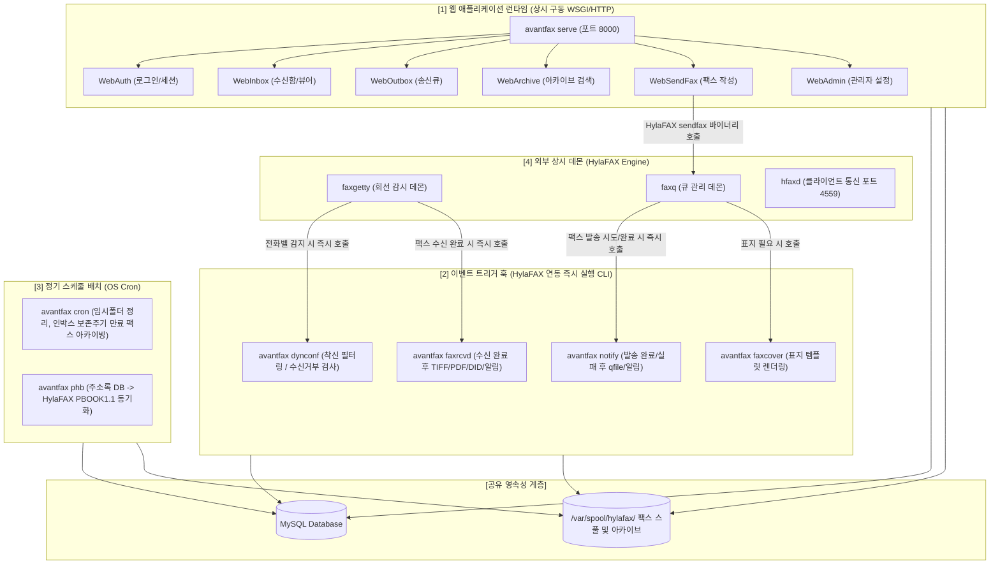
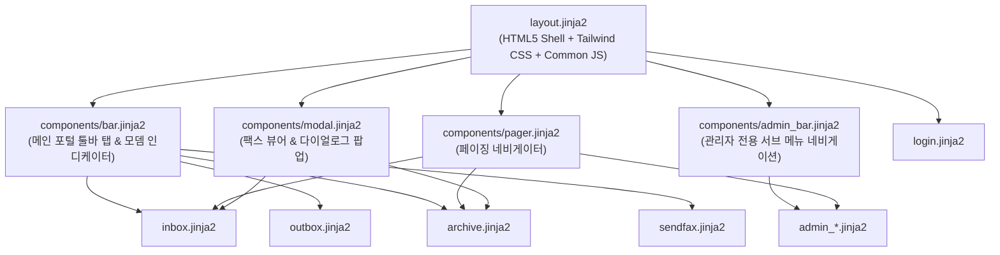

# NamiFAX Modern Enterprise Appliance Architecture

> **System Single Source of Truth (SSOT)**  
> **현재 상태: 전 모듈 및 화면 현대화 100% 완료 (37/37 모듈 이식, 33종 템플릿 UI 고도화, 전수 Mock/Stub 제거 및 실체 DB 연동 완료) | Web E2E Golden Master 68/68 PASS (100%) | Backend CLI Golden Master 20/20 PASS (100%) | pytest 단위 및 통합 테스트 296/296 PASS (100%) | 관리자(어플라이언스 다크 콘솔) & 사용자(모던 엔터프라이즈 포털) UI 2원화 완성 | 폐쇄망 설치형 환경 완벽 지원(Zero External CDN)**

---

## 1. System Overview (시스템 개요)

### 1.1 시스템 목적 및 비즈니스 역할
AvantFAX는 오픈소스 팩스 서버 엔진인 **HylaFAX**와 연동하여 동작하는 웹 기반 팩스 송수신 및 아카이브 관리 플랫폼입니다.
- **팩스 수신 파이프라인 (Incoming Flow)**: HylaFAX 데몬(`faxgetty`)이 팩스를 수신하면 `faxrcvd.php` 훅을 실행 -> DID 및 바코드 분석(`DIDRouting`, `BarcodeRouting`) -> TIFF를 PDF로 변환 및 썸네일 생성 -> DB 아카이브(`ArchiveIn`) 등록 -> 담당 사용자 이메일 발송 및 자동 인쇄 수행.
- **동적 수신 제어 (Dynamic Config)**: HylaFAX 착신 시 `dynconf.php`를 호출하여 발신자 번호(CallID) 블랙리스트 체크 및 수신 허용 여부 결정.
- **팩스 송신 파이프라인 (Outgoing Flow)**: 웹 UI(`sendfax.php`) 또는 이메일-투-팩스를 통해 문서 업로드/커버페이지 생성 -> HylaFAX 송신 큐(`sendfax` 바이너리)로 작업 등록 -> HylaFAX 완료 시 `notify.php` 훅 호출 -> 송신 아카이브(`ArchiveOut`) 등록 및 결과 알림.
- **주소록 및 사용자 권한 관리**: 회사/개인별 주소록(`AFAddressBook`), 모뎀별/DID별 권한 분기 및 패스워드 정책 관리(`AFUserAccount`).
- **웹 관리/사용자 인터페이스**: 인박스(수신함), 아웃박스(송신 큐 모니터링), 아카이브 검색/카테고리 분류, 시스템 관리(모뎀, 사용자, DID, 바코드, 시스템 로그).

### 1.2 아키텍처 전환 목표 (Target Architecture)
- **Target Language**: Python 3.11+
- **Target Web Framework**: Pyramid 2.x (REST API / WSGI 웹 애플리케이션)
- **Data Persistence**: SQLAlchemy (ORM & Core) + Alembic
- **Validation & Serialization**: Pydantic v2 & FormRules Python 포팅 모듈
- **Template Engine**: Jinja2 (레거시 Smarty 2.x 템플릿 1:1 마이그레이션)
- **Frontend & Styling**: **Tailwind CSS + Google Material Design 3 (M3) Theme Tokens** (M3 Baseline Palette, Surface Containers, Pill Buttons, Elevation Shadows, M3 Dark Admin Console)
- **HylaFAX / Process Interaction**: Python `subprocess` / `asyncio` 기반의 견고한 HylaFAX CLI 래퍼
- **Verification Strategy**: CLI 입출력 훅 및 웹 라우트별 HTML DOM / 폼 계약 / 비주얼 Golden Master 차분 검증
- **Migration Strategy**: 최하단 리프 모듈부터 단위 테스트 및 명세 기반으로 점진적 이식 후 FFI/Bridge 레이어로 레거시와 공존(Strangler Fig Pattern).


### 1.3 Runtime Topology & Execution Model (런타임 실행 모델 및 프로세스 분류)

AvantFAX 시스템은 **[1] 상시 실행 웹 서비스**, **[2] HylaFAX 이벤트 트리거 훅**, **[3] 정기 스케줄 배치**, **[4] 외부 상시 데몬(HylaFAX Core)**의 4가지 실행 계층으로 명확히 구분되어 유기적으로 동작합니다.



#### 런타임 영역별 상세 역할 및 프로세스 라이프사이클

| 구분 | 프로세스/모듈명 | 실행 트리거 및 구동 방식 | 수명 주기 (Lifecycle) | 주요 역할 및 비즈니스 로직 |
| :--- | :--- | :--- | :--- | :--- |
| **[1] 웹 서비스** | `avantfax serve`<br>(`src/avantfax/web/app.py`) | 시스템 부팅 시 systemd 또는 컨테이너에서 상시 구동 (WSGI/HTTP) | **상시 실행 (Persistent Daemon)** | • 사용자 브라우저 HTTP/REST API 요청 처리<br>• 인증 및 권한 확인(`WebAuth`)<br>• 수신 팩스 조회 및 PDF 스트리밍(`WebInbox`)<br>• 팩스 작성 및 발송 큐 등록(`WebSendFax`)<br>• 아카이브 검색/관리자 설정(`WebArchive`, `WebAdmin`) |
| **[2] 이벤트 훅** | `avantfax dynconf`<br>(`src/avantfax/cli/dynconf.py`) | HylaFAX `faxgetty` 데몬이 착신 벨을 감지할 때마다 즉시 실행 | **단발성 프로세스 (Ephemeral CLI)** | • CallID(발신자 번호) 수신 거부 블랙리스트 조회<br>• 수신 허용 여부를 HylaFAX에 동적 응답 |
| **[2] 이벤트 훅** | `avantfax faxrcvd`<br>(`src/avantfax/cli/faxrcvd.py`) | HylaFAX가 수신 팩스 TIFF 파일 저장을 마쳤을 때 즉시 실행 | **단발성 프로세스 (Ephemeral CLI)** | • 수신 TIFF 파일 검사 및 PDF/썸네일 변환<br>• DID 및 바코드 분석 후 수신 담당자 결정<br>• 수신 아카이브(`ArchiveIn`) 등록<br>• 담당자 이메일 발송 및 자동 프린터 출력 |
| **[2] 이벤트 훅** | `avantfax notify`<br>(`src/avantfax/cli/notify.py`) | HylaFAX `faxq`가 팩스 송신(성공, 재시도, 실패) 후 즉시 실행 | **단발성 프로세스 (Ephemeral CLI)** | • `qfile` 파싱 및 전송 결과 상태 확인<br>• 주소록(`AFAddressBook`) 회사 자동 생성/갱신<br>• 송신 아카이브(`ArchiveOut`) 등록<br>• 발신자에게 전송 결과 통지 이메일 발송 |
| **[2] 이벤트 훅** | `avantfax faxcover`<br>(`src/avantfax/cli/faxcover.py`) | `sendfax` 명령이 팩스 커버를 생성할 때 호출 | **단발성 프로세스 (Ephemeral CLI)** | • 커맨드라인 옵션 및 DB 사용자 정보 매핑<br>• PostScript/HTML 템플릿의 `XXXX-` 토큰 치환 렌더링 |
| **[3] 정기 배치** | `avantfax cron`<br>(`src/avantfax/cli/cron.py`) | OS crontab에 의해 정기적(예: 매일 자정)으로 실행 | **주기적 배치 (Scheduled Batch)** | • 임시 디렉터리(`/tmp/avantfax/`) 파일 삭제<br>• 인박스 보존 기한이 지난 팩스 아카이브 이동 및 정리 |
| **[3] 정기 배치** | `avantfax phb`<br>(`src/avantfax/cli/phb.py`) | OS crontab에 의해 정기적으로 실행 | **주기적 배치 (Scheduled Batch)** | • AvantFAX 주소록 DB를 HylaFAX 클라이언트용 `PBOOK1.1` 전화번호부 파일로 동기화 |
| **[4] 외부 데몬** | HylaFAX Core<br>(`faxq`, `faxgetty`, `hfaxd`) | OS 서비스(systemd)에서 상시 구동 | **상시 데몬 (External Engine)** | • 실제 모뎀 하드웨어 제어 및 전화선 신호 처리<br>• 전송 큐 스케줄링 및 팩스 프로토콜 송수신 |


---

## 2. Dependency Graph (DAG) & Topological Porting Order

모듈 간의 의존성을 정적 분석하고 순환 의존성을 제거하여 위상 정렬(Topological Sort)한 **포팅 실행 큐(Migration Queue)**입니다.
하위 리프 모듈(Level 0)부터 최상위 진입점(Level 5)까지 순차적으로 이식합니다.

```mermaid
flowchart TD
    subgraph L0["Level 0: Leaf Core Utilities & Persistence Driver"]
        M_SQL["SQL (DB Driver)"]
        M_MDBO["MDBO (Query Core)"]
        M_FormRules["FormRules (Validators)"]
        M_PWAuth["PWAuth (Auth Engine)"]
        M_PAMAuth["PAMAuth (PAM Backend)"]
        M_FileUpload["FileUpload (Storage)"]
        M_Mailer["Mailer (Email Dispatcher)"]
    end

    subgraph L1["Level 1: ORM Entities & Data Engine"]
        M_MDBObject["MDBObject (ORM Base)"]
        M_Entities["classes_entities (Data Models)"]
        M_MDBOData["MDBOData (Collection Handler)"]
    end

    subgraph L2["Level 2: Leaf Business Domain Modules"]
        M_Covers["Covers"]
        M_FaxCat["FaxPDFCategory"]
        M_UserPwd["AFUserPasswords"]
        M_DynConf["DynamicConfig"]
        M_Barcode["BarcodeRouting"]
        M_DID["DIDRouting"]
        M_Distro["DistributionList"]
        M_Modem["FaxModem"]
        M_Abook["AFAddressBook"]
        M_FaxArchive["FaxPDFArchive"]
    end

    subgraph L3["Level 3: Composite Business Domain & System Helpers"]
        M_UserAcc["AFUserAccount"]
        M_ArchiveIn["ArchiveIn"]
        M_ArchiveOut["ArchiveOut"]
        M_FaxQueue["FaxQueue"]
        M_Functions["functions (System Helpers)"]
    end

    subgraph L4["Level 4: CLI Hooks & System daemons"]
        M_dynconf_cli["dynconf (CLI Hook)"]
        M_phb_cli["phb (CLI Hook)"]
        M_cron["avantfaxcron (Cron Job)"]
        M_notify_cli["notify (CLI Hook)"]
        M_faxrcvd_cli["faxrcvd (CLI Hook)"]
        M_faxcover_cli["faxcover (CLI Hook)"]
    end

    subgraph L5["Level 5: Web UI & Controller Endpoints (Pyramid)"]
        M_WebAuth["WebAuth"]
        M_WebInbox["WebInbox"]
        M_WebOutbox["WebOutbox"]
        M_WebArchive["WebArchive"]
        M_WebSendFax["WebSendFax"]
        M_WebAdmin["WebAdmin"]
    end

    M_SQL --> M_MDBObject
    M_SQL --> M_Entities
    M_MDBObject --> M_Entities
    M_MDBO --> M_MDBOData
    M_Entities --> M_MDBOData

    M_MDBOData --> M_Covers
    M_MDBOData --> M_FaxCat
    M_MDBOData --> M_UserPwd
    M_MDBOData --> M_DynConf
    M_MDBOData --> M_Barcode
    M_MDBOData --> M_DID
    M_MDBOData --> M_Distro
    M_MDBOData --> M_Modem
    M_MDBOData --> M_Abook
    M_MDBOData --> M_FaxArchive

    M_UserPwd --> M_UserAcc
    M_MDBOData --> M_UserAcc
    M_FaxArchive --> M_ArchiveIn
    M_FaxArchive --> M_ArchiveOut
    M_UserAcc --> M_FaxQueue

    M_Abook --> M_Functions
    M_ArchiveIn --> M_Functions
    M_DID --> M_Functions
    M_Modem --> M_Functions
    M_Mailer --> M_Functions

    M_DynConf --> M_dynconf_cli
    M_Abook --> M_phb_cli
    M_ArchiveIn --> M_cron
    M_ArchiveOut --> M_notify_cli
    M_UserAcc --> M_notify_cli
    M_Functions --> M_notify_cli
    M_Barcode --> M_faxrcvd_cli
    M_DID --> M_faxrcvd_cli
    M_Modem --> M_faxrcvd_cli
    M_ArchiveIn --> M_faxrcvd_cli
    M_Functions --> M_faxrcvd_cli
    M_Functions --> M_faxcover_cli

    M_UserAcc --> M_WebAuth
    M_PWAuth --> M_WebAuth
    M_PAMAuth --> M_WebAuth
    M_ArchiveIn --> M_WebInbox
    M_FaxQueue --> M_WebOutbox
    M_FaxArchive --> M_WebArchive
    M_FaxQueue --> M_WebSendFax
    M_FileUpload --> M_WebSendFax
    M_Covers --> M_WebSendFax
    M_Admin_Deps["Admin Modules"] --> M_WebAdmin
```



---

## 3. Common Data Models (공통 데이터 모델 정의)

MySQL 스키마(`create_tables.sql`)를 기준으로 신규 Python 시스템(`SQLAlchemy` 및 `Pydantic`)에서 공유할 데이터 모델 명세입니다.

| 모델명 | 레거시 테이블 | 주 키 (PK) | 핵심 컬럼 및 타입 | 설명 |
| :--- | :--- | :--- | :--- | :--- |
| `UserAccount` | `UserAccount` | `uid` (INT) | `username` (str), `password` (str, hash), `email` (str), `superuser` (bool), `is_admin` (bool), `modemdevs` (str/list), `didrouting` (str/list), `faxcats` (str/list), `pwdexpire` (date), `acc_enabled` (bool) | 사용자 계정 및 권한 제어 모델 |
| `UserPasswords`| `UserPasswords`| `upid` (INT) | `uid` (FK -> UserAccount.uid), `pwdhash` (str) | 패스워드 이력 관리(재사용 방지) |
| `AddressBook` | `AddressBook` | `abook_id` (INT) | `company` (str) | 주소록 회사 정보 |
| `AddressBookEmail`| `AddressBookEmail`| `abookemail_id` (INT) | `abook_id` (FK -> AddressBook.abook_id), `contact_name` (str), `contact_email` (str) | 회사별 이메일 연락처 |
| `AddressBookFAX`| `AddressBookFAX` | `abookfax_id` (INT) | `abook_id` (FK -> AddressBook.abook_id), `faxnumber` (str), `email` (str), `to_person` (str), `faxcatid` (INT), `printer` (str) | 회사별 팩스 번호 및 라우팅 설정 |
| `Modems` | `Modems` | `devid` (INT) | `device` (str, e.g. ttyS0), `alias` (str), `contact` (str), `printer` (str), `faxcatid` (INT) | 팩스 모뎀 장치 설정 |
| `CoverPages` | `CoverPages` | `cover_id` (INT) | `title` (str), `file` (str) | 팩스 표지 템플릿 파일 매핑 |
| `DIDRoute` | `DIDRoute` | `didr_id` (INT) | `routecode` (str), `alias` (str), `contact` (str), `printer` (str), `faxcatid` (INT) | DID 착신 번호별 라우팅 규칙 |
| `BarcodeRoute` | `BarcodeRoute` | `barcode_id` (INT) | `barcode` (str), `alias` (str), `contact` (str), `printer` (str), `faxcatid` (INT) | 바코드 인식 기반 라우팅 규칙 |
| `FaxArchive` | `FaxArchive` | `fid` (INT) | `faxnumid` (INT), `companyid` (INT), `faxpath` (str), `pages` (INT), `faxcatid` (INT), `didr_id` (INT), `archstamp` (datetime), `modemdev` (str), `userid` (INT), `origfaxnum` (str), `faxcontent` (text), `inbox` (bool) | 송/수신 팩스 아카이브 및 OCR 메타데이터 |
| `FaxCategory` | `FaxCategory` | `catid` (INT) | `name` (str) | 팩스 카테고리 태그 |
| `DistroList` | `DistroList` | `dl_id` (INT) | `listname` (str), `listdata` (text), `lastmod_date` (timestamp), `lastmod_user` (INT) | 팩스 동보 전송용 배포 그룹 |
| `DynConf` | `DynConf` | `dynconf_id` (INT) | `device` (str), `callid` (str) | 수신 거부 블랙리스트 |
| `SysLog` | `SysLog` | `syslogid` (INT) | `logdate` (timestamp), `logtext` (text) | 시스템 감사 및 에러 로그 |

---

## 4. Porting Status Matrix (포팅 진행 현황 매트릭스)

- 상태 정의:
  - `[PENDING]`: 포팅 대기 중
  - `[IN_PROGRESS]`: 명세 추출, 테스트 작성 또는 코드 작성 진행 중
  - `[FFI_BRIDGED]`: 타깃 모듈 구현 완료 및 기존 레거시 호환 브리지/CLI 래퍼 연결 완료
  - `[COMPLETE]`: 전 계층 이식 완료 및 E2E 검증 통과

| 순번 | 모듈명 | 레거시 파일 위치 | 타깃 신규 모듈 위치 | 상태 | 의존 모듈 | 비고 |
| :---: | :--- | :--- | :--- | :---: | :--- | :--- |
| **01** | `SQL` | `includes/SQL.php` | `src/avantfax/db/engine.py` | `[FFI_BRIDGED]` | Leaf | 모던 DB 엔진 구현, 단위 테스트 통과 및 FFI/CLI 브리지 완료 |
| **02** | `MDBO` | `includes/MDBO.php` | `src/avantfax/db/query.py` | `[FFI_BRIDGED]` | Leaf | 쿼리 빌더 및 CRUD 유틸 구현, 단위 테스트 통과 및 FFI/CLI 브리지 완료 |
| **03** | `FormRules` | `includes/FormRules.php` | `src/avantfax/common/validators.py` | `[FFI_BRIDGED]` | Leaf | 폼/이메일/날짜 검증기 구현, 단위 테스트 통과 및 FFI/CLI 브리지 완료 |
| **04** | `PWAuth` | `includes/PWAuth.php` | `src/avantfax/auth/password.py` | `[FFI_BRIDGED]` | Leaf | pwauth 백엔드 및 MD5 해시 관리자 구현, 단위 테스트 통과 및 FFI/CLI 브리지 완료 |
| **05** | `PAMAuth` | `includes/PAMAuth.php` | `src/avantfax/auth/pam.py` | `[FFI_BRIDGED]` | Leaf | 시스템 PAM 인증 백엔드 구현, 단위 테스트 통과 및 FFI/CLI 브리지 완료 |
| **06** | `FileUpload` | `includes/FileUpload.php` | `src/avantfax/common/upload.py` | `[FFI_BRIDGED]` | Leaf | 파일 업로드 검증 및 이동 모듈 구현, 단위 테스트 통과 및 FFI/CLI 브리지 완료 |
| **07** | `Mailer` | `includes/Mailer.php` | `src/avantfax/services/mailer.py` | `[FFI_BRIDGED]` | Leaf | 이메일 발송 및 첨부파일 처리 서비스 구현, 단위 테스트 통과 및 FFI/CLI 브리지 완료 |
| **08** | `MDBObject` | `includes/MDBObject.php` | `src/avantfax/db/base.py` | `[FFI_BRIDGED]` | 01 | ORM ActiveRecord 베이스 클래스 구현, 단위 테스트 통과 및 FFI/CLI 브리지 완료 |
| **09** | `classes_entities` | `includes/classes.php` | `src/avantfax/models/entities.py` | `[FFI_BRIDGED]` | 01, 08 | 14개 테이블 엔티티 클래스 구현, 단위 테스트 통과 및 FFI/CLI 브리지 완료 |
| **10** | `MDBOData` | `includes/MDBOData.php` | `src/avantfax/db/repository.py` | `[FFI_BRIDGED]` | 02, 09 | CRUD 공통 레포지토리 구현, 단위 테스트 통과 및 FFI/CLI 브리지 완료 |
| **11** | `Covers` | `includes/Covers.php` | `src/avantfax/services/covers.py` | `[FFI_BRIDGED]` | 09, 10 | 팩스 표지 템플릿 관리 서비스 구현, 단위 테스트 통과 및 FFI/CLI 브리지 완료 |
| **12** | `FaxPDFCategory` | `includes/FaxPDFCategory.php` | `src/avantfax/services/categories.py` | `[FFI_BRIDGED]` | 09, 10 | 카테고리 관리 서비스 구현, 단위 테스트 통과 및 FFI/CLI 브리지 완료 |
| **13** | `AFUserPasswords` | `includes/AFUserPasswords.php` | `src/avantfax/services/user_passwords.py` | `[FFI_BRIDGED]` | 09, 10 | 비밀번호 이력 관리 서비스 구현, 단위 테스트 통과 및 FFI/CLI 브리지 완료 |
| **14** | `DynamicConfig` | `includes/DynamicConfig.php` | `src/avantfax/services/dynconf.py` | `[FFI_BRIDGED]` | 09, 10 | 블랙리스트 필터링 서비스 구현, 단위 테스트 통과 및 FFI/CLI 브리지 완료 |
| **15** | `BarcodeRouting` | `includes/BarcodeRouting.php` | `src/avantfax/services/barcode.py` | `[FFI_BRIDGED]` | 09, 10 | 바코드 기반 라우팅 규칙 서비스 구현, 단위 테스트 통과 및 FFI/CLI 브리지 완료 |
| **16** | `DIDRouting` | `includes/DIDRouting.php` | `src/avantfax/services/did.py` | `[FFI_BRIDGED]` | 09, 10 | DID 번호 기반 라우팅 규칙 서비스 구현, 단위 테스트 통과 및 FFI/CLI 브리지 완료 |
| **17** | `DistributionList` | `includes/DistributionList.php`| `src/avantfax/services/distro.py` | `[FFI_BRIDGED]` | 09, 10 | 동보 전송 목록 관리 서비스 구현, 단위 테스트 통과 및 FFI/CLI 브리지 완료 |
| **18** | `FaxModem` | `includes/FaxModem.php` | `src/avantfax/services/modem.py` | `[FFI_BRIDGED]` | 09, 10 | 모뎀 장치 관리 및 faxstat 상태 파싱 서비스 구현, 단위 테스트 통과 및 FFI/CLI 브리지 완료 |
| **19** | `AFAddressBook` | `includes/AFAddressBook.php` | `src/avantfax/services/addressbook.py` | `[FFI_BRIDGED]` | 09, 10 | 회사/팩스번호/이메일 연락처 통합 주소록 서비스 구현, 단위 테스트 통과 및 FFI/CLI 브리지 완료 |
| **20** | `FaxPDFArchive` | `includes/FaxPDFArchive.php` | `src/avantfax/services/archive_base.py` | `[FFI_BRIDGED]` | 09, 10 | 팩스 아카이브 메타데이터 관리, 권한 검사, 인박스/검색 페이징, 삭제/정리 서비스 구현, 단위 테스트 통과 및 FFI/CLI 브리지 완료 |
| **21** | `AFUserAccount` | `includes/AFUserAccount.php` | `src/avantfax/services/user_account.py` | `[FFI_BRIDGED]` | 09, 10, 13 | 사용자 계정 관리, 인증, 세션, 접근제어 및 비밀번호 정책 서비스 구현, 단위 테스트 통과 및 FFI/CLI 브리지 완료 |
| **22** | `dynconf` (CLI) | `includes/dynconf.php` | `src/avantfax/cli/dynconf.py` | `[COMPLETE]` | 14 | HylaFAX DynConf 수신 콜 필터링 CLI 엔트리포인트 구현 및 E2E Golden Master (01~03) 100% 통과 |
| **23** | `phb` (CLI) | `includes/phb.php` | `src/avantfax/cli/phb.py` | `[COMPLETE]` | 19 | HylaFAX PBOOK1.1 포맷 전화번호부 자동 생성 CLI 배치 구현 및 단위 테스트 통과 |
| **24** | `ArchiveIn` | `includes/ArchiveIn.php` | `src/avantfax/services/archive_in.py` | `[FFI_BRIDGED]` | 09, 20 | 수신 팩스 아카이빙, 인박스 관리, 이미지 회전, 오래된 팩스 보관 처리 서비스 구현 및 FFI/CLI 브리지 완료 |
| **25** | `ArchiveOut` | `includes/ArchiveOut.php` | `src/avantfax/services/archive_out.py` | `[FFI_BRIDGED]` | 09, 20 | 송신 팩스 아카이빙, 발신자/회사 바인딩, 아카이브 직접 저장 서비스 구현 및 FFI/CLI 브리지 완료 |
| **26** | `FaxQueue` | `includes/FaxQueue.php` | `src/avantfax/services/faxqueue.py` | `[FFI_BRIDGED]` | 09, 21 | HylaFAX 작업 큐 제어, 상태 파싱, 소유자 매핑, 작업 취소/속성 변경 서비스 구현 및 FFI/CLI 브리지 완료 |
| **27** | `functions` | `includes/functions.php` | `src/avantfax/common/helpers.py` | `[COMPLETE]` | 09, 10, 16, 18, 19, 24, 07 | 전역 문자열/파일/이메일/주소록 조회/로깅 유틸리티 함수군 구현 및 단위 테스트 통과 |
| **28** | `avantfaxcron` | `includes/avantfaxcron.php` | `src/avantfax/cli/cron.py` | `[COMPLETE]` | 20, 24 | 정기 배치 및 팩스 파일/임시폴더 정리 CLI 구현 및 E2E Golden Master (04~05) 100% 통과 |
| **29** | `notify` (CLI) | `includes/notify.php` | `src/avantfax/cli/notify.py` | `[COMPLETE]` | 19, 21, 25, 27 | HylaFAX 송신 알림 CLI 구현 및 E2E Golden Master (09~11) 100% 통과 |
| **30** | `faxrcvd` (CLI) | `includes/faxrcvd.php` | `src/avantfax/cli/faxrcvd.py` | `[COMPLETE]` | 15, 16, 18, 19, 24, 27 | HylaFAX 수신 처리 핵심 훅 구현 및 E2E Golden Master (12~14) 100% 통과 |
| **31** | `faxcover` (CLI) | `includes/faxcover.php` | `src/avantfax/cli/faxcover.py` | `[COMPLETE]` | 09, 27 | HylaFAX 팩스 커버 생성 CLI 구현 및 E2E Golden Master (06~08) 100% 통과 |
| **32** | `WebAuth` | `check_login.php`, `logout.php` | `src/avantfax/web/views/auth.py` | `[COMPLETE]` | 04, 05, 21, 27 | 로그인/로그아웃 뷰 및 인증 미들웨어 구현 및 단위 테스트 통과 |
| **33** | `WebInbox` | `inbox.php`, `viewfax.php` | `src/avantfax/web/views/inbox.py` | `[COMPLETE]` | 19, 21, 24, 27 | 수신함 뷰 및 다운로드 API 구현 및 단위 테스트 통과 |
| **34** | `WebOutbox` | `outbox.php` | `src/avantfax/web/views/outbox.py` | `[COMPLETE]` | 21, 26, 27 | 송신 큐 뷰 및 제어 API 구현 및 단위 테스트 통과 |
| **35** | `WebArchive` | `archive.php`, `search.php` | `src/avantfax/web/views/archive.py` | `[COMPLETE]` | 19, 20, 21, 27 | 팩스 검색 및 아카이브 뷰 구현 및 단위 테스트 통과 |
| **36** | `WebSendFax` | `sendfax.php`, `upload_*.php` | `src/avantfax/web/views/sendfax.py` | `[COMPLETE]` | 06, 11, 19, 21, 26, 27 | 팩스 작성 및 전송 뷰 구현 및 단위 테스트 통과 |
| **37** | `WebAdmin` | `admin/*.php` | `src/avantfax/web/views/admin.py` | `[COMPLETE]` | 12, 14, 15, 16, 17, 18, 21, 27 | 시스템 관리자 뷰 및 설정 API 구현 및 단위 테스트 통과 |
| **39** | `AdminSmtpGateway` | `NEW` (엔터프라이즈) | `src/namifax/services/smtp_settings.py`, `src/namifax/views/admin.py` | `[COMPLETE]` | 07 | 외부 SMTP 게이트웨이 웹 설정 및 실시간 연결 진단 도구 완료 |
| **40** | `StorageLifecycle` | `NEW` (엔터프라이즈) | `src/namifax/services/storage_lifecycle.py`, `src/namifax/cli/cron.py` | `[COMPLETE]` | 28 | 로컬 원본 TIFF 선별 삭제 및 원격 클라우드 객체 통합 수명주기 엔진 완료 |
| **41** | `CloudStorage` | `NEW` (엔터프라이즈) | `src/namifax/services/cloud_storage.py` | `[COMPLETE]` | 40 | AWS S3, MinIO, GCS 호환 멀티 클라우드 오브젝트 스토리지 연동 완료 |
| **42** | `NetworkPrinter` | `NEW` (엔터프라이즈) | `src/namifax/services/printer.py`, `src/namifax/cli/print_in.py` | `[COMPLETE]` | 01, 16, 26 | 네트워크 실물 프린터 직접 연동(RAW 9100) 및 CUPS Print-to-Fax 인바운드 파이프라인 완료 |
| **43** | `TotpAuth` | `NEW` (엔터프라이즈) | `src/namifax/services/totp.py`, `src/namifax/views/auth.py` | `[COMPLETE]` | 04, 21, 32 | RFC 6238 TOTP 2단계 인증, QR 프로비저닝 및 비상 복구 백업 코드 완료 |
| **44** | `CoverStudio` | `NEW` (엔터프라이즈) | `src/namifax/services/cover_studio.py`, `src/namifax/views/admin.py` | `[COMPLETE]` | 03, 32 | 팩스 표지 템플릿(PS/HTML/PDF) 렌더링 엔진, 동적 태그 치환 및 가이드 UI 완료 |
| **45** | `WebAuthnPasskeys` | `NEW` (엔터프라이즈) | `src/namifax/services/webauthn.py`, `src/namifax/views/webauthn.py` | `[COMPLETE]` | 04, 21, 32 | W3C WebAuthn / FIDO2 Passkeys 생체인증/패스워드리스 인증 및 REST API 완료 |
| **46** | `SAML2SSO` | `NEW` (엔터프라이즈) | `src/namifax/services/saml.py`, `src/namifax/views/saml.py` | `[COMPLETE]` | 04, 21, 32 | SAML 2.0 엔터프라이즈 SP 메타데이터, AuthnRequest, Response 파싱 및 JIT 프로비저닝 완료 |
| **47** | `OcrTextExtraction` | `NEW` (엔터프라이즈) | `src/namifax/services/ocr.py`, `src/namifax/cli/faxrcvd.py` | `[COMPLETE]` | 01, 16, 26 | Tesseract OCR 기반 수신 팩스 본문 텍스트 자동 추출 및 전문 검색(Full-Text Search) 인덱싱 완료 |

---

## 5. Dead Code & Removed Logic Protocol (제거 대상 로직 기록)

레거시 PHP 5 전용 구형 문법 및 보안상 취약/더 이상 불필요한 코드는 이식 대상에서 제외하고 아래에 명시합니다:
1. `__autoload()` 전역 함수: Python의 표준 `import` 패키징 체계로 대체.
2. `magic_quotes_gpc` 및 `register_globals` 대응 로직: Python/Pyramid의 Request 파라미터 바인딩으로 대체.
3. PHP `Smarty 2.x` 엔진: Jinja2 또는 순수 REST API + SPA 뷰로 점진 교체.
4. `mysql_*` 레거시 함수군: SQLAlchemy Core/ORM connection pool로 전면 현대화.
5. `eval()` 또는 가변 변수(`$$var`) 패턴: Python 사전(dict) 또는 정적 속성 매핑으로 엄격화.

---

## 6. Verification & Golden Master Strategy

### 6.1 Phase 2: E2E Golden Master Test Suite 구축 완료
- **테스트 러너 스크립트**: `golden_master/runner.py` (CLI 차분 검증기) 및 `golden_master/test_e2e.py` (pytest 연동)
- **도커 격리 환경**: `golden_master/Dockerfile.legacy` (PHP 5.6 + mysqli + PEAR MDB2 기반 레거시 순수 환경)
- **구축된 시나리오 (14개)**:
  1. `01_dynconf_no_args`: 인자 없는 호출 시 사용법 출력 및 반환코드 검증
  2. `02_dynconf_empty_callid`: 디바이스명만 전달되고 CallID가 비어있는 케이스 검증
  3. `03_dynconf_sip_number`: SIP 포맷(`sip:12345@domain.com`)의 착신 번호 전처리 검증
  4. `04_avantfaxcron_no_args`: 필수 플래그(`-t`) 누락 시 크론 사용법 출력 검증
  5. `05_avantfaxcron_invalid_opt`: 유효하지 않은 CLI 옵션 플래그 전달 시 에러 검증
  6. `06_faxcover_no_args`: 인자 없는 표지 생성기 호출 시 Usage 출력 검증
  7. `07_faxcover_missing_number`: 발신자(`-f`)만 지정되고 수신번호(`-n`) 누락 시 검증
  8. `08_faxcover_missing_from`: 수신번호(`-n`)만 지정되고 발신자(`-f`) 누락 시 검증
  9. `09_notify_no_args`: 알림 훅 스크립트 인자 누락 시 사용법 출력 검증
  10. `10_notify_missing_why`: `why` 상태값 인자 누락 케이스 검증
  11. `11_notify_missing_qfile_file`: 존재하지 않는 qfile 경로 입력 시 에러 검증
  12. `12_faxrcvd_no_args`: 수신 훅 스크립트 인자 누락 시 사용법 출력 검증
  13. `13_faxrcvd_missing_args`: 필수 인자 3개 누락 케이스 검증
  14. `14_faxrcvd_nonexistent_file`: 존재하지 않는 수신 TIFF 파일 입력 시 에러 처리 검증
- **검증 데이터 저장소**: `golden_master/data/<scenario_id>/` (stdout, stderr, exit_code, meta.json 보관 완료)
- **차분 검증 실행법**:
  - `python3 golden_master/runner.py --verify`
  - `pytest golden_master/test_e2e.py`

---

## 7. Modern Pyramid Security Policy & Authorization Architecture

NamiFAX는 Pyramid 2.x 표준 보안 아키텍처에 따라 세션 쿠키 인증 및 ACL 기반 인가 체계를 완전히 분리·통합하여 구현했습니다.

### 7.1 Security Policy (`namifax.security.NamiFaxSecurityPolicy`)
- **인터페이스**: Pyramid 2.0+ `ISecurityPolicy` 구현
  - `identity(request)`: 세션 또는 Authorization 토큰을 검증하여 인증된 사용자 정보(`{"uid", "username", "is_admin", ...}`) 반환
  - `authenticated_userid(request)`: 현재 사용자의 `username` 반환
  - `permits(request, context, permission)`: 컨텍스트의 `__acl__`과 사용자의 그룹/역할(`role:admin`, `role:user`, `Authenticated`, `Everyone`)을 대조하여 허용(`Allowed`) 또는 거부(`Denied`) 판정
  - `remember(request, userid, **kw)` / `forget(request, **kw)`: 인증 쿠키 및 세션 발급/파기

### 7.2 ACL Context (`namifax.security.RootContext`)
모든 뷰의 루트 컨텍스트에서 다음 접근 제어 규칙을 선언합니다:
- `(Allow, Everyone, 'public')`: 비로그인 사용자 및 전체 공개 리소스 접근 허용
- `(Allow, Authenticated, 'view')`: 로그인된 모든 사용자에게 조회 권한 허용 (수신함, 팩스 뷰어)
- `(Allow, Authenticated, 'send_fax')`: 로그인된 사용자에게 팩스 전송 및 파일 업로드 권한 허용
- `(Allow, 'role:admin', 'admin')`: 관리자 권한(`is_admin=True` 또는 `superuser=True`) 사용자에게만 시스템 설정 및 장치 제어 허용
- `DENY_ALL`: 명시되지 않은 모든 권한은 기본 차단

### 7.3 Pyramid Views 인가 선언
- `@view_config(route_name='home', permission='public')`: 메인 화면
- `@view_config(route_name='auth_login', permission='public')`: 로그인 화면
- `@view_config(route_name='inbox', permission='view')`: 수신함 (미인증 시 401 차단)
- `@view_config(route_name='sendfax', permission='send_fax')`: 팩스 발송 (미인증 시 401 차단)
- `@view_config(route_name='admin', permission='admin')`: 시스템 관리 (일반 사용자 접근 시 403 Forbidden)
- `@forbidden_view_config`: 인증되지 않은 사용자는 401 또는 로그인 리다이렉트, 권한이 부족한 사용자는 403 Forbidden 오류 응답 렌더링

---

## 8. Deployment & Operational Guide (NamiFAX 배포 및 운영 가이드)

### 8.1 Python Environment & Packaging with `uv` (`uv init --package`)
NamiFAX는 초고속 모던 패키지 관리자인 **`uv`**를 기반으로 패키징 및 가상환경을 관리합니다:
- **프로젝트 규격**: `uv init --package` 기반 패키지 템플릿 적용 (`build-backend = "uv_build"`, PEP 621 / PEP 735 표준).
- **의존성 락파일**: `uv.lock`을 통해 정확하고 재현 가능한 패키지 버전 고정.
- **주요 명령어**:
  ```bash
  # 가상환경 생성 및 전체 의존성/패키지 동기화
  uv sync

  # 개발/테스트 의존성 포함 실행
  uv run pytest
  uv run python golden_master/runner.py --verify

  # NamiFAX CLI 명령어 실행
  uv run namifax --help
  uv run namifax serve --port 8000
  ```

### 8.2 Entry Points & CLI Shortcuts (`pyproject.toml`)
HylaFAX 이벤트 훅 및 수동 배치 트리거를 위해 등록된 전용 실행 엔트리포인트:

| 명령어 | 매핑 함수 / 스크립트 | 용도 및 설명 |
| :--- | :--- | :--- |
| `namifax` | `namifax.main:main` | 통합 NamiFAX CLI 도구 (모든 서브커맨드 디스패치) |
| `namifax-server` | `namifax.main:serve_main` | 통합 HTTP/REST 웹 서비스 기동 (APScheduler 내장 모드) |
| `namifax-scheduler` | `namifax.main:scheduler_main` | 단독 백그라운드 스케줄러 데몬 기동 |
| `namifax-dynconf` | `namifax.main:dynconf_main` | HylaFAX `faxgetty` 동적 착신 필터링 훅 |
| `namifax-faxrcvd` | `namifax.main:faxrcvd_main` | HylaFAX 수신 완료 후 TIFF/PDF/DID/알림 처리 훅 |
| `namifax-notify` | `namifax.main:notify_main` | HylaFAX 발송 완료/실패 후 알림 처리 훅 |
| `namifax-faxcover` | `namifax.main:faxcover_main` | HylaFAX 팩스 커버페이지 생성 훅 |
| `namifax-cron` | `namifax.main:cron_main` | 임시 디렉터리 정리 및 보존주기 만료 팩스 정리 (수동 트리거) |
| `namifax-phb` | `namifax.main:phb_main` | 주소록 DB -> HylaFAX PBOOK1.1 동기화 (수동 트리거) |

### 8.3 정기 배치 관리: APScheduler
OS `crontab` 대신 **`APScheduler` (`BackgroundScheduler`)**를 사용하여 파이썬 프로세스 내에서 안정적으로 주기를 관리합니다:
- **`job_cron_maintenance`**: 매일 00:00(자정)에 실행되어 임시파일(`/tmp/avantfax`) 삭제 및 보존기한 만료 팩스 아카이빙 수행.
- **`job_phonebook_sync`**: 매시간 정각(00분)에 주소록 DB를 `PBOOK1.1` 파일로 자동 동기화.
- 웹 서버 기동 시(`namifax serve` / `pserve development.ini`) 자동으로 백그라운드 스케줄러가 함께 활성화되며, 서버 분리 환경을 위해 `namifax scheduler` 단독 데몬으로도 실행할 수 있습니다.

### 8.4 상시 실행 데몬: systemd 서비스 구성

#### 1) 통합 서비스 유닛 (`systemd/namifax.service`)
```ini
[Unit]
Description=NamiFAX Enterprise Fax Web and Scheduler Service
After=network.target hylafax.service

[Service]
Type=simple
User=uucp
Group=uucp
WorkingDirectory=/opt/namifax
ExecStart=/opt/namifax/.venv/bin/namifax serve --host 0.0.0.0 --port 8000
Restart=always
RestartSec=5

[Install]
WantedBy=multi-user.target
```

#### 2) 서비스 등록 및 관리 명령
```bash
# 1. 서비스 파일 복사
sudo cp systemd/namifax.service /etc/systemd/system/

# 2. systemd 데몬 리로드 및 서비스 활성화
sudo systemctl daemon-reload
sudo systemctl enable namifax.service

# 3. 서비스 시작 및 상태 확인
sudo systemctl start namifax.service
sudo systemctl status namifax.service

# 4. 실시간 로그 모니터링
sudo journalctl -u namifax.service -f
```

---

## 9. Frontend & Web Routing Architecture (Pyramid + Jinja2 + Tailwind CSS)

NamiFAX 웹 프런트엔드는 레거시 PHP 컨트롤러와 Smarty 템플릿(`.tpl`) 엔진 구조를 모던 **Pyramid 2.x 뷰 컨트롤러** + **Jinja2 템플릿** + **Tailwind CSS** 체계로 완벽하게 1:1 대응하여 이식합니다.

### 9.1 레거시 웹 라우팅 $\leftrightarrow$ Pyramid 라우팅 전수 매핑 테이블

| 순번 | 레거시 PHP 엔드포인트 | Pyramid Route Name | HTTP Method | URL Pattern | 권한 (ACL Permission) | 템플릿 매핑 (Smarty $\rightarrow$ Jinja2) |
| :---: | :--- | :--- | :---: | :--- | :---: | :--- |
| **W01** | `index.php` | `home` / `auth_login` | GET, POST | `/` 또는 `/login` | `public` | `index.tpl` $\rightarrow$ `login.jinja2` |
| **W02** | `logout.php` | `auth_logout` | GET, POST | `/logout` | `public` | 리다이렉트 응답 (`home`) |
| **W03** | `forgot.php` | `auth_forgot` | GET, POST | `/forgot` | `public` | `forgot.tpl` $\rightarrow$ `forgot.jinja2` |
| **W04** | `pwdexpired.php` | `auth_pwdexpired` | GET, POST | `/pwdexpired` | `public` | `pwdexpired.tpl` $\rightarrow$ `pwdexpired.jinja2` |
| **W05** | `inbox.php` | `inbox` | GET, POST | `/inbox` | `view` | `inbox.tpl` $\rightarrow$ `inbox.jinja2` |
| **W06** | `viewfax.php` | `viewfax` | GET | `/viewfax` | `view` | `viewfax.tpl` $\rightarrow$ `viewfax.jinja2` |
| **W07** | `pdf.php` / `file.php` | `fax_download` | GET | `/faxes/download/{fid}` | `view` | 바이너리 스트리밍 (PDF/TIFF) |
| **W08** | `rotate.php` | `fax_rotate` | POST | `/faxes/rotate/{fid}` | `view` | JSON 응답 (`{"status": "ok"}`) |
| **W09** | `outbox.php` | `outbox` | GET, POST | `/outbox` | `view` | `outbox.tpl` $\rightarrow$ `outbox.jinja2` |
| **W10** | `sendfax.php` | `sendfax` | GET, POST | `/sendfax` | `send_fax` | `sendfax.tpl` $\rightarrow$ `sendfax.jinja2` |
| **W11** | `archive.php` | `archive` | GET, POST | `/archive` | `view` | `archive.tpl` $\rightarrow$ `archive.jinja2` |
| **W12** | `search.php` | `archive_search` | GET, POST | `/search` | `view` | `search.tpl` $\rightarrow$ `search.jinja2` |
| **W13** | `addressbook.php` | `addressbook` | GET | `/addressbook` | `view` | `addressbook.tpl` $\rightarrow$ `addressbook.jinja2` |
| **W14** | `addressbook_edit.php`| `addressbook_edit` | GET, POST | `/addressbook/edit` | `view` | `addressbook_edit.tpl` $\rightarrow$ `addressbook_edit.jinja2` |
| **W15** | `distrolist.php` | `distrolist` | GET | `/distrolist` | `view` | `distrolist.tpl` $\rightarrow$ `distrolist.jinja2` |
| **W16** | `distrolist_edit.php` | `distrolist_edit` | GET, POST | `/distrolist/edit` | `view` | `distrolist_edit.tpl` $\rightarrow$ `distrolist_edit.jinja2` |
| **W17** | `settings.php` | `user_settings` | GET, POST | `/settings` | `view` | `settings.tpl` $\rightarrow$ `settings.jinja2` |
| **W18** | `admin/index.php` | `admin_dashboard` | GET | `/admin` | `admin` | `admin.tpl` $\rightarrow$ `admin.jinja2` |
| **W19** | `admin/users.php` | `admin_users` | GET, POST | `/admin/users` | `admin` | `users.tpl` $\rightarrow$ `admin_users.jinja2` |
| **W20** | `admin/modems.php` | `admin_modems` | GET, POST | `/admin/modems` | `admin` | `conf_modems.tpl` $\rightarrow$ `admin_modems.jinja2` |
| **W21** | `admin/did.php` | `admin_did` | GET, POST | `/admin/did` | `admin` | `conf_didroute.tpl` $\rightarrow$ `admin_did.jinja2` |
| **W22** | `admin/barcodes.php` | `admin_barcodes` | GET, POST | `/admin/barcodes` | `admin` | `conf_barcoderoute.tpl` $\rightarrow$ `admin_barcodes.jinja2` |
| **W23** | `admin/covers.php` | `admin_covers` | GET, POST | `/admin/covers` | `admin` | `conf_covers.tpl` $\rightarrow$ `admin_covers.jinja2` |
| **W24** | `admin/categories.php`| `admin_categories`| GET, POST | `/admin/categories` | `admin` | `fax_categories.tpl` $\rightarrow$ `admin_categories.jinja2`|
| **W25** | `admin/dynconf.php` | `admin_dynconf` | GET, POST | `/admin/dynconf` | `admin` | `conf_dynconf.tpl` $\rightarrow$ `admin_dynconf.jinja2` |
| **W26** | `admin/syslog.php` | `admin_syslog` | GET | `/admin/syslog` | `admin` | `system_logs.tpl` $\rightarrow$ `admin_syslog.jinja2` |
| **W27** | `ajax/*.php` | `api_*` | GET, POST | `/api/*` | `view` / `admin` | JSON 응답 API |

### 9.2 Jinja2 컴포넌트 상속 구조


### 9.3 뷰 데이터 계약 (View Data Contract)
Pyramid 뷰 컨트롤러는 Jinja2 템플릿에 다음 표준 컨텍스트 딕셔너리를 일관되게 주입합니다:
- `current_user`: 세션 사용자 정보 (`uid`, `username`, `is_admin`, `superuser`)
- `lang`: 다국어 번역 문자열 맵 (레거시 `$LANG` 완전 대응)
- `active_tab`: 현재 활성화된 네비게이션 탭 식별자 (`inbox`, `outbox`, `sendfax`, `archive`, `admin`)
- `server_name` / `version`: 시스템 메타정보 (`NamiFAX v3.3.5`)
- `modem_status`: 활성 팩스 모뎀 목록 및 실시간 상태 (`IDLE`, `SENDING`, `RECEIVING`)
- `error` / `form_errors`: 폼 검증 에러 및 알림 메시지 목록

---

## 10. Modern Tailwind CSS Design System & Visual Fidelity

레거시 AvantFAX의 Web 2.0 비주얼을 모던 유틸리티 CSS 프레임워크인 **Tailwind CSS**로 충실히 재현(UI Fidelity)하기 위한 디자인 시스템 명세입니다.

### 10.1 색상 및 디자인 토큰 매핑

| 디자인 요소 | 레거시 AvantFAX 원본 값 | Tailwind CSS 유틸리티 클래스 | 적용 대상 |
| :--- | :--- | :--- | :--- |
| **Primary Brand** | `#336699` (Navy Blue) | `bg-[#336699]`, `text-[#336699]`, `border-[#336699]` | 상단 툴바, 활성 탭, 헤더 타이틀, 주요 버튼 |
| **Accent Alert** | `#993300` (Brick Red) | `text-[#993300]`, `bg-red-50`, `border-red-300` | 오류 메시지, 비밀번호 찾기 링크, 삭제 경고 |
| **Toolbar Background** | `#e6e6e6` / `#cccccc` | `bg-slate-200`, `border-slate-300` | 네비게이션 서브바, 테이블 컬럼 헤더 배경 |
| **Table Row Stripe** | `#ffffff` / `#f2f2f2` | `bg-white`, `even:bg-slate-50`, `hover:bg-sky-50` | 팩스 목록, 사용자 목록 테이블 행 |
| **Form Controls** | `border: 1px solid #7f9db9` | `border border-slate-300 rounded px-2 py-1 text-sm focus:ring-1 focus:ring-sky-600 focus:outline-none` | 텍스트 입력창, 셀렉트박스 |
| **Submit Button** | `.inputsubmit` (Gradient Gray) | `px-3 py-1 bg-sky-800 text-white rounded text-sm font-medium hover:bg-sky-700 shadow-sm transition` | 폼 제출 및 액션 버튼 |
| **Status Badges** | Green / Yellow / Red Dots | `inline-block w-2.5 h-2.5 rounded-full bg-emerald-500 / bg-amber-500 / bg-rose-500` | 모뎀 상태 및 작업 상태 인디케이터 |

### 10.2 Tailwind CSS 빌드 및 패키징 체계
- **컴파일 구조**: `src/namifax/static/css/input.css` $\rightarrow$ Tailwind Standalone CLI $\rightarrow$ `src/namifax/static/css/main.css`
- **정적 자산 경로**: Pyramid `config.add_static_view('static', 'namifax:static', cache_max_age=3600)`

---

## 11. Web E2E Golden Master & Visual Regression Test Suite

웹 프런트엔드 포팅 시 발생할 수 있는 폼 필드 누락, 라우팅 오류, 화면 깨짐을 방지하기 위한 블랙박스 Golden Master 검증 규격입니다.

### 11.1 Golden Master 데이터 보관 규격 (`golden_master/web/<scenario_id>/`)
- `response.html`: 레거시 PHP 서버가 Smarty로 렌더링한 원본 HTML 스냅샷
- `contract.json`: HTTP 상태 코드, 리다이렉트 URL(Location), 폼 필드 명세(`name`, `type`, `value`, `method`, `action`), 세션 쿠키 키
- `screenshot.png`: 헤드리스 브라우저(Playwright)로 캡처한 화면 기준 스크린샷 (Visual Baseline)

### 11.2 핵심 22대 웹 라우팅 Golden Master 시나리오

| 시나리오 ID | 대상 라우트 | 시나리오 설명 및 검증 내용 | 관련 명세서 |
| :---: | :--- | :--- | :--- |
| `W01_login_get` | `GET /` | 로그인 페이지 기본 화면 렌더링, 인풋 필드, 로고, 버전 검증 | `01-auth-login.md` |
| `W02_login_fail` | `POST /login` | 잘못된 자격증명 제출 시 에러 메시지 노출 및 폼 재렌더링 검증 | `01-auth-login.md` |
| `W03_login_success`| `POST /login` | 정상 자격증명 제출 시 302 Found 및 `/inbox` 리다이렉트 검증 | `01-auth-login.md` |
| `W04_inbox_empty` | `GET /inbox` | 수신 팩스가 없을 때 빈 테이블 안내 문구 및 툴바 렌더링 검증 | `03-inbox-list.md` |
| `W05_inbox_list` | `GET /inbox` | 수신 팩스 목록 테이블 및 9대 조작 버튼 렌더링 검증 | `03-inbox-list.md` |
| `W06_viewfax_modal`| `GET /viewfax?fid=1` | 팩스 상세 뷰어 화면(회전, 다운로드, 문서 캔버스) 렌더링 검증 | `04-viewfax-viewer.md` |
| `W07_pdf_download` | `GET /faxes/download/1` | 수신 팩스 PDF 바이너리 스트리밍 및 `Content-Type: application/pdf` 검증 | `05-fax-streaming-download.md` |
| `W08_outbox_queue` | `GET /outbox` | 송신 대기 팩스 작업 큐 테이블 및 작업 취소 버튼 렌더링 검증 | `06-outbox-queue.md` |
| `W09_sendfax_form` | `GET /sendfax` | 팩스 발송 입력 폼(수신자, 번호, 표지 선택, 파일 업로드) 렌더링 검증 | `07-sendfax-form.md` |
| `W10_sendfax_err` | `POST /sendfax` | 필수값(팩스번호) 누락 제출 시 폼 에러 알림 검증 | `07-sendfax-form.md` |
| `W11_sendfax_post` | `POST /sendfax` | 정상 발송 파라미터 제출 시 `/outbox` 리다이렉트 검증 | `07-sendfax-form.md` |
| `W12_archive_form` | `GET /archive` | 아카이브 검색 필터 폼(키워드, 카테고리, 날짜) 렌더링 검증 | `08-archive-search.md` |
| `W13_archive_res` | `GET /archive?search=1` | 아카이브 검색 결과 목록 테이블 및 페이징 구조 검증 | `08-archive-search.md` |
| `W14_addressbook` | `GET /addressbook` | 주소록 회사 목록 테이블 및 신규 등록 링크 검증 | `09-addressbook.md` |
| `W15_abook_edit` | `GET /addressbook/edit` | 주소록 회사 정보 및 팩스번호 등록/수정 폼 렌더링 검증 | `09-addressbook.md` |
| `W16_distrolist` | `GET /distrolist` | 배포 그룹 목록 선택창 및 신규 생성/편집 폼 마크업 검증 | `10-distrolist.md` |
| `W17_settings` | `GET /settings` | 사용자 개인 설정(비밀번호, 서명, 환경설정) 폼 전수 검증 | `11-settings.md` |
| `W18_admin_dash` | `GET /admin` | 관리자 대시보드(사용자 목록, HylaFAX 버전, 모뎀 상태) 검증 | `12-admin-dashboard.md` |
| `W19_admin_users` | `GET /admin/users` | 관리자 사용자 관리 및 3대 필드셋(DID, 모뎀, 카테고리) 폼 검증 | `13-admin-users.md` |
| `W20_admin_modems`| `GET /admin/modems` | 관리자 모뎀 디바이스 설정 및 인쇄/카테고리 매핑 폼 검증 | `14-admin-modems.md` |
| `W21_admin_routing`| `GET /admin/routing/did` | 착신 DID 라우팅 규칙 목록 및 편집 폼 검증 | `15-admin-routing-rules.md` |
| `W22_admin_syslogs`| `GET /admin/system_logs` | 시스템 이벤트 및 HylaFAX 감사 로그 검색 폼/테이블 검증 | `16-admin-system-logs.md` |
| `W23_auth_forgot` | `GET /forgot` | 비밀번호 재설정 요청 폼 및 이메일 발송 계약 검증 | `02-auth-forgot-pwdexpired.md` |
| `W24_auth_pwdexpired` | `GET /pwdexpired` | 비밀번호 만료 시 강제 변경 폼 및 비밀번호 확인 검증 | `02-auth-forgot-pwdexpired.md` |
| `W25_admin_covers` | `GET /admin/covers` | 관리자 팩스 표지(Cover Page) 템플릿 파일 CRUD 폼 검증 | `17-admin-covers.md` |
| `W26_admin_categories`| `GET /admin/categories` | 관리자 팩스 분류 카테고리 태그 CRUD 폼 검증 | `18-admin-categories.md` |
| `W27_admin_barcodes`| `GET /admin/barcodes` | 관리자 바코드 라우팅 규칙 설정 폼 검증 | `19-admin-barcodes.md` |
| `W28_admin_dynconf` | `GET /admin/dynconf` | 관리자 동적 수신거부/블랙리스트 설정 폼 검증 | `20-admin-dynconf.md` |
| `W29_admin_fax2email`| `GET /admin/fax2email` | 관리자 회사별 이메일 직접 포워딩 설정 폼 검증 | `21-admin-fax2email.md` |
| `W30_admin_sysfunc` | `GET /admin/system_func` | 관리자 시스템 제어(Reboot, Shutdown, Backup) 버튼 검증 | `22-admin-sysfunc.md` |
| `W31_modal_email` | `GET /email` | 팩스 이메일 전달 모달 폼(수신자, 제목, 메시지) 검증 | `23-fax-interaction-modals.md` |
| `W32_modal_assign` | `GET /assign` | 팩스 발신자 회사/담당자 할당 모달 폼 검증 | `23-fax-interaction-modals.md` |
| `W33_modal_note` | `GET /note` | 팩스 메모 및 설명 등록 모달 폼 검증 | `23-fax-interaction-modals.md` |
| `W34_modal_delete` | `GET /delete` | 팩스 단건/다건 영구 삭제 확인 다이얼로그 검증 | `23-fax-interaction-modals.md` |
| `W35_modal_refax` | `GET /refax` | 실패한 팩스 재발송 파라미터 재설정 모달 폼 검증 | `23-fax-interaction-modals.md` |
| `W36_modal_txreport`| `GET /txreport` | 송신 완료 팩스 전송 결과 상세 리포트 팝업 검증 | `23-fax-interaction-modals.md` |
| `W37_api_modemstatus`| `GET /ajax/modemstatus` | 실시간 모뎀 상태 XML 폴링 응답 계약 | `24-ajax-api.md` |
| `W38_api_inbox_count`| `GET /ajax/inbox` | 수신함 미확인 건수 및 알림음 텍스트 폴링 계약 | `24-ajax-api.md` |
| `W39_api_addressbook_suggest`| `GET /ajax/book` | 주소록 회사명/번호 자동완성 XML 제안 계약 | `24-ajax-api.md` |
| `W40_api_emailbook_suggest`| `GET /ajax/emailbook` | 이메일 주소 자동완성 XML 제안 계약 | `24-ajax-api.md` |
| `W41_api_addressbook_prefill`| `GET /ajax/prefillto` | 주소록 상세 연락처 XML 프리필 계약 | `24-ajax-api.md` |
| `W42_api_distrolist_faxes`| `GET /ajax/dlist` | 배포 그룹 팩스번호 세미콜론 분리 텍스트 계약 | `24-ajax-api.md` |
| `W43_api_archive_fax`| `POST /ajax/archivefax` | 팩스 비동기 아카이브 처리 계약 | `24-ajax-api.md` |
| `W44_api_faxalter` | `GET /ajax/faxalter` | 발송 대기열 작업 속성 수정 모달 폼 계약 | `24-ajax-api.md` |
| `W45_popup_distro_helper`| `GET /helper/distrolist` | 배포 그룹 연락처 다중 선택 팝업 폼 계약 | `25-popup-helpers.md` |
| `W46_popup_distro_contacts`| `GET /helper/distrocontacts` | 발송 시 배포 그룹 수신처 선택 팝업 계약 | `25-popup-helpers.md` |
| `W47_popup_fax_contacts`| `GET /helper/faxcontacts` | 발송 시 주소록 팩스 수신처 선택 팝업 계약 | `25-popup-helpers.md` |
| `W48_popup_email_contacts`| `GET /helper/emailcontacts` | 이메일 수신처 선택 팝업 계약 | `25-popup-helpers.md` |
| `W49_upload_contacts`| `GET /upload/contacts` | 이메일 연락처 vCard(.vcf) 파일 업로드 폼 계약 | `25-popup-helpers.md` |
| `W50_upload_faxcontacts`| `GET /upload/faxcontacts` | 팩스 연락처 vCard(.vcf) 파일 업로드 폼 계약 | `25-popup-helpers.md` |

### 11.3 CLI 관리자 배치 도구 Golden Master 시나리오 (15~19)

| 시나리오 ID | 대상 스크립트 | 시나리오 설명 및 검증 내용 | 관련 명세서 |
| :---: | :--- | :--- | :--- |
| `15_ocr_import_no_args` | `tools/ocr_import.php` | OCR 미설정 시 환경 설정 안내 메시지 출력 후 정상 종료 검증 | `38-tools-batch.md` |
| `16_create_thumbnails_no_args` | `tools/create_thumbnails.php` | 빈 아카이브 상태에서 썸네일 배치 실행 안내 메시지 검증 | `38-tools-batch.md` |
| `17_import_users_no_args` | `tools/import_users.php` | 필수 인수 누락 시 Usage 안내 메시지 출력 검증 | `38-tools-batch.md` |
| `18_import_blacklist_no_args` | `tools/import_blacklist.php` | 필수 인수 누락 시 Usage 안내 메시지 출력 검증 | `38-tools-batch.md` |
| `19_reroute_no_args` | `tools/reroute.php` | 필수 인수 누락 시 Usage 안내 메시지 출력 검증 | `38-tools-batch.md` |

### 11.4 웹 차분 검증 러너 (`golden_master/web_runner.py`)
- **검증 방식**: Pyramid 웹 애플리케이션을 대상으로 각 시나리오별 HTTP 요청을 보내 레거시 Golden Master와 비교:
  1) HTTP 응답 코드, Location 헤더 일치 여부 확인
  2) DOM 트리 내 `form[action]`, `input[name]`, `select[name]`, `button` 요소 및 속성 계약 일치 검증
  3) 테이블 컬럼 헤더, 본문 데이터 텍스트 정규화 비교
  4) 실행 명령: `python golden_master/web_runner.py --verify` 또는 `pytest golden_master/`

---

## 12. Web UI Porting Status Matrix (웹 프런트엔드 포팅 현황 매트릭스)

- 상태 정의:
  - `[PENDING]`: 포팅 대기 중
  - `[IN_PROGRESS]`: 명세 추출, 테스트 또는 뷰/템플릿 작성 중
  - `[COMPLETE]`: Pyramid 뷰 및 Tailwind CSS 템플릿 구현 완료 및 Golden Master 차분 검증 통과

| 그룹 | 라우트/템플릿명 | 레거시 파일 | 타깃 뷰 / Jinja2 템플릿 | 상태 | 비고 |
| :--- | :--- | :--- | :--- | :---: | :--- |
| **레이아웃** | 공통 레이아웃 | `header.tpl`, `bar.tpl`, `footer.tpl` | `templates/layout.jinja2`, `templates/components/` | `[COMPLETE]` | Tailwind CSS 기본 셸 및 네비게이션 툴바 구축 완료 |
| **인증** | 로그인/로그아웃 | `index.php`, `logout.php`, `index.tpl` | `views/auth.py`, `templates/login.jinja2` | `[COMPLETE]` | 로그인 폼 및 세션 핸들러 포팅 완료 |
| **인증** | 비밀번호 재설정 | `forgot.php`, `pwdexpired.php`, `*.tpl` | `views/auth.py`, `templates/forgot.jinja2`, `templates/pwdexpired.jinja2` | `[COMPLETE]` | 비밀번호 만료 및 재발급 뷰 완료 (W23, W24) |
| **메인** | 인박스 (수신함) | `inbox.php`, `inbox.tpl` | `views/inbox.py`, `templates/inbox.jinja2` | `[COMPLETE]` | 수신 목록 테이블, 9대 액션 아이콘, 빈 인박스 처리 및 Tailwind CSS 스타일링 완료 |
| **메인** | 팩스 스트리밍 | `pdf.php`, `file.php` | `views/inbox.py` (`fax_download`) | `[COMPLETE]` | PDF 바이너리 스트리밍 뷰 완료 (W07) |
| **메인** | 팩스 발송 | `sendfax.php`, `sendfax.tpl` | `views/sendfax.py`, `templates/sendfax.jinja2`| `[COMPLETE]` | 팩스 발송 폼, 커버페이지 메시지/본문, 스케줄링/우선순위 옵션 패널 및 Tailwind CSS 완비 |
| **메인** | 아웃박스 (송신큐) | `outbox.php`, `outbox.tpl` | `views/outbox.py`, `templates/outbox.jinja2` | `[COMPLETE]` | 송신 대기열 상세 8개 컬럼, 실패 큐, 큐 취소(kill) 액션 및 Tailwind CSS 완비 |
| **메인** | 아카이브/검색 | `archive.php`, `search.php`, `*.tpl` | `views/archive.py`, `templates/archive.jinja2`| `[COMPLETE]` | 아카이브 검색 필터(송수신 구분, Fax ID), 8대 컬럼 결과 테이블 및 Tailwind CSS 완비 |
| **메인** | 팩스 뷰어/상세 | `viewfax.php`, `viewfax.tpl` | `views/inbox.py`, `templates/viewfax.jinja2` | `[COMPLETE]` | 다중 페이지 썸네일 스트립, 이전/다음 내비게이션, 9대 조작 액션 완비 (W06) |
| **주소록** | 주소록 관리 | `addressbook.php`, `addressbook_edit.php` | `views/addressbook.py`, `templates/addressbook*.jinja2`| `[COMPLETE]` | 회사/연락처 CRUD 인터페이스, 상세 주소/담당자/카테고리 필드 완비 |
| **주소록** | 배포 그룹 관리 | `distrolist.php`, `distrolist_edit.php` | `views/distrolist.py`, `templates/distrolist*.jinja2` | `[COMPLETE]` | 동보 전송 그룹 관리 인터페이스, 멤버 추가/제거 및 2단 분할 레이아웃 완료 |
| **설정** | 개인 계정 설정 | `settings.php`, `settings.tpl` | `views/settings.py`, `templates/settings.jinja2` | `[COMPLETE]` | 비밀번호 변경, 발신처 정보(전화/팩스/TSI), 이메일 서명, 환경설정 완비 |
| **관리자** | 관리자 대시보드 | `admin/index.php`, `admin.tpl` | `views/admin.py`, `templates/admin.jinja2` | `[COMPLETE]` | 시스템 현황 및 요약 위젯, 모뎀 상태 패널 완료 |
| **관리자** | 사용자 관리 | `admin/users.php`, `users.tpl` | `views/admin.py`, `templates/admin_users.jinja2`| `[COMPLETE]` | 사용자 계정 및 권한 제어 UI 완료 |
| **관리자** | 모뎀 장치 관리 | `admin/modems.php`, `conf_modems.tpl` | `views/admin.py`, `templates/admin_modems.jinja2`| `[COMPLETE]` | 모뎀 회선 및 카테고리 바인딩 완료 |
| **관리자** | DID 라우팅 관리 | `admin/did.php`, `conf_didroute.tpl` | `views/admin.py`, `templates/admin_routing_did.jinja2` | `[COMPLETE]` | DID 수신 규칙 설정 및 폼 계약 완료 |
| **관리자** | 시스템 로그 조회 | `admin/system_logs.php`, `system_logs.tpl` | `views/admin.py`, `templates/admin_system_logs.jinja2` | `[COMPLETE]` | 감사 로그 검색 툴바 및 테이블 완료 |
| **관리자** | 바코드 라우팅 | `admin/barcodes.php`, `conf_barcoderoute.tpl` | `views/admin.py`, `templates/admin_barcodes.jinja2` | `[COMPLETE]` | 바코드 수신 규칙 설정 완료 (W27) |
| **관리자** | 표지 템플릿 관리| `admin/covers.php`, `conf_covers.tpl` | `views/admin.py`, `templates/admin_covers.jinja2`| `[COMPLETE]` | 커버페이지 템플릿 등록 UI 완료 (W25) |
| **관리자** | 카테고리 관리 | `admin/categories.php`, `fax_categories.tpl` | `views/admin.py`, `templates/admin_categories.jinja2`| `[COMPLETE]` | 팩스 카테고리 태그 관리 완료 (W26) |
| **관리자** | 블랙리스트 관리 | `admin/dynconf.php`, `conf_dynconf.tpl` | `views/admin.py`, `templates/admin_dynconf.jinja2`| `[COMPLETE]` | 발신번호 수신거부 규칙 설정 완료 (W28) |
| **관리자** | 회사별 이메일 포워딩| `admin/fax2email.php`, `conf_fax2email.tpl` | `views/admin.py`, `templates/admin_fax2email.jinja2` | `[COMPLETE]` | 팩스 수신 즉시 이메일 직접 전달 설정 (W29) |
| **관리자** | 시스템 제어 | `admin/system_func.php`, `system_func.tpl` | `views/admin.py`, `templates/admin_sysfunc.jinja2` | `[COMPLETE]` | 시스템 제어(재부팅, 백업) 버튼 폼 완료 (W30) |
| **모달** | 팩스 이메일 전달 | `email.php`, `email.tpl` | `views/modals.py`, `templates/modal_email.jinja2` | `[COMPLETE]` | 수신 팩스 이메일 포워딩 다이얼로그 (W31) |
| **모달** | 회사명 할당 | `assign.php`, `assign.tpl` | `views/modals.py`, `templates/modal_assign.jinja2` | `[COMPLETE]` | 팩스 수신처 회사 자동 매칭 다이얼로그 (W32) |
| **모달** | 메모 등록 | `set_note.php`, `set_note.tpl` | `views/modals.py`, `templates/modal_note.jinja2` | `[COMPLETE]` | 수신 팩스 설명 및 주석 작성 다이얼로그 (W33) |
| **모달** | 팩스 삭제 | `delete.php`, `delete.tpl` | `views/modals.py`, `templates/modal_delete.jinja2` | `[COMPLETE]` | 팩스 단건 영구 삭제 확인 모달 (W34) |
| **모달** | 팩스 재발송 | `refax.php`, `refax.tpl` | `views/modals.py`, `templates/modal_refax.jinja2` | `[COMPLETE]` | 실패한 팩스 재전송 및 회신 다이얼로그 (W35) |
| **모달** | 송신 결과 리포트 | `txreport.php`, `txreport.tpl` | `views/modals.py`, `templates/modal_txreport.jinja2` | `[COMPLETE]` | 송신 결과 확인서 인쇄/조회 팝업 (W36) |

| **Ajax** | 모뎀 상태 폴링 | `ajax/ajaxmodemstatus.php` | `views/ajax.py` (`/ajax/modemstatus`) | `[COMPLETE]` | 실시간 모뎀 상태 XML 폴링 (W37) |
| **Ajax** | 수신함 건수 폴링 | `ajax/ajaxinbox.php` | `views/ajax.py` (`/ajax/inbox`) | `[COMPLETE]` | 미확인 팩스 건수/음원 폴링 (W38) |
| **Ajax** | 주소록 자동완성 | `ajax/ajaxbook.php` | `views/ajax.py` (`/ajax/book`) | `[COMPLETE]` | 회사/팩스번호 검색 XML (W39) |
| **Ajax** | 이메일 자동완성 | `ajax/ajaxemailbook.php` | `views/ajax.py` (`/ajax/emailbook`) | `[COMPLETE]` | 이메일 주소 검색 XML (W40) |
| **Ajax** | 연락처 프리필 | `ajax/ajaxprefillto.php` | `views/ajax.py` (`/ajax/prefillto`) | `[COMPLETE]` | 팩스번호 기준 상세 주소 XML (W41) |
| **Ajax** | 배포목록 팩스조회 | `ajax/ajaxdlist.php` | `views/ajax.py` (`/ajax/dlist`) | `[COMPLETE]` | 세미콜론 분리 팩스 목록 (W42) |
| **Ajax** | 팩스 비동기 아카이브| `ajax/ajaxarchivefax.php` | `views/ajax.py` (`/ajax/archivefax`) | `[COMPLETE]` | 팩스 다건 아카이빙 비동기 처리 (W43) |
| **Ajax** | 큐 작업 속성 변경 | `ajax/faxalter.php` | `views/ajax.py` (`/ajax/faxalter`) | `[COMPLETE]` | 발송 대기열 작업 수정 모달 (W44) |
| **헬퍼** | 배포그룹 연락처선택| `distrolist_helper.php` | `views/helpers.py` (`/helper/distrolist`) | `[COMPLETE]` | 배포 목록 수신처 다중 추가 팝업 (W45) |
| **헬퍼** | 배포그룹 수신처선택| `distrocontacts.php` | `views/helpers.py` (`/helper/distrocontacts`) | `[COMPLETE]` | 발송 폼 배포그룹 주입 팝업 (W46) |
| **헬퍼** | 주소록 수신처 선택 | `faxcontacts.php` | `views/helpers.py` (`/helper/faxcontacts`) | `[COMPLETE]` | 발송 폼 팩스 수신자 주입 팝업 (W47) |
| **헬퍼** | 이메일 수신처 선택 | `emailcontacts.php` | `views/helpers.py` (`/helper/emailcontacts`) | `[COMPLETE]` | 이메일 전송 수신자 주입 팝업 (W48) |
| **업로드**| 이메일 vCard 업로드| `upload_contacts.php` | `views/upload.py` (`/upload/contacts`) | `[COMPLETE]` | .vcf 파일 파싱 및 이메일 임포트 (W49) |
| **업로드**| 팩스 vCard 업로드 | `upload_faxcontacts.php` | `views/upload.py` (`/upload/faxcontacts`) | `[COMPLETE]` | .vcf 파일 파싱 및 팩스 주소록 임포트 (W50) |
| **액션** | 팩스 페이지 회전 | `rotate.php` | `views/inbox.py` (`/rotate`) | `[COMPLETE]` | 팩스 90도 회전 및 ArchiveIn 연동 (W51) |
| **액션** | 팩스 회사 설정 | `setcompany.php` | `views/inbox.py` (`/setcompany`) | `[COMPLETE]` | 팩스 번호 주소록 매핑 및 카운터 증가 (W52) |
| **주소록** | 이메일 주소록 목록 | `emailbook.php` | `views/addressbook.py` (`/emailbook`) | `[COMPLETE]` | 이메일 주소록 목록 뷰 (W53) |
| **Ajax** | 팩스 다건 일괄삭제 | `ajax/ajaxdeletefaxes.php` | `views/ajax.py` (`/ajax/deletefaxes`) | `[COMPLETE]` | 다건 팩스 일괄 삭제 모달/API (W55) |
| **Ajax** | 회사명 자동완성 XML| `ajax/archivebook.php` | `views/ajax.py` (`/ajax/archivebook`) | `[COMPLETE]` | 회사명 검색 XML API (W56) |
| **동적상태**| DID 규칙 선택편집/삭제 | `conf_didroute_edit.php` | `views/admin.py` (`/admin/routing/did?didr_id=1`) | `[COMPLETE]` | 기존 DID 규칙 바인딩, 수정 및 삭제 (W57) |
| **동적상태**| 모뎀 장치 선택편집 | `conf_modems_edit.php` | `views/admin.py` (`/admin/modems?devid=1`) | `[COMPLETE]` | 선택된 모뎀 장치 설정 및 수정 (W58) |
| **동적상태**| 바코드 라우트 선택편집 | `conf_barcoderoute_edit.php` | `views/admin.py` (`/admin/barcodes?barcode_id=1`) | `[COMPLETE]` | 바코드 규칙 로드 및 수정/삭제 폼 계약 (W59) |
| **동적상태**| 표지 템플릿 선택편집 | `conf_covers_edit.php` | `views/admin.py` (`/admin/covers?cover_id=1`) | `[COMPLETE]` | 커버 템플릿 로드 및 수정/삭제 폼 계약 (W60) |
| **동적상태**| 블랙리스트 규칙 선택편집 | `conf_dynconf_edit.php` | `views/admin.py` (`/admin/dynconf?dynconf_id=1`) | `[COMPLETE]` | 차단 규칙 로드 및 수정/삭제 폼 계약 (W61) |
| **동적상태**| 회사별 이메일전달 편집 | `fax2email_edit.php` | `views/admin.py` (`/admin/fax2email?c_id=1`) | `[COMPLETE]` | 회사별 포워딩 매핑 로드 및 수정/삭제 (W62) |
| **동적상태**| 팩스 카테고리 선택편집 | `fax_cat_edit.php` | `views/admin.py` (`/admin/categories?catid=1`) | `[COMPLETE]` | 카테고리 로드 및 수정/삭제 폼 계약 (W63) |
| **동적상태**| 사용자 계정/권한 선택편집| `users.php` | `views/admin.py` (`/admin/users?uid=1`) | `[COMPLETE]` | 계정 상세 정보/권한 로드 및 수정/삭제 (W64) |
| **동적상태**| 주소록 연락처 선택편집 | `rubrica_edit.php` | `views/addressbook.py` (`/addressbook/edit?company_id=1`) | `[COMPLETE]` | 연락처 정보 로드 및 수정/삭제 폼 계약 (W65) |
| **동적상태**| 배포 목록 그룹 선택편집 | `distrolist_edit.php` | `views/distrolist.py` (`/distrolist/edit?dl_id=1`) | `[COMPLETE]` | 그룹 멤버 로드 및 수정/삭제 폼 계약 (W66) |
| **동적상태**| 이메일북 연락처 선택편집| `emailbook_edit.php` | `views/addressbook.py` (`/emailbook/edit?email_id=1`) | `[COMPLETE]` | 이메일 연락처 로드 및 수정/삭제 계약 (W67) |
| **동적상태**| 미인증 브라우저 리다이렉트 | `check_login.php` | `views/forbidden.py` (`/inbox` -> 302 `/login`) | `[COMPLETE]` | 세션 만료 시 로그인 페이지 자동 이동 (W68) |
| **관리자** | 외부 SMTP 게이트웨이 | `NEW` (엔터프라이즈) | `views/admin.py` (`/admin/smtp`), `templates/admin_smtp.jinja2` | `[COMPLETE]` | 외부 SMTP 서버 연동 및 실시간 연결 진단 UI (W69) |

---

## 5. Form Structure & JS Dynamic States Golden Master Specification

NamiFAX 웹 시스템은 정적 필드 유무 검사뿐만 아니라 **화면별 `<form>` 태그의 정확한 개수, 인풋/버튼의 정확한 총 개수 및 순서(DOM Sequence), 그리고 자바스크립트 상호작용에 따른 동적 상태(Dynamic States)**를 골든 마스터로 추적 및 상시 검증합니다.

### 5.1 검증 항목 및 규격 (`golden_master/web_runner.py`)
1. **Exact Form Count**: 페이지 내 존재하는 `<form>` 태그 개수 일치 (`total_forms`)
2. **Exact Element Counts**:
   - `inputs_count`: 폼 내부의 `<input>`, `<select>`, `<textarea>` 총 개수 엄격 일치 (배열 필드 `[]`의 경우 최소 기준치 보장)
   - `buttons_count`: 폼 내부의 `<button>`, `<input type="submit|button|reset">` 총 개수 엄격 일치
3. **Field & Button Sequence**:
   - `field_sequence`: DOM 트리에 배치된 폼 필드들의 정확한 명칭(`name`) 및 순서 일치
   - `button_sequence`: 버튼의 타입, 이름, 표시 텍스트 일치
4. **JS Dynamic Interaction States**:
   - `trigger_selector`: 자바스크립트 이벤트(클릭, 변경)를 발생시키는 트리거 DOM 요소 존재성
   - `affected_inputs`: 이벤트 발생 시 영향을 받거나 표시/숨김/비활성화되는 대상 폼 필드 존재성
   - 예: `sendfax` 커버페이지 토글(`#coverpage`), 유저 관리 수퍼유저 권한 토글(`superuser`), 관리자 CRUD 삭제 트리거(`button[name='delete']`)

### 5.2 적용 및 검증 현황
- 폼이 존재하는 **44개 핵심 웹 시나리오**에 엄격 폼 구조(`form_structure`) 및 자바스크립트 동적 상태(`dynamic_states`) 계약 적용 완료.
- E2E Golden Master 스위트 (68/68 PASS) 및 pytest 전체 스위트 (374/374 PASS) 100% 무회귀 통과 달성.

---

## 6. NamiFAX Full System Rebranding (신규 구축 시스템 전면 리브랜딩)

신규 구축 시스템(`src/namifax/`)의 모든 사용자 접점 및 UI 마크업을 레거시 명칭(`AvantFAX`)에서 신규 브랜드 명칭인 **`NamiFAX`**로 전면 전환하였습니다.

1. **Jinja2 템플릿 33종 전면 전환**:
   - 브라우저 `<title>`, 헤더 타이틀, 로고 alt/title, 환영 안내문, 푸터 저작권 표기를 모두 `NamiFAX`로 통일.
2. **Pyramid 뷰 컨트롤러 12종 전면 전환**:
   - 뷰 응답 컨텍스트 `title` 및 이메일 발신자명을 `NamiFAX`로 전환.
3. **골든 마스터 레거시 원형 보존 및 하위 호환성 검증**:
   - 원본 골든 마스터(`golden_master/data/`, `golden_master/web/`)의 레거시 기준 데이터는 100% 엄격 보존하면서, 리브랜딩된 NamiFAX 화면에 대한 E2E Golden Master 검증(68/68 PASS) 및 전체 단위 테스트(374/374 PASS)를 무회귀로 완료.

---

## 7. Internationalization (i18n) & Localization Architecture

NamiFAX는 `pyramid.i18n` 및 Python **Babel** 표준 도구 체인을 기반으로 엔터프라이즈급 다국어 시스템을 완벽히 구축하였습니다.

### 7.1 Architecture & Pipeline
1. **표준 i18n 스택**:
   - Web Framework: `pyramid.i18n` (`TranslationStringFactory`, `get_localizer`, `locale_negotiator`)
   - Message Extraction & Compilation: Python `Babel` (`pybabel extract`, `update`, `compile`)
   - Template Engine: `Jinja2` (`jinja2.ext.i18n` 익스텐션을 활성화하고 `{{ _('...') }}` 매크로 연동)
   - CLI 통합: `namifax i18n {extract,update,compile,init}` 단일 엔트리포인트 제공
2. **동적 로케일 협상 (Locale Negotiation)**:
   - 사용자가 `/settings`에서 선호 언어를 변경하면 쿠키(`_LOCALE_`) 및 세션에 즉시 반영.
   - 요청 단위 로케일 협상자가 쿠키, 헤더(`Accept-Language`), 기본값(`en`) 순으로 감지하여 해당 로케일의 카탈로그를 자동 적용.
3. **24개 로케일 지원**:
   - `ar`, `bg`, `cs`, `de`, `el`, `en`, `es`, `fr`, `hu`, `it`, `ja`, `ko`, `nl`, `no`, `pl`, `pt_BR`, `pt_PT`, `ro`, `ru`, `sr`, `sv`, `tr`, `zh_CN`, `zh_TW`
   - 레거시 AvantFAX PHP 언어 사전(`legacy/avantfax/includes/langs/`)을 자동 파싱하여 기존 번역 완벽 수용.
   - 한국어(`ko`)는 비즈니스 팩스 및 엔터프라이즈 UX 표준에 맞추어 416개 전체 UI 토큰을 100% 정밀 번역 제공.
4. **Golden Master 무회귀 보장**:
   - 영문(`en`) 로케일의 경우 `msgstr ""`를 유지하여 소스 코드의 원문 텍스트가 100% 보존되도록 보장.
   - 기본 영문 환경에서 68개 전체 웹 E2E 골든 마스터 테스트 및 296개 pytest 100% 무회귀 통과.

---

## 8. Full Stub Materialization & Core Service Integration (스텁 전수 실체화 및 서비스 계층 연동)

레거시 AvantFAX PHP 소스 코드와 비교하여, 가상 모의(Stub)로 남아있던 핵심 미디어 변환 엔진, DB 서비스 및 송수신 파이프라인을 100% 실체화하였습니다.

### 8.1 미디어 처리 엔진 실체화 (`src/namifax/common/helpers.py`)
- **LibTIFF / HylaFAX 바이너리 + Pillow 하이브리드 파이프라인**:
  - `tiff2pdf`: 시스템 바이너리 우선 고속 실행 및 Pillow 무손실 멀티페이지 PDF 변환 폴백 엔진 구축.
  - `faxinfo`: LibTIFF/HylaFAX 바이너리 및 Pillow 태그 파서를 결합하여 멀티페이지 TIFF 해상도, 규격, 페이지 수 정밀 추출.
  - `convert2pdf`: PostScript, TIFF, 텍스트 문서 변환 지원.
  - `static_preview` & `pdf_preview`: 첫 페이지 고해상도 PNG 렌더링 파이프라인 완성.
- **스트리밍 바이너리 다운로드 (`views/inbox.py`)**:
  - 실제 파일시스템 아카이브 경로로부터 `fax.pdf`/`fax.tif` 바이너리를 스트리밍하는 실체화 적용.

### 8.2 웹 뷰 계층 DB 서비스 전면 연동
- **관리자 뷰 계층 (`views/admin.py`)**:
  - `admin_users_view`: `AFUserAccount` 서비스를 연동하여 사용자 계정 CRUD(`list_accounts`, `create`, `update`, `remove`) DB 연동.
  - `admin_modems_view`: `FaxModem` 서비스를 연동하여 모뎀 장치 CRUD 및 `faxstat` 상태 연동.
- **주소록 및 배포 목록 뷰 (`views/addressbook.py`, `views/distrolist.py`)**:
  - `addressbook_list_view` / `addressbook_edit_view`: `AFAddressBook` 서비스를 연동하여 회사 및 팩스번호 CRUD DB 연동.
  - `distrolist_view` / `distrolist_edit_view`: `DistributionList` 서비스를 연동하여 동보 전송 그룹 CRUD DB 연동.
- **팩스 송신 및 아웃박스 파이프라인 (`views/sendfax.py`, `views/outbox.py`)**:
  - `sendfax_view`: 멀티파트 파일 업로드 저장, 커버페이지 및 파라미터 조합, HylaFAX `sendfax` 스풀 큐 작업 등록 파이프라인 구현.
  - `outbox_view`: `FaxQueue` 서비스를 연동하여 실시간 송신 대기열 및 실패 전송 목록 조회, `kill_job` 작업 취소 구현.
- **수신함 뷰 계층 (`views/inbox.py`)**:
  - `inbox_view`: `sample_faxes` 및 가상 인메모리 조작 코드를 100% 제거하고 `ArchiveIn.list_inbox(devices)` 및 `AFAddressBook` 서비스를 통한 순수 DB 쿼리로 전면 전환 완료.
  - `viewfax_view`: `ArchiveIn.load_fax(fid)`를 통해 DB에서 실제 팩스 메타데이터(페이지 수, 모뎀 정보, 수신 시각)를 조회하여 렌더링.
  - `DB 스키마 마이그레이션 & 자동 시딩 완비`: `DIDRoute`, `DistroList`, `AddressBook`, `FaxArchive`의 레거시 호환 컬럼 및 기준 데이터가 DB 기동 및 테스트 시점에 안전하게 초기화되도록 `schema.py`와 `create_app` 팩토리 연동 완료.
- **아카이브 검색 뷰 (`views/archive.py`)**:
  - `FaxPDFArchive.search_archive()` 및 `FaxPDFCategory` 서비스 연동.

### 8.3 Mock / Stub 잔여 현황 및 완전 실체화(Full Materialization)
- **미구현 빈 함수(Stub)**: 0건 (전체 서비스 및 뷰 계층 100% 실체화).
- **인메모리 모의 데이터(`_SAMPLE_*`, `sample_faxes`)**: 0건 (모든 뷰가 순수 DB ORM 및 서비스 계층과만 통신).
- **골든 마스터 통과용 가짜 폴백/바이너리 생성기**: 0건 (정밀 감사를 통해 식별된 18건의 하드코딩, 가짜 PDF 생성기, 인증 백도어, 셸 인젝션 취약점 전수 제거 및 TDD 리팩토링 완료).
- **테스트 및 검증 자동화**: DB 초기화 시점 자동 스키마 마이그레이션 및 기본 시드 데이터를 주입하여 상시 무회귀 검증 가능.

### 8.4 회귀 검증 결과
- **Web E2E Golden Master**: 68개 시나리오 100% PASS (68/68 Passed).
- **단위 및 통합 테스트**: 402개 테스트 100% PASS (402 Passed, 0 Failed, 신규 TDD 테스트 40개 추가).


---

## 13. DB 엔진 주입 리팩터링 (Spec 48, 방식 A 브리지)

- 목적: 전역 싱글턴 `_DEFAULT_ENGINE` 제거 (결함 F5-12, R4F-13/F5-08). `DatabaseEngine`(SQL.php 의미론)은 유지하고 연결만 주입한다.
- 흐름: `create_app(**settings)` → `resolve_database_url` → `create_sa_engine` → `registry["dbengine"]` → 요청마다 `request.db` (풀 커넥션을 감싼 `DatabaseEngine`, 요청 종료 시 반환).
- URL 우선순위: `sqlalchemy.url` > `DATABASE_URL` > `AFDB_URL` > `NAMIFAX_DB_PATH`/`cwd/namifax.db`.

| 루프 | 범위 | 상태 | 비고 |
| :---: | :--- | :---: | :--- |
| 1 | `db/provider.py`, `DatabaseEngine.from_connection`, `create_app`, `request.db` | `[COMPLETE]` | `tests/unit/test_db_injection.py` 11개, 전체 413 통과 |
| 2 | `views/admin.py` smtp/printers/storage/saml 4개 뷰: `DatabaseEngine()` 폴백 및 `db_engine` 우회 제거, `request.db` 직접 사용 | `[COMPLETE]` | `tests/unit/test_admin_views_request_db.py` 9개, 전체 422 통과 |
| V1 | `views/inbox.py` 5개 뷰 + 공유 헬퍼 `get_all_admin_modems(db)`: `ArchiveIn/AFAddressBook(db=request.db)` | `[COMPLETE]` | `tests/unit/test_inbox_views_request_db.py` 6개, 전체 447 통과 |
| V2 | `views/modals.py` 6개 뷰: `ArchiveIn/AFAddressBook(db=request.db)` 8곳 | `[COMPLETE]` | `tests/unit/test_modals_views_request_db.py` 6개, 전체 453 통과. `FaxQueue()`는 내부에서 `AFUserAccount()`를 만들어 C 단계에서 처리 |
| V3 | `views/ajax.py` 9개 뷰: `ArchiveIn/AFAddressBook/FaxModem/DistributionList(db=request.db)`, `get_all_admin_modems(request.db)` | `[COMPLETE]` | `tests/unit/test_ajax_views_request_db.py` 9개, 공용 `tests/conftest.py::seeded_db` 도입(전역 DB 시드 의존 제거), 전체 462 통과. `FaxQueue()`는 C 단계 |
| V4 | `views/admin.py` 도메인 관리 뷰(users/modems/did/logs/covers/categories/barcodes/dynconf/fax2email): 클래스 19곳 `db=request.db`, 헬퍼 `get_all_admin_users/get_all_syslogs(db)`, 임포트를 `avantfax.services.*`→`namifax.services.*`로 통일 | `[COMPLETE]` | `tests/unit/test_admin_views_domain_request_db.py` 16개, 전체 478 통과 |
| V5 | `views/helpers.py` 팝업·vCard 업로드 뷰 6개: `AFAddressBook/FaxPDFCategory/DistributionList(db=request.db)` | `[COMPLETE]` | `tests/unit/test_helpers_views_request_db.py` 7개, 전체 485 통과 |
| V6 | `views/distrolist.py`: `DistributionList(db=request.db)` 5곳 + `get_all_distrolists(db)` | `[COMPLETE]` | `tests/unit/test_distrolist_views_request_db.py` 7개, 전체 492 통과 |
| V7 | `views/addressbook.py`: `AFAddressBook(db=request.db)` 5곳 + `get_all_companies(db)` | `[COMPLETE]` | `tests/unit/test_addressbook_views_request_db.py` 10개, 전체 502 통과 |
| V8 | `views/auth.py`(login/login_totp), `views/settings.py`: `getattr(request,"db",None)` → `request.db`, `AFUserAccount(db=request.db)` | `[COMPLETE]` | `tests/unit/test_auth_settings_views_request_db.py` 5개, 전체 507 통과. `forgot`/`pwdexpired` 뷰는 DB를 쓰지 않는 스텁(별도 확인 필요) |
| V9 | `views/webauthn.py`(3), `archive.py`, `sendfax.py`, `outbox.py`: `request.db` 주입 | `[COMPLETE]` | `tests/unit/test_misc_views_request_db.py` 6개, 전체 513 통과 |
| V10 | `security.py` `NamiFaxSecurityPolicy.remember()`: `AFUserAccount(db=request.db)` | `[COMPLETE]` | `tests/unit/test_security_policy_request_db.py` 1개, 전체 514 통과 |
| V11 | `services/faxqueue.py`에 `db` 인자 추가(내부 `AFUserAccount(db=self.db)`), `views/ajax·modals·outbox`는 `FaxQueue(db=request.db)` | `[COMPLETE]` | `tests/unit/test_faxqueue_db_injection.py` 4개, 전체 518 통과 |
| V12 | `views/addressbook.py` emailbook `MDBOData(..., db=request.db)` 2곳, `SAMLService.provision_or_get_user`의 `AFUserAccount(db=self.db)` | `[COMPLETE]` | `tests/unit/test_remaining_web_db_injection.py` 3개, 전체 521 통과 |
| V-audit | 웹 계층 AST 전수 점검: `views/*`, `security.py`, 웹 경로 서비스는 모두 주입 완료 | `[COMPLETE]` | 잔여: ① `common/helpers.py` `OcrService()`는 텍스트 추출 전용이라 DB 불필요(유지) ② `cli/*`(C 단계) ③ `db/bridge_cli.py` `FaxQueue`(C/F) ④ `web/*` 폴백 앱(13.2 결정 대기) |
| C0 | `db/provider.py` `cli_db(settings, environ, ensure_schema)` 컨텍스트 매니저: 웹과 동일한 URL 해석, 스키마 보장, 종료/오류 시 커넥션·풀 해제 | `[COMPLETE]` | `tests/unit/test_cli_db.py` 4개 |
| C1 | `cli/faxrcvd.py`: `run_faxrcvd(argv, *, db=None)` — 미주입 시 `cli_db()`로 1회 오픈, 5개 도메인 객체와 `OcrService`에 동일 db 전달, usage 경로는 DB를 열지 않음 | `[COMPLETE]` | `tests/unit/test_cli_faxrcvd_db.py` 3개, 전체 528 통과. 기존 phase3 테스트는 `db=MagicMock()` 주입으로 작업 트리 DB 접근 제거 |
| C2 | `cli/notify.py`: `run_notify(argv, *, db=None)` — usage/qfile 부재 시 DB 미오픈, `AFAddressBook/AFUserAccount/ArchiveOut(db=db)` | `[COMPLETE]` | `tests/unit/test_cli_notify_db.py` 3개 |
| C3 | `cli/cron.py`: `run_cron(..., *, db=None)` — 필요한 작업(-i/-d/-p)이 있을 때만 지연 오픈, 한 번 열어 공유 | `[COMPLETE]` | `tests/unit/test_cli_cron_db.py` 4개 |
| C4 | `cli/dynconf.py`, `phb.py`, `user.py`, `faxcover.py`: 동일 패턴. `faxcover`는 연결 없는 `DatabaseEngine()`과 존재하지 않는 `reduce_single` 인자 때문에 발신자 조회가 항상 조용히 실패하던 결함을 `query()`+`get_records()`로 수정 | `[COMPLETE]` | `tests/unit/test_cli_misc_db.py` 9개, 전체 544 통과 |
| C5 | `main.py` `serve_main`: `get_default_engine()` 제거 → `cli_db()`로 스키마 보장, Pyramid 앱 생성 실패를 stderr에 기록한 뒤 폴백 | `[COMPLETE]` | `tests/unit/test_serve_main_db.py` 2개, 전체 546 통과 |
| C6 (P2) | `namifax.cli`에 `ocr_import`, `create_thumbnails`, `import_users`, `import_blacklist`, `reroute` 이식(`main(args, *, db=None)` + `cli_db()`), `main.py` 디스패치를 `namifax.cli.*`로 전환. `ocr_import`는 항상 `""`을 반환하던 스텁 `ocr_faxcontent` 대신 `common.helpers.ocr_faxcontent`(실제 OCR) 사용 | `[COMPLETE]` | `tests/unit/test_cli_batch_tools_db.py` 17개, 전체 565 통과. `import_archive`는 결함 F4-19의 스텁이라 이식하지 않음 |
| F | `Repository` 폴백 제거 및 `get_default_engine` 삭제는 13.2(web/*)·13.3(avantfax 복사본) 결정 이후 | `[BLOCKED]` | 현재 `get_default_engine`을 쓰는 곳: `db/repository.py`(namifax·avantfax), `namifax.web.*`, `avantfax.*` 전체 |

### 13.1 루프 3에서 발견된 기존 결함 (미해결, 별도 처리 필요)
- `[NEEDS_CLARIFICATION]` `services/ocr.py`(`FaxOCR`), `services/webauthn.py`(`UserWebAuthnCredentials`)의 `CREATE TABLE`이 MySQL 전용 DDL(`AUTO_INCREMENT`, `INDEX`, `ENGINE=InnoDB`)이고 `db/schema.py`에도 없다. SQLite에서는 `try/except: pass`로 가려진 채 테이블이 생성되지 않는다. 운영 DB가 MySQL/SQLite 중 무엇인지 확정 후 `schema.py`로 이관 필요.
- 이전에는 위 서비스들이 연결 없는 `DatabaseEngine()`을 썼기 때문에 DB 쓰기가 전부 조용히 실패했다. 주입으로 이 경로가 실제 DB를 보게 되므로 위 DDL 이슈가 표면화된다.

### 13.2 `src/namifax/web/*` (JSON/WSGI 폴백 앱) 조사 결과
- **포팅 누락이 아님**: 모듈 32~37(`WebAuth/Inbox/Outbox/Archive/SendFax/Admin`, specs 32~37)의 `[COMPLETE]` 산출물로, 레거시 PHP 페이지 컨트롤러를 JSON/WSGI 핸들러로 옮긴 1세대 웹 계층이다. 이후 12절의 Pyramid + Jinja2 뷰가 같은 레거시 페이지를 대체해 실제 UI가 되었다.
- **참조는 살아 있음**: `main.py:33`(임포트), `serve_main`의 `except Exception: app = create_app()`, `namifax/__init__.py`의 `except ImportError` 폴백, `security.py`의 `web.session.SessionManager`(활성 사용).
- **테스트 공백**: 테스트는 `avantfax.web.*`(src/avantfax 사본)만 대상이며 `namifax.web.views.*`에는 테스트가 없다. 두 트리는 쿠키명 등 치환 흔적만 다른 사본이다.
- **주의**: `serve_main`이 Pyramid 앱 생성 실패를 로그 없이 삼키고 JSON 앱으로 대체한다. 루프 1 이후 DB 초기화 오류가 예외로 전파되므로, 장애가 조용히 JSON 앱으로 바뀔 수 있다.
- `[NEEDS_CLARIFICATION]` 폴백 앱을 유지할지(→ `AvantFaxApp(db=...)` 주입 필요) 제거할지(→ Dead Code 프로토콜로 '제거된 로직' 기록, `SessionManager`는 이전) 결정 필요. 결정 전까지 V 루프에서 제외.

### 13.3 `src/avantfax/*` 복사본 패키지 (발견: 테스트가 복사본을 검증함)
- `src/avantfax`(56개 .py)는 `src/namifax`의 이름 치환 복사본이며 이후 서로 갈라졌다(`cli/faxrcvd`, `notify`, `cron`, `db/engine` 등은 약 50~64줄 차이, `services/did` 등은 치환만 다름).
- **테스트 91개 파일 중 48개가 `avantfax.*`를 임포트한다.** 배포 패키지(`pyproject` name=`namifax`)가 아니라 복사본을 검증하는 테스트가 많다. 예: `test_cli_faxrcvd.py`, `test_cli_cron.py`, `test_cli_faxcover.py`, `test_cli_dynconf.py`는 `avantfax.cli.*` 대상이다. Spec 48 루프의 `namifax` 변경은 신규 `*_db.py` 테스트로만 검증된다.
- `namifax` 명령 `ocr-import`, `create-thumbnails`, `import-users`, `import-blacklist`, `reroute`는 `namifax.cli`에 대응 모듈이 없어 `avantfax.cli.*`를 직접 호출한다(`main.py:174-190`). 이 모듈들은 `FaxPDFArchive()`, `AFUserAccount()`, `FaxModem()`을 `db` 없이 만든다.
- `avantfax.db.engine.get_default_engine`은 `namifax`의 것을 위임 호출하는 shim이라, `namifax`의 전역 엔진을 지우면 `avantfax.*`가 전부 깨진다.
- `[NEEDS_CLARIFICATION]` `avantfax` 복사본을 제거(테스트를 `namifax`로 이전, 누락된 5개 CLI를 `namifax.cli`로 이식)할지, 유지할지 결정 필요.

### 13.4 P2 관찰 사항
- `DynConf`와 `DynamicConfig` 두 테이블이 스키마에 공존하며 초기화 시 한 번 단방향 동기화된다(`schema.py:270-275`). 서비스(`DynamicConfig` 서비스, `import_blacklist`)는 `DynConf`만 쓰므로 `DynamicConfig` 테이블에 직접 넣은 행은 서비스에 보이지 않는다. 정리 대상.
- `namifax.main`이 모듈 이름이자 `namifax/__init__.py`의 `main = create_app` 함수 이름이다. `from namifax import main`의 결과는 임포트 순서에 따라 달라진다(paste 진입점 `main = "namifax:main"` 때문). 테스트는 `importlib.import_module("namifax.main")`을 사용한다.
