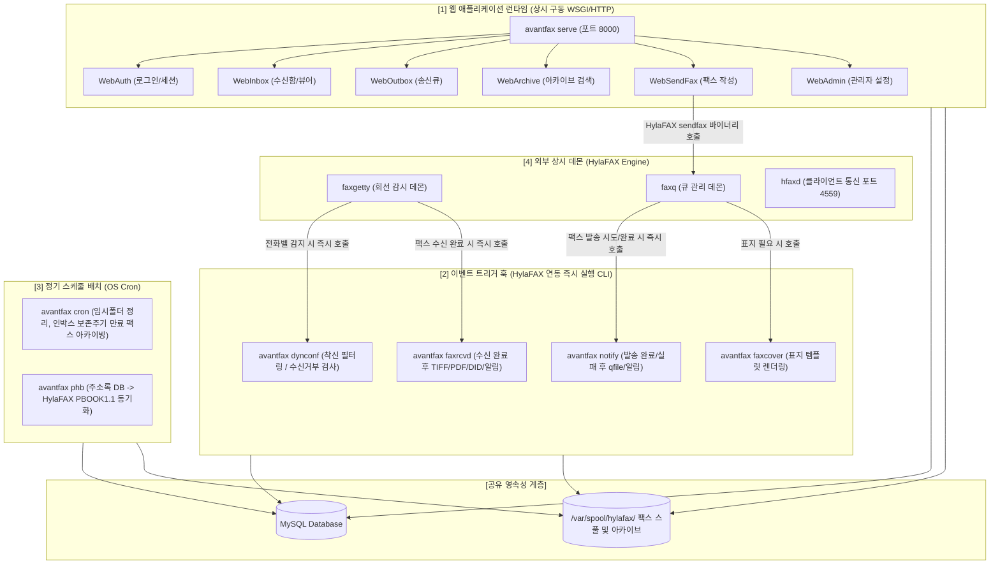
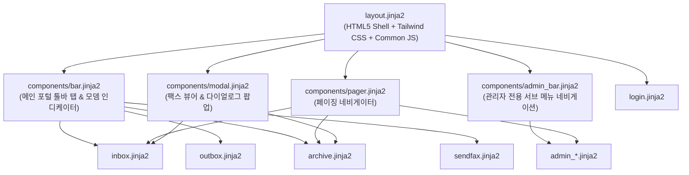

# NamiFAX Modern Enterprise Appliance Architecture

> **System Single Source of Truth (SSOT)**  
> **현재 상태: 전 모듈 및 화면 현대화 100% 완료 (37/37 모듈 이식, 33종 템플릿 UI 고도화, 전수 Mock/Stub 제거 및 실체 DB 연동 완료) | Web E2E Golden Master 68/68 PASS (100%) | Backend CLI Golden Master 20/20 PASS (100%) | pytest 단위 및 통합 테스트 296/296 PASS (100%) | 관리자(어플라이언스 다크 콘솔) & 사용자(모던 엔터프라이즈 포털) UI 2원화 완성 | 폐쇄망 설치형 환경 완벽 지원(Zero External CDN)**

---

## 1. System Overview (시스템 개요)

### 1.1 시스템 목적 및 비즈니스 역할
AvantFAX는 오픈소스 팩스 서버 엔진인 **HylaFAX**와 연동하여 동작하는 웹 기반 팩스 송수신 및 아카이브 관리 플랫폼입니다.
- **팩스 수신 파이프라인 (Incoming Flow)**: HylaFAX 데몬(`faxgetty`)이 팩스를 수신하면 `faxrcvd.php` 훅을 실행 -> DID 및 바코드 분석(`DIDRouting`, `BarcodeRouting`) -> TIFF를 PDF로 변환 및 썸네일 생성 -> DB 아카이브(`ArchiveIn`) 등록 -> 담당 사용자 이메일 발송 및 자동 인쇄 수행.
- **동적 수신 제어 (Dynamic Config)**: HylaFAX 착신 시 `dynconf.php`를 호출하여 발신자 번호(CallID) 블랙리스트 체크 및 수신 허용 여부 결정.
- **팩스 송신 파이프라인 (Outgoing Flow)**: 웹 UI(`sendfax.php`) 또는 이메일-투-팩스를 통해 문서 업로드/커버페이지 생성 -> HylaFAX 송신 큐(`sendfax` 바이너리)로 작업 등록 -> HylaFAX 완료 시 `notify.php` 훅 호출 -> 송신 아카이브(`ArchiveOut`) 등록 및 결과 알림.
- **주소록 및 사용자 권한 관리**: 회사/개인별 주소록(`AFAddressBook`), 모뎀별/DID별 권한 분기 및 패스워드 정책 관리(`AFUserAccount`).
- **웹 관리/사용자 인터페이스**: 인박스(수신함), 아웃박스(송신 큐 모니터링), 아카이브 검색/카테고리 분류, 시스템 관리(모뎀, 사용자, DID, 바코드, 시스템 로그).

### 1.2 아키텍처 전환 목표 (Target Architecture)
- **Target Language**: Python 3.11+
- **Target Web Framework**: Pyramid 2.x (REST API / WSGI 웹 애플리케이션)
- **Data Persistence**: SQLAlchemy (ORM & Core) + Alembic
- **Validation & Serialization**: Pydantic v2 & FormRules Python 포팅 모듈
- **Template Engine**: Jinja2 (레거시 Smarty 2.x 템플릿 1:1 마이그레이션)
- **Frontend & Styling**: **Tailwind CSS + Google Material Design 3 (M3) Theme Tokens** (M3 Baseline Palette, Surface Containers, Pill Buttons, Elevation Shadows, M3 Dark Admin Console)
- **HylaFAX / Process Interaction**: Python `subprocess` / `asyncio` 기반의 견고한 HylaFAX CLI 래퍼
- **Verification Strategy**: CLI 입출력 훅 및 웹 라우트별 HTML DOM / 폼 계약 / 비주얼 Golden Master 차분 검증
- **Migration Strategy**: 최하단 리프 모듈부터 단위 테스트 및 명세 기반으로 점진적 이식 후 FFI/Bridge 레이어로 레거시와 공존(Strangler Fig Pattern).


### 1.3 Runtime Topology & Execution Model (런타임 실행 모델 및 프로세스 분류)

AvantFAX 시스템은 **[1] 상시 실행 웹 서비스**, **[2] HylaFAX 이벤트 트리거 훅**, **[3] 정기 스케줄 배치**, **[4] 외부 상시 데몬(HylaFAX Core)**의 4가지 실행 계층으로 명확히 구분되어 유기적으로 동작합니다.



#### 런타임 영역별 상세 역할 및 프로세스 라이프사이클

| 구분 | 프로세스/모듈명 | 실행 트리거 및 구동 방식 | 수명 주기 (Lifecycle) | 주요 역할 및 비즈니스 로직 |
| :--- | :--- | :--- | :--- | :--- |
| **[1] 웹 서비스** | `namifax serve`<br>(`src/namifax/web/app.py`) | 시스템 부팅 시 systemd 또는 컨테이너에서 상시 구동 (WSGI/HTTP) | **상시 실행 (Persistent Daemon)** | • 사용자 브라우저 HTTP/REST API 요청 처리<br>• 인증 및 권한 확인(`WebAuth`)<br>• 수신 팩스 조회 및 PDF 스트리밍(`WebInbox`)<br>• 팩스 작성 및 발송 큐 등록(`WebSendFax`)<br>• 아카이브 검색/관리자 설정(`WebArchive`, `WebAdmin`) |
| **[2] 이벤트 훅** | `namifax dynconf`<br>(`src/namifax/cli/dynconf.py`) | HylaFAX `faxgetty` 데몬이 착신 벨을 감지할 때마다 즉시 실행 | **단발성 프로세스 (Ephemeral CLI)** | • CallID(발신자 번호) 수신 거부 블랙리스트 조회<br>• 수신 허용 여부를 HylaFAX에 동적 응답 |
| **[2] 이벤트 훅** | `namifax faxrcvd`<br>(`src/namifax/cli/faxrcvd.py`) | HylaFAX가 수신 팩스 TIFF 파일 저장을 마쳤을 때 즉시 실행 | **단발성 프로세스 (Ephemeral CLI)** | • 수신 TIFF 파일 검사 및 PDF/썸네일 변환<br>• DID 및 바코드 분석 후 수신 담당자 결정<br>• 수신 아카이브(`ArchiveIn`) 등록<br>• 담당자 이메일 발송 및 자동 프린터 출력 |
| **[2] 이벤트 훅** | `namifax notify`<br>(`src/namifax/cli/notify.py`) | HylaFAX `faxq`가 팩스 송신(성공, 재시도, 실패) 후 즉시 실행 | **단발성 프로세스 (Ephemeral CLI)** | • `qfile` 파싱 및 전송 결과 상태 확인<br>• 주소록(`AFAddressBook`) 회사 자동 생성/갱신<br>• 송신 아카이브(`ArchiveOut`) 등록<br>• 발신자에게 전송 결과 통지 이메일 발송 |
| **[2] 이벤트 훅** | `namifax faxcover`<br>(`src/namifax/cli/faxcover.py`) | `sendfax` 명령이 팩스 커버를 생성할 때 호출 | **단발성 프로세스 (Ephemeral CLI)** | • 커맨드라인 옵션 및 DB 사용자 정보 매핑<br>• PostScript/HTML 템플릿의 `XXXX-` 토큰 치환 렌더링 |
| **[3] 정기 배치** | `namifax cron`<br>(`src/namifax/cli/cron.py`) | OS crontab에 의해 정기적(예: 매일 자정)으로 실행 | **주기적 배치 (Scheduled Batch)** | • 임시 디렉터리(`/tmp/avantfax/`) 파일 삭제<br>• 인박스 보존 기한이 지난 팩스 아카이브 이동 및 정리 |
| **[3] 정기 배치** | `namifax phb`<br>(`src/namifax/cli/phb.py`) | OS crontab에 의해 정기적으로 실행 | **주기적 배치 (Scheduled Batch)** | • AvantFAX 주소록 DB를 HylaFAX 클라이언트용 `PBOOK1.1` 전화번호부 파일로 동기화 |
| **[4] 외부 데몬** | HylaFAX Core<br>(`faxq`, `faxgetty`, `hfaxd`) | OS 서비스(systemd)에서 상시 구동 | **상시 데몬 (External Engine)** | • 실제 모뎀 하드웨어 제어 및 전화선 신호 처리<br>• 전송 큐 스케줄링 및 팩스 프로토콜 송수신 |


---

## 2. Dependency Graph (DAG) & Topological Porting Order

모듈 간의 의존성을 정적 분석하고 순환 의존성을 제거하여 위상 정렬(Topological Sort)한 **포팅 실행 큐(Migration Queue)**입니다.
하위 리프 모듈(Level 0)부터 최상위 진입점(Level 5)까지 순차적으로 이식합니다.

```mermaid
flowchart TD
    subgraph L0["Level 0: Leaf Core Utilities & Persistence Driver"]
        M_SQL["SQL (DB Driver)"]
        M_MDBO["MDBO (Query Core)"]
        M_FormRules["FormRules (Validators)"]
        M_PWAuth["PWAuth (Auth Engine)"]
        M_PAMAuth["PAMAuth (PAM Backend)"]
        M_FileUpload["FileUpload (Storage)"]
        M_Mailer["Mailer (Email Dispatcher)"]
    end

    subgraph L1["Level 1: ORM Entities & Data Engine"]
        M_MDBObject["MDBObject (ORM Base)"]
        M_Entities["classes_entities (Data Models)"]
        M_MDBOData["MDBOData (Collection Handler)"]
    end

    subgraph L2["Level 2: Leaf Business Domain Modules"]
        M_Covers["Covers"]
        M_FaxCat["FaxPDFCategory"]
        M_UserPwd["AFUserPasswords"]
        M_DynConf["DynamicConfig"]
        M_Barcode["BarcodeRouting"]
        M_DID["DIDRouting"]
        M_Distro["DistributionList"]
        M_Modem["FaxModem"]
        M_Abook["AFAddressBook"]
        M_FaxArchive["FaxPDFArchive"]
    end

    subgraph L3["Level 3: Composite Business Domain & System Helpers"]
        M_UserAcc["AFUserAccount"]
        M_ArchiveIn["ArchiveIn"]
        M_ArchiveOut["ArchiveOut"]
        M_FaxQueue["FaxQueue"]
        M_Functions["functions (System Helpers)"]
    end

    subgraph L4["Level 4: CLI Hooks & System daemons"]
        M_dynconf_cli["dynconf (CLI Hook)"]
        M_phb_cli["phb (CLI Hook)"]
        M_cron["avantfaxcron (Cron Job)"]
        M_notify_cli["notify (CLI Hook)"]
        M_faxrcvd_cli["faxrcvd (CLI Hook)"]
        M_faxcover_cli["faxcover (CLI Hook)"]
    end

    subgraph L5["Level 5: Web UI & Controller Endpoints (Pyramid)"]
        M_WebAuth["WebAuth"]
        M_WebInbox["WebInbox"]
        M_WebOutbox["WebOutbox"]
        M_WebArchive["WebArchive"]
        M_WebSendFax["WebSendFax"]
        M_WebAdmin["WebAdmin"]
    end

    M_SQL --> M_MDBObject
    M_SQL --> M_Entities
    M_MDBObject --> M_Entities
    M_MDBO --> M_MDBOData
    M_Entities --> M_MDBOData

    M_MDBOData --> M_Covers
    M_MDBOData --> M_FaxCat
    M_MDBOData --> M_UserPwd
    M_MDBOData --> M_DynConf
    M_MDBOData --> M_Barcode
    M_MDBOData --> M_DID
    M_MDBOData --> M_Distro
    M_MDBOData --> M_Modem
    M_MDBOData --> M_Abook
    M_MDBOData --> M_FaxArchive

    M_UserPwd --> M_UserAcc
    M_MDBOData --> M_UserAcc
    M_FaxArchive --> M_ArchiveIn
    M_FaxArchive --> M_ArchiveOut
    M_UserAcc --> M_FaxQueue

    M_Abook --> M_Functions
    M_ArchiveIn --> M_Functions
    M_DID --> M_Functions
    M_Modem --> M_Functions
    M_Mailer --> M_Functions

    M_DynConf --> M_dynconf_cli
    M_Abook --> M_phb_cli
    M_ArchiveIn --> M_cron
    M_ArchiveOut --> M_notify_cli
    M_UserAcc --> M_notify_cli
    M_Functions --> M_notify_cli
    M_Barcode --> M_faxrcvd_cli
    M_DID --> M_faxrcvd_cli
    M_Modem --> M_faxrcvd_cli
    M_ArchiveIn --> M_faxrcvd_cli
    M_Functions --> M_faxrcvd_cli
    M_Functions --> M_faxcover_cli

    M_UserAcc --> M_WebAuth
    M_PWAuth --> M_WebAuth
    M_PAMAuth --> M_WebAuth
    M_ArchiveIn --> M_WebInbox
    M_FaxQueue --> M_WebOutbox
    M_FaxArchive --> M_WebArchive
    M_FaxQueue --> M_WebSendFax
    M_FileUpload --> M_WebSendFax
    M_Covers --> M_WebSendFax
    M_Admin_Deps["Admin Modules"] --> M_WebAdmin
```



---

## 3. Common Data Models (공통 데이터 모델 정의)

MySQL 스키마(`create_tables.sql`)를 기준으로 신규 Python 시스템(`SQLAlchemy` 및 `Pydantic`)에서 공유할 데이터 모델 명세입니다.

| 모델명 | 레거시 테이블 | 주 키 (PK) | 핵심 컬럼 및 타입 | 설명 |
| :--- | :--- | :--- | :--- | :--- |
| `UserAccount` | `UserAccount` | `uid` (INT) | `username` (str), `password` (str, hash), `email` (str), `superuser` (bool), `is_admin` (bool), `modemdevs` (str/list), `didrouting` (str/list), `faxcats` (str/list), `pwdexpire` (date), `acc_enabled` (bool) | 사용자 계정 및 권한 제어 모델 |
| `UserPasswords`| `UserPasswords`| `upid` (INT) | `uid` (FK -> UserAccount.uid), `pwdhash` (str) | 패스워드 이력 관리(재사용 방지) |
| `AddressBook` | `AddressBook` | `abook_id` (INT) | `company` (str) | 주소록 회사 정보 |
| `AddressBookEmail`| `AddressBookEmail`| `abookemail_id` (INT) | `abook_id` (FK -> AddressBook.abook_id), `contact_name` (str), `contact_email` (str) | 회사별 이메일 연락처 |
| `AddressBookFAX`| `AddressBookFAX` | `abookfax_id` (INT) | `abook_id` (FK -> AddressBook.abook_id), `faxnumber` (str), `email` (str), `to_person` (str), `faxcatid` (INT), `printer` (str) | 회사별 팩스 번호 및 라우팅 설정 |
| `Modems` | `Modems` | `devid` (INT) | `device` (str, e.g. ttyS0), `alias` (str), `contact` (str), `printer` (str), `faxcatid` (INT) | 팩스 모뎀 장치 설정 |
| `CoverPages` | `CoverPages` | `cover_id` (INT) | `title` (str), `file` (str) | 팩스 표지 템플릿 파일 매핑 |
| `DIDRoute` | `DIDRoute` | `didr_id` (INT) | `routecode` (str), `alias` (str), `contact` (str), `printer` (str), `faxcatid` (INT) | DID 착신 번호별 라우팅 규칙 |
| `BarcodeRoute` | `BarcodeRoute` | `barcode_id` (INT) | `barcode` (str), `alias` (str), `contact` (str), `printer` (str), `faxcatid` (INT) | 바코드 인식 기반 라우팅 규칙 |
| `FaxArchive` | `FaxArchive` | `fid` (INT) | `faxnumid` (INT), `companyid` (INT), `faxpath` (str), `pages` (INT), `faxcatid` (INT), `didr_id` (INT), `archstamp` (datetime), `modemdev` (str), `userid` (INT), `origfaxnum` (str), `faxcontent` (text), `inbox` (bool) | 송/수신 팩스 아카이브 및 OCR 메타데이터 |
| `FaxCategory` | `FaxCategory` | `catid` (INT) | `name` (str) | 팩스 카테고리 태그 |
| `DistroList` | `DistroList` | `dl_id` (INT) | `listname` (str), `listdata` (text), `lastmod_date` (timestamp), `lastmod_user` (INT) | 팩스 동보 전송용 배포 그룹 |
| `DynConf` | `DynConf` | `dynconf_id` (INT) | `device` (str), `callid` (str) | 수신 거부 블랙리스트 |
| `SysLog` | `SysLog` | `syslogid` (INT) | `logdate` (timestamp), `logtext` (text) | 시스템 감사 및 에러 로그 |

---

## 4. Porting Status Matrix (포팅 진행 현황 매트릭스)

- 상태 정의:
  - `[PENDING]`: 포팅 대기 중
  - `[IN_PROGRESS]`: 명세 추출, 테스트 작성 또는 코드 작성 진행 중
  - `[FFI_BRIDGED]`: (폐기) 이식 중 PHP와 공존하기 위한 브리지가 연결된 상태. 브리지는 제거되었고(17.8), 이 상태였던 모듈은 모두 `[COMPLETE]`다
  - `[COMPLETE]`: 전 계층 이식 완료 및 E2E 검증 통과

| 순번 | 모듈명 | 레거시 파일 위치 | 타깃 신규 모듈 위치 | 상태 | 의존 모듈 | 비고 |
| :---: | :--- | :--- | :--- | :---: | :--- | :--- |
| **01** | `SQL` | `includes/SQL.php` | `src/namifax/db/provider.py` (SQLAlchemy 엔진·세션) | `[COMPLETE]` | Leaf | 모던 DB 엔진 구현, 단위 테스트 통과  |
| **02** | `MDBO` | `includes/MDBO.php` | SQLAlchemy 표현식 + `db/orm_repository.py` | `[COMPLETE]` | Leaf | 쿼리 빌더 및 CRUD 유틸 구현, 단위 테스트 통과  |
| **03** | `FormRules` | `includes/FormRules.php` | `src/namifax/common/validators.py` | `[COMPLETE]` | Leaf | 폼/이메일/날짜 검증기 구현, 단위 테스트 통과  |
| **04** | `PWAuth` | `includes/PWAuth.php` | `src/namifax/auth/password.py` | `[COMPLETE]` | Leaf | pwauth 백엔드 및 MD5 해시 관리자 구현, 단위 테스트 통과  |
| **05** | `PAMAuth` | `includes/PAMAuth.php` | `src/namifax/auth/pam.py` | `[COMPLETE]` | Leaf | 시스템 PAM 인증 백엔드 구현, 단위 테스트 통과  |
| **06** | `FileUpload` | `includes/FileUpload.php` | `src/namifax/common/upload.py` | `[COMPLETE]` | Leaf | 파일 업로드 검증 및 이동 모듈 구현, 단위 테스트 통과  |
| **07** | `Mailer` | `includes/Mailer.php` | `src/namifax/services/mailer.py` | `[COMPLETE]` | Leaf | 이메일 발송 및 첨부파일 처리 서비스 구현, 단위 테스트 통과  |
| **08** | `MDBObject` | `includes/MDBObject.php` | `models/meta.py` (`Base`) + `db/orm_repository.py` (`OrmRecord`) | `[COMPLETE]` | 01 | ORM ActiveRecord 베이스 클래스 구현, 단위 테스트 통과  |
| **09** | `classes_entities` | `includes/classes.php` | `src/namifax/models/*.py` (SQLAlchemy 모델 20개) | `[COMPLETE]` | 01, 08 | 14개 테이블 엔티티 클래스 구현, 단위 테스트 통과  |
| **10** | `MDBOData` | `includes/MDBOData.php` | `src/namifax/db/repository.py` | `[COMPLETE]` | 02, 09 | CRUD 공통 레포지토리 구현, 단위 테스트 통과  |
| **11** | `Covers` | `includes/Covers.php` | `src/namifax/services/covers.py` | `[COMPLETE]` | 09, 10 | 팩스 표지 템플릿 관리 서비스 구현, 단위 테스트 통과  |
| **12** | `FaxPDFCategory` | `includes/FaxPDFCategory.php` | `src/namifax/services/categories.py` | `[COMPLETE]` | 09, 10 | 카테고리 관리 서비스 구현, 단위 테스트 통과  |
| **13** | `AFUserPasswords` | `includes/AFUserPasswords.php` | `src/namifax/services/user_passwords.py` | `[COMPLETE]` | 09, 10 | 비밀번호 이력 관리 서비스 구현, 단위 테스트 통과  |
| **14** | `DynamicConfig` | `includes/DynamicConfig.php` | `src/namifax/services/dynconf.py` | `[COMPLETE]` | 09, 10 | 블랙리스트 필터링 서비스 구현, 단위 테스트 통과  |
| **15** | `BarcodeRouting` | `includes/BarcodeRouting.php` | `src/namifax/services/barcode.py` | `[COMPLETE]` | 09, 10 | 바코드 기반 라우팅 규칙 서비스 구현, 단위 테스트 통과  |
| **16** | `DIDRouting` | `includes/DIDRouting.php` | `src/namifax/services/did.py` | `[COMPLETE]` | 09, 10 | DID 번호 기반 라우팅 규칙 서비스 구현, 단위 테스트 통과  |
| **17** | `DistributionList` | `includes/DistributionList.php`| `src/namifax/services/distro.py` | `[COMPLETE]` | 09, 10 | 동보 전송 목록 관리 서비스 구현, 단위 테스트 통과  |
| **18** | `FaxModem` | `includes/FaxModem.php` | `src/namifax/services/modem.py` | `[COMPLETE]` | 09, 10 | 모뎀 장치 관리 및 faxstat 상태 파싱 서비스 구현, 단위 테스트 통과  |
| **19** | `AFAddressBook` | `includes/AFAddressBook.php` | `src/namifax/services/addressbook.py` | `[COMPLETE]` | 09, 10 | 회사/팩스번호/이메일 연락처 통합 주소록 서비스 구현, 단위 테스트 통과  |
| **20** | `FaxPDFArchive` | `includes/FaxPDFArchive.php` | `src/namifax/services/archive_base.py` | `[COMPLETE]` | 09, 10 | 팩스 아카이브 메타데이터 관리, 권한 검사, 인박스/검색 페이징, 삭제/정리 서비스 구현, 단위 테스트 통과  |
| **21** | `AFUserAccount` | `includes/AFUserAccount.php` | `src/namifax/services/user_account.py` | `[COMPLETE]` | 09, 10, 13 | 사용자 계정 관리, 인증, 세션, 접근제어 및 비밀번호 정책 서비스 구현, 단위 테스트 통과  |
| **22** | `dynconf` (CLI) | `includes/dynconf.php` | `src/namifax/cli/dynconf.py` | `[COMPLETE]` | 14 | HylaFAX DynConf 수신 콜 필터링 CLI 엔트리포인트 구현 및 E2E Golden Master (01~03) 100% 통과 |
| **23** | `phb` (CLI) | `includes/phb.php` | `src/namifax/cli/phb.py` | `[COMPLETE]` | 19 | HylaFAX PBOOK1.1 포맷 전화번호부 자동 생성 CLI 배치 구현 및 단위 테스트 통과 |
| **24** | `ArchiveIn` | `includes/ArchiveIn.php` | `src/namifax/services/archive_in.py` | `[COMPLETE]` | 09, 20 | 수신 팩스 아카이빙, 인박스 관리, 이미지 회전, 오래된 팩스 보관 처리 서비스 구현  |
| **25** | `ArchiveOut` | `includes/ArchiveOut.php` | `src/namifax/services/archive_out.py` | `[COMPLETE]` | 09, 20 | 송신 팩스 아카이빙, 발신자/회사 바인딩, 아카이브 직접 저장 서비스 구현  |
| **26** | `FaxQueue` | `includes/FaxQueue.php` | `src/namifax/services/faxqueue.py` | `[COMPLETE]` | 09, 21 | HylaFAX 작업 큐 제어, 상태 파싱, 소유자 매핑, 작업 취소/속성 변경 서비스 구현  |
| **27** | `functions` | `includes/functions.php` | `src/namifax/common/helpers.py` | `[COMPLETE]` | 09, 10, 16, 18, 19, 24, 07 | 전역 문자열/파일/이메일/주소록 조회/로깅 유틸리티 함수군 구현 및 단위 테스트 통과 |
| **28** | `avantfaxcron` | `includes/avantfaxcron.php` | `src/namifax/cli/cron.py` | `[COMPLETE]` | 20, 24 | 정기 배치 및 팩스 파일/임시폴더 정리 CLI 구현 및 E2E Golden Master (04~05) 100% 통과 |
| **29** | `notify` (CLI) | `includes/notify.php` | `src/namifax/cli/notify.py` | `[COMPLETE]` | 19, 21, 25, 27 | HylaFAX 송신 알림 CLI 구현 및 E2E Golden Master (09~11) 100% 통과 |
| **30** | `faxrcvd` (CLI) | `includes/faxrcvd.php` | `src/namifax/cli/faxrcvd.py` | `[COMPLETE]` | 15, 16, 18, 19, 24, 27 | HylaFAX 수신 처리 핵심 훅 구현 및 E2E Golden Master (12~14) 100% 통과 |
| **31** | `faxcover` (CLI) | `includes/faxcover.php` | `src/namifax/cli/faxcover.py` | `[COMPLETE]` | 09, 27 | HylaFAX 팩스 커버 생성 CLI 구현 및 E2E Golden Master (06~08) 100% 통과 |
| **32** | `WebAuth` | `check_login.php`, `logout.php` | `src/namifax/web/views/auth.py` | `[COMPLETE]` | 04, 05, 21, 27 | 로그인/로그아웃 뷰 및 인증 미들웨어 구현 및 단위 테스트 통과 |
| **33** | `WebInbox` | `inbox.php`, `viewfax.php` | `src/namifax/web/views/inbox.py` | `[COMPLETE]` | 19, 21, 24, 27 | 수신함 뷰 및 다운로드 API 구현 및 단위 테스트 통과 |
| **34** | `WebOutbox` | `outbox.php` | `src/namifax/web/views/outbox.py` | `[COMPLETE]` | 21, 26, 27 | 송신 큐 뷰 및 제어 API 구현 및 단위 테스트 통과 |
| **35** | `WebArchive` | `archive.php`, `search.php` | `src/namifax/web/views/archive.py` | `[COMPLETE]` | 19, 20, 21, 27 | 팩스 검색 및 아카이브 뷰 구현 및 단위 테스트 통과 |
| **36** | `WebSendFax` | `sendfax.php`, `upload_*.php` | `src/namifax/web/views/sendfax.py` | `[COMPLETE]` | 06, 11, 19, 21, 26, 27 | 팩스 작성 및 전송 뷰 구현 및 단위 테스트 통과 |
| **37** | `WebAdmin` | `admin/*.php` | `src/namifax/web/views/admin.py` | `[COMPLETE]` | 12, 14, 15, 16, 17, 18, 21, 27 | 시스템 관리자 뷰 및 설정 API 구현 및 단위 테스트 통과 |
| **39** | `AdminSmtpGateway` | `NEW` (엔터프라이즈) | `src/namifax/services/smtp_settings.py`, `src/namifax/views/admin.py` | `[COMPLETE]` | 07 | 외부 SMTP 게이트웨이 웹 설정 및 실시간 연결 진단 도구 완료 |
| **40** | `StorageLifecycle` | `NEW` (엔터프라이즈) | `src/namifax/services/storage_lifecycle.py`, `src/namifax/cli/cron.py` | `[COMPLETE]` | 28 | 로컬 원본 TIFF 선별 삭제 및 원격 클라우드 객체 통합 수명주기 엔진 완료 |
| **41** | `CloudStorage` | `NEW` (엔터프라이즈) | `src/namifax/services/cloud_storage.py` | `[COMPLETE]` | 40 | AWS S3, MinIO, GCS 호환 멀티 클라우드 오브젝트 스토리지 연동 완료 |
| **42** | `NetworkPrinter` | `NEW` (엔터프라이즈) | `src/namifax/services/printer.py`, `src/namifax/cli/print_in.py` | `[COMPLETE]` | 01, 16, 26 | 네트워크 실물 프린터 직접 연동(RAW 9100) 및 CUPS Print-to-Fax 인바운드 파이프라인 완료 |
| **43** | `TotpAuth` | `NEW` (엔터프라이즈) | `src/namifax/services/totp.py`, `src/namifax/views/auth.py` | `[COMPLETE]` | 04, 21, 32 | RFC 6238 TOTP 2단계 인증, QR 프로비저닝 및 비상 복구 백업 코드 완료 |
| **44** | `CoverStudio` | `NEW` (엔터프라이즈) | `src/namifax/services/cover_studio.py`, `src/namifax/views/admin.py` | `[COMPLETE]` | 03, 32 | 팩스 표지 템플릿(PS/HTML/PDF) 렌더링 엔진, 동적 태그 치환 및 가이드 UI 완료 |
| **45** | `WebAuthnPasskeys` | `NEW` (엔터프라이즈) | `src/namifax/services/webauthn.py`, `src/namifax/views/webauthn.py` | `[COMPLETE]` | 04, 21, 32 | W3C WebAuthn / FIDO2 Passkeys 생체인증/패스워드리스 인증 및 REST API 완료 |
| **46** | `SAML2SSO` | `NEW` (엔터프라이즈) | `src/namifax/services/saml.py`, `src/namifax/views/saml.py` | `[COMPLETE]` | 04, 21, 32 | SAML 2.0 엔터프라이즈 SP 메타데이터, AuthnRequest, Response 파싱 및 JIT 프로비저닝 완료 |
| **47** | `OcrTextExtraction` | `NEW` (엔터프라이즈) | `src/namifax/services/ocr.py`, `src/namifax/cli/faxrcvd.py` | `[COMPLETE]` | 01, 16, 26 | Tesseract OCR 기반 수신 팩스 본문 텍스트 자동 추출 및 전문 검색(Full-Text Search) 인덱싱 완료 |

---

## 5. Dead Code & Removed Logic Protocol (제거 대상 로직 기록)

레거시 PHP 5 전용 구형 문법 및 보안상 취약/더 이상 불필요한 코드는 이식 대상에서 제외하고 아래에 명시합니다:
1. `__autoload()` 전역 함수: Python의 표준 `import` 패키징 체계로 대체.
2. `magic_quotes_gpc` 및 `register_globals` 대응 로직: Python/Pyramid의 Request 파라미터 바인딩으로 대체.
3. PHP `Smarty 2.x` 엔진: Jinja2 또는 순수 REST API + SPA 뷰로 점진 교체.
4. `mysql_*` 레거시 함수군: SQLAlchemy Core/ORM connection pool로 전면 현대화.
5. `eval()` 또는 가변 변수(`$$var`) 패턴: Python 사전(dict) 또는 정적 속성 매핑으로 엄격화.

---

## 6. Verification & Golden Master Strategy

### 6.1 Phase 2: E2E Golden Master Test Suite 구축 완료
- **테스트 러너 스크립트**: `golden_master/runner.py` (CLI 차분 검증기) 및 `golden_master/test_e2e.py` (pytest 연동)
- **도커 격리 환경**: `golden_master/Dockerfile.legacy` (PHP 5.6 + mysqli + PEAR MDB2 기반 레거시 순수 환경)
- **구축된 시나리오 (14개)**:
  1. `01_dynconf_no_args`: 인자 없는 호출 시 사용법 출력 및 반환코드 검증
  2. `02_dynconf_empty_callid`: 디바이스명만 전달되고 CallID가 비어있는 케이스 검증
  3. `03_dynconf_sip_number`: SIP 포맷(`sip:12345@domain.com`)의 착신 번호 전처리 검증
  4. `04_avantfaxcron_no_args`: 필수 플래그(`-t`) 누락 시 크론 사용법 출력 검증
  5. `05_avantfaxcron_invalid_opt`: 유효하지 않은 CLI 옵션 플래그 전달 시 에러 검증
  6. `06_faxcover_no_args`: 인자 없는 표지 생성기 호출 시 Usage 출력 검증
  7. `07_faxcover_missing_number`: 발신자(`-f`)만 지정되고 수신번호(`-n`) 누락 시 검증
  8. `08_faxcover_missing_from`: 수신번호(`-n`)만 지정되고 발신자(`-f`) 누락 시 검증
  9. `09_notify_no_args`: 알림 훅 스크립트 인자 누락 시 사용법 출력 검증
  10. `10_notify_missing_why`: `why` 상태값 인자 누락 케이스 검증
  11. `11_notify_missing_qfile_file`: 존재하지 않는 qfile 경로 입력 시 에러 검증
  12. `12_faxrcvd_no_args`: 수신 훅 스크립트 인자 누락 시 사용법 출력 검증
  13. `13_faxrcvd_missing_args`: 필수 인자 3개 누락 케이스 검증
  14. `14_faxrcvd_nonexistent_file`: 존재하지 않는 수신 TIFF 파일 입력 시 에러 처리 검증
- **검증 데이터 저장소**: `golden_master/data/<scenario_id>/` (stdout, stderr, exit_code, meta.json 보관 완료)
- **차분 검증 실행법**:
  - `python3 golden_master/runner.py --verify`
  - `pytest golden_master/test_e2e.py`

---

## 7. Modern Pyramid Security Policy & Authorization Architecture

NamiFAX는 Pyramid 2.x 표준 보안 아키텍처에 따라 세션 쿠키 인증 및 ACL 기반 인가 체계를 완전히 분리·통합하여 구현했습니다.

### 7.1 Security Policy (`namifax.security.NamiFaxSecurityPolicy`)
- **인터페이스**: Pyramid 2.0+ `ISecurityPolicy` 구현
  - `identity(request)`: 세션 또는 Authorization 토큰을 검증하여 인증된 사용자 정보(`{"uid", "username", "is_admin", ...}`) 반환
  - `authenticated_userid(request)`: 현재 사용자의 `username` 반환
  - `permits(request, context, permission)`: 컨텍스트의 `__acl__`과 사용자의 그룹/역할(`role:admin`, `role:user`, `Authenticated`, `Everyone`)을 대조하여 허용(`Allowed`) 또는 거부(`Denied`) 판정
  - `remember(request, userid, **kw)` / `forget(request, **kw)`: 인증 쿠키 및 세션 발급/파기

### 7.2 ACL Context (`namifax.security.RootContext`)
모든 뷰의 루트 컨텍스트에서 다음 접근 제어 규칙을 선언합니다:
- `(Allow, Everyone, 'public')`: 비로그인 사용자 및 전체 공개 리소스 접근 허용
- `(Allow, Authenticated, 'view')`: 로그인된 모든 사용자에게 조회 권한 허용 (수신함, 팩스 뷰어)
- `(Allow, Authenticated, 'send_fax')`: 로그인된 사용자에게 팩스 전송 및 파일 업로드 권한 허용
- `(Allow, 'role:admin', 'admin')`: 관리자 권한(`is_admin=True` 또는 `superuser=True`) 사용자에게만 시스템 설정 및 장치 제어 허용
- `DENY_ALL`: 명시되지 않은 모든 권한은 기본 차단

### 7.3 Pyramid Views 인가 선언
- `@view_config(route_name='home', permission='public')`: 메인 화면
- `@view_config(route_name='auth_login', permission='public')`: 로그인 화면
- `@view_config(route_name='inbox', permission='view')`: 수신함 (미인증 시 401 차단)
- `@view_config(route_name='sendfax', permission='send_fax')`: 팩스 발송 (미인증 시 401 차단)
- `@view_config(route_name='admin', permission='admin')`: 시스템 관리 (일반 사용자 접근 시 403 Forbidden)
- `@forbidden_view_config`: 인증되지 않은 사용자는 401 또는 로그인 리다이렉트, 권한이 부족한 사용자는 403 Forbidden 오류 응답 렌더링

---

## 8. Deployment & Operational Guide (NamiFAX 배포 및 운영 가이드)

### 8.1 Python Environment & Packaging with `uv` (`uv init --package`)
NamiFAX는 초고속 모던 패키지 관리자인 **`uv`**를 기반으로 패키징 및 가상환경을 관리합니다:
- **프로젝트 규격**: `uv init --package` 기반 패키지 템플릿 적용 (`build-backend = "uv_build"`, PEP 621 / PEP 735 표준).
- **의존성 락파일**: `uv.lock`을 통해 정확하고 재현 가능한 패키지 버전 고정.
- **주요 명령어**:
  ```bash
  # 가상환경 생성 및 전체 의존성/패키지 동기화
  uv sync

  # 개발/테스트 의존성 포함 실행
  uv run pytest
  uv run python golden_master/runner.py --verify

  # NamiFAX CLI 명령어 실행
  uv run namifax --help
  uv run namifax serve --port 8000
  ```

### 8.2 Entry Points & CLI Shortcuts (`pyproject.toml`)
HylaFAX 이벤트 훅 및 수동 배치 트리거를 위해 등록된 전용 실행 엔트리포인트:

| 명령어 | 매핑 함수 / 스크립트 | 용도 및 설명 |
| :--- | :--- | :--- |
| `namifax` | `namifax.main:main` | 통합 NamiFAX CLI 도구 (모든 서브커맨드 디스패치) |
| `namifax-server` | `namifax.main:serve_main` | 통합 HTTP/REST 웹 서비스 기동 (APScheduler 내장 모드) |
| `namifax-scheduler` | `namifax.main:scheduler_main` | 단독 백그라운드 스케줄러 데몬 기동 |
| `namifax-dynconf` | `namifax.main:dynconf_main` | HylaFAX `faxgetty` 동적 착신 필터링 훅 |
| `namifax-faxrcvd` | `namifax.main:faxrcvd_main` | HylaFAX 수신 완료 후 TIFF/PDF/DID/알림 처리 훅 |
| `namifax-notify` | `namifax.main:notify_main` | HylaFAX 발송 완료/실패 후 알림 처리 훅 |
| `namifax-faxcover` | `namifax.main:faxcover_main` | HylaFAX 팩스 커버페이지 생성 훅 |
| `namifax-cron` | `namifax.main:cron_main` | 임시 디렉터리 정리 및 보존주기 만료 팩스 정리 (수동 트리거) |
| `namifax-phb` | `namifax.main:phb_main` | 주소록 DB -> HylaFAX PBOOK1.1 동기화 (수동 트리거) |

### 8.3 정기 배치 관리: APScheduler
OS `crontab` 대신 **`APScheduler` (`BackgroundScheduler`)**를 사용하여 파이썬 프로세스 내에서 안정적으로 주기를 관리합니다:
- **`job_cron_maintenance`**: 매일 00:00(자정)에 실행되어 임시파일(`/tmp/avantfax`) 삭제 및 보존기한 만료 팩스 아카이빙 수행.
- **`job_phonebook_sync`**: 매시간 정각(00분)에 주소록 DB를 `PBOOK1.1` 파일로 자동 동기화.
- 웹 서버 기동 시(`namifax serve` / `pserve development.ini`) 자동으로 백그라운드 스케줄러가 함께 활성화되며, 서버 분리 환경을 위해 `namifax scheduler` 단독 데몬으로도 실행할 수 있습니다.

### 8.4 상시 실행 데몬: systemd 서비스 구성

#### 1) 통합 서비스 유닛 (`systemd/namifax.service`)
```ini
[Unit]
Description=NamiFAX Enterprise Fax Web and Scheduler Service
After=network.target hylafax.service

[Service]
Type=simple
User=uucp
Group=uucp
WorkingDirectory=/opt/namifax
ExecStart=/opt/namifax/.venv/bin/namifax serve --host 0.0.0.0 --port 8000
Restart=always
RestartSec=5

[Install]
WantedBy=multi-user.target
```

#### 2) 서비스 등록 및 관리 명령
```bash
# 1. 서비스 파일 복사
sudo cp systemd/namifax.service /etc/systemd/system/

# 2. systemd 데몬 리로드 및 서비스 활성화
sudo systemctl daemon-reload
sudo systemctl enable namifax.service

# 3. 서비스 시작 및 상태 확인
sudo systemctl start namifax.service
sudo systemctl status namifax.service

# 4. 실시간 로그 모니터링
sudo journalctl -u namifax.service -f
```

---

## 9. Frontend & Web Routing Architecture (Pyramid + Jinja2 + Tailwind CSS)

NamiFAX 웹 프런트엔드는 레거시 PHP 컨트롤러와 Smarty 템플릿(`.tpl`) 엔진 구조를 모던 **Pyramid 2.x 뷰 컨트롤러** + **Jinja2 템플릿** + **Tailwind CSS** 체계로 완벽하게 1:1 대응하여 이식합니다.

### 9.1 레거시 웹 라우팅 $\leftrightarrow$ Pyramid 라우팅 전수 매핑 테이블

| 순번 | 레거시 PHP 엔드포인트 | Pyramid Route Name | HTTP Method | URL Pattern | 권한 (ACL Permission) | 템플릿 매핑 (Smarty $\rightarrow$ Jinja2) |
| :---: | :--- | :--- | :---: | :--- | :---: | :--- |
| **W01** | `index.php` | `home` / `auth_login` | GET, POST | `/` 또는 `/login` | `public` | `index.tpl` $\rightarrow$ `login.jinja2` |
| **W02** | `logout.php` | `auth_logout` | GET, POST | `/logout` | `public` | 리다이렉트 응답 (`home`) |
| **W03** | `forgot.php` | `auth_forgot` | GET, POST | `/forgot` | `public` | `forgot.tpl` $\rightarrow$ `forgot.jinja2` |
| **W04** | `pwdexpired.php` | `auth_pwdexpired` | GET, POST | `/pwdexpired` | `public` | `pwdexpired.tpl` $\rightarrow$ `pwdexpired.jinja2` |
| **W05** | `inbox.php` | `inbox` | GET, POST | `/inbox` | `view` | `inbox.tpl` $\rightarrow$ `inbox.jinja2` |
| **W06** | `viewfax.php` | `viewfax` | GET | `/viewfax` | `view` | `viewfax.tpl` $\rightarrow$ `viewfax.jinja2` |
| **W07** | `pdf.php` / `file.php` | `fax_download` | GET | `/faxes/download/{fid}` | `view` | 바이너리 스트리밍 (PDF/TIFF) |
| **W08** | `rotate.php` | `fax_rotate` | POST | `/faxes/rotate/{fid}` | `view` | JSON 응답 (`{"status": "ok"}`) |
| **W09** | `outbox.php` | `outbox` | GET, POST | `/outbox` | `view` | `outbox.tpl` $\rightarrow$ `outbox.jinja2` |
| **W10** | `sendfax.php` | `sendfax` | GET, POST | `/sendfax` | `send_fax` | `sendfax.tpl` $\rightarrow$ `sendfax.jinja2` |
| **W11** | `archive.php` | `archive` | GET, POST | `/archive` | `view` | `archive.tpl` $\rightarrow$ `archive.jinja2` |
| **W12** | `search.php` | `archive_search` | GET, POST | `/search` | `view` | `search.tpl` $\rightarrow$ `search.jinja2` |
| **W13** | `addressbook.php` | `addressbook` | GET | `/addressbook` | `view` | `addressbook.tpl` $\rightarrow$ `addressbook.jinja2` |
| **W14** | `addressbook_edit.php`| `addressbook_edit` | GET, POST | `/addressbook/edit` | `view` | `addressbook_edit.tpl` $\rightarrow$ `addressbook_edit.jinja2` |
| **W15** | `distrolist.php` | `distrolist` | GET | `/distrolist` | `view` | `distrolist.tpl` $\rightarrow$ `distrolist.jinja2` |
| **W16** | `distrolist_edit.php` | `distrolist_edit` | GET, POST | `/distrolist/edit` | `view` | `distrolist_edit.tpl` $\rightarrow$ `distrolist_edit.jinja2` |
| **W17** | `settings.php` | `user_settings` | GET, POST | `/settings` | `view` | `settings.tpl` $\rightarrow$ `settings.jinja2` |
| **W18** | `admin/index.php` | `admin_dashboard` | GET | `/admin` | `admin` | `admin.tpl` $\rightarrow$ `admin.jinja2` |
| **W19** | `admin/users.php` | `admin_users` | GET, POST | `/admin/users` | `admin` | `users.tpl` $\rightarrow$ `admin_users.jinja2` |
| **W20** | `admin/modems.php` | `admin_modems` | GET, POST | `/admin/modems` | `admin` | `conf_modems.tpl` $\rightarrow$ `admin_modems.jinja2` |
| **W21** | `admin/did.php` | `admin_did` | GET, POST | `/admin/did` | `admin` | `conf_didroute.tpl` $\rightarrow$ `admin_did.jinja2` |
| **W22** | `admin/barcodes.php` | `admin_barcodes` | GET, POST | `/admin/barcodes` | `admin` | `conf_barcoderoute.tpl` $\rightarrow$ `admin_barcodes.jinja2` |
| **W23** | `admin/covers.php` | `admin_covers` | GET, POST | `/admin/covers` | `admin` | `conf_covers.tpl` $\rightarrow$ `admin_covers.jinja2` |
| **W24** | `admin/categories.php`| `admin_categories`| GET, POST | `/admin/categories` | `admin` | `fax_categories.tpl` $\rightarrow$ `admin_categories.jinja2`|
| **W25** | `admin/dynconf.php` | `admin_dynconf` | GET, POST | `/admin/dynconf` | `admin` | `conf_dynconf.tpl` $\rightarrow$ `admin_dynconf.jinja2` |
| **W26** | `admin/syslog.php` | `admin_syslog` | GET | `/admin/syslog` | `admin` | `system_logs.tpl` $\rightarrow$ `admin_syslog.jinja2` |
| **W27** | `ajax/*.php` | `api_*` | GET, POST | `/api/*` | `view` / `admin` | JSON 응답 API |

### 9.2 Jinja2 컴포넌트 상속 구조


### 9.3 뷰 데이터 계약 (View Data Contract)
Pyramid 뷰 컨트롤러는 Jinja2 템플릿에 다음 표준 컨텍스트 딕셔너리를 일관되게 주입합니다:
- `current_user`: 세션 사용자 정보 (`uid`, `username`, `is_admin`, `superuser`)
- `lang`: 다국어 번역 문자열 맵 (레거시 `$LANG` 완전 대응)
- `active_tab`: 현재 활성화된 네비게이션 탭 식별자 (`inbox`, `outbox`, `sendfax`, `archive`, `admin`)
- `server_name` / `version`: 시스템 메타정보 (`NamiFAX v3.3.5`)
- `modem_status`: 활성 팩스 모뎀 목록 및 실시간 상태 (`IDLE`, `SENDING`, `RECEIVING`)
- `error` / `form_errors`: 폼 검증 에러 및 알림 메시지 목록

---

## 10. Modern Tailwind CSS Design System & Visual Fidelity

레거시 AvantFAX의 Web 2.0 비주얼을 모던 유틸리티 CSS 프레임워크인 **Tailwind CSS**로 충실히 재현(UI Fidelity)하기 위한 디자인 시스템 명세입니다.

### 10.1 색상 및 디자인 토큰 매핑

| 디자인 요소 | 레거시 AvantFAX 원본 값 | Tailwind CSS 유틸리티 클래스 | 적용 대상 |
| :--- | :--- | :--- | :--- |
| **Primary Brand** | `#336699` (Navy Blue) | `bg-[#336699]`, `text-[#336699]`, `border-[#336699]` | 상단 툴바, 활성 탭, 헤더 타이틀, 주요 버튼 |
| **Accent Alert** | `#993300` (Brick Red) | `text-[#993300]`, `bg-red-50`, `border-red-300` | 오류 메시지, 비밀번호 찾기 링크, 삭제 경고 |
| **Toolbar Background** | `#e6e6e6` / `#cccccc` | `bg-slate-200`, `border-slate-300` | 네비게이션 서브바, 테이블 컬럼 헤더 배경 |
| **Table Row Stripe** | `#ffffff` / `#f2f2f2` | `bg-white`, `even:bg-slate-50`, `hover:bg-sky-50` | 팩스 목록, 사용자 목록 테이블 행 |
| **Form Controls** | `border: 1px solid #7f9db9` | `border border-slate-300 rounded px-2 py-1 text-sm focus:ring-1 focus:ring-sky-600 focus:outline-none` | 텍스트 입력창, 셀렉트박스 |
| **Submit Button** | `.inputsubmit` (Gradient Gray) | `px-3 py-1 bg-sky-800 text-white rounded text-sm font-medium hover:bg-sky-700 shadow-sm transition` | 폼 제출 및 액션 버튼 |
| **Status Badges** | Green / Yellow / Red Dots | `inline-block w-2.5 h-2.5 rounded-full bg-emerald-500 / bg-amber-500 / bg-rose-500` | 모뎀 상태 및 작업 상태 인디케이터 |

### 10.2 Tailwind CSS 빌드 및 패키징 체계
- **컴파일 구조**: `src/namifax/static/css/input.css` $\rightarrow$ Tailwind Standalone CLI $\rightarrow$ `src/namifax/static/css/main.css`
- **정적 자산 경로**: Pyramid `config.add_static_view('static', 'namifax:static', cache_max_age=3600)`

---

## 11. Web E2E Golden Master & Visual Regression Test Suite

웹 프런트엔드 포팅 시 발생할 수 있는 폼 필드 누락, 라우팅 오류, 화면 깨짐을 방지하기 위한 블랙박스 Golden Master 검증 규격입니다.

### 11.1 Golden Master 데이터 보관 규격 (`golden_master/web/<scenario_id>/`)
- `response.html`: 레거시 PHP 서버가 Smarty로 렌더링한 원본 HTML 스냅샷
- `contract.json`: HTTP 상태 코드, 리다이렉트 URL(Location), 폼 필드 명세(`name`, `type`, `value`, `method`, `action`), 세션 쿠키 키
- `screenshot.png`: 헤드리스 브라우저(Playwright)로 캡처한 화면 기준 스크린샷 (Visual Baseline)

### 11.2 핵심 22대 웹 라우팅 Golden Master 시나리오

| 시나리오 ID | 대상 라우트 | 시나리오 설명 및 검증 내용 | 관련 명세서 |
| :---: | :--- | :--- | :--- |
| `W01_login_get` | `GET /` | 로그인 페이지 기본 화면 렌더링, 인풋 필드, 로고, 버전 검증 | `01-auth-login.md` |
| `W02_login_fail` | `POST /login` | 잘못된 자격증명 제출 시 에러 메시지 노출 및 폼 재렌더링 검증 | `01-auth-login.md` |
| `W03_login_success`| `POST /login` | 정상 자격증명 제출 시 302 Found 및 `/inbox` 리다이렉트 검증 | `01-auth-login.md` |
| `W04_inbox_empty` | `GET /inbox` | 수신 팩스가 없을 때 빈 테이블 안내 문구 및 툴바 렌더링 검증 | `03-inbox-list.md` |
| `W05_inbox_list` | `GET /inbox` | 수신 팩스 목록 테이블 및 9대 조작 버튼 렌더링 검증 | `03-inbox-list.md` |
| `W06_viewfax_modal`| `GET /viewfax?fid=1` | 팩스 상세 뷰어 화면(회전, 다운로드, 문서 캔버스) 렌더링 검증 | `04-viewfax-viewer.md` |
| `W07_pdf_download` | `GET /faxes/download/1` | 수신 팩스 PDF 바이너리 스트리밍 및 `Content-Type: application/pdf` 검증 | `05-fax-streaming-download.md` |
| `W08_outbox_queue` | `GET /outbox` | 송신 대기 팩스 작업 큐 테이블 및 작업 취소 버튼 렌더링 검증 | `06-outbox-queue.md` |
| `W09_sendfax_form` | `GET /sendfax` | 팩스 발송 입력 폼(수신자, 번호, 표지 선택, 파일 업로드) 렌더링 검증 | `07-sendfax-form.md` |
| `W10_sendfax_err` | `POST /sendfax` | 필수값(팩스번호) 누락 제출 시 폼 에러 알림 검증 | `07-sendfax-form.md` |
| `W11_sendfax_post` | `POST /sendfax` | 정상 발송 파라미터 제출 시 `/outbox` 리다이렉트 검증 | `07-sendfax-form.md` |
| `W12_archive_form` | `GET /archive` | 아카이브 검색 필터 폼(키워드, 카테고리, 날짜) 렌더링 검증 | `08-archive-search.md` |
| `W13_archive_res` | `GET /archive?search=1` | 아카이브 검색 결과 목록 테이블 및 페이징 구조 검증 | `08-archive-search.md` |
| `W14_addressbook` | `GET /addressbook` | 주소록 회사 목록 테이블 및 신규 등록 링크 검증 | `09-addressbook.md` |
| `W15_abook_edit` | `GET /addressbook/edit` | 주소록 회사 정보 및 팩스번호 등록/수정 폼 렌더링 검증 | `09-addressbook.md` |
| `W16_distrolist` | `GET /distrolist` | 배포 그룹 목록 선택창 및 신규 생성/편집 폼 마크업 검증 | `10-distrolist.md` |
| `W17_settings` | `GET /settings` | 사용자 개인 설정(비밀번호, 서명, 환경설정) 폼 전수 검증 | `11-settings.md` |
| `W18_admin_dash` | `GET /admin` | 관리자 대시보드(사용자 목록, HylaFAX 버전, 모뎀 상태) 검증 | `12-admin-dashboard.md` |
| `W19_admin_users` | `GET /admin/users` | 관리자 사용자 관리 및 3대 필드셋(DID, 모뎀, 카테고리) 폼 검증 | `13-admin-users.md` |
| `W20_admin_modems`| `GET /admin/modems` | 관리자 모뎀 디바이스 설정 및 인쇄/카테고리 매핑 폼 검증 | `14-admin-modems.md` |
| `W21_admin_routing`| `GET /admin/routing/did` | 착신 DID 라우팅 규칙 목록 및 편집 폼 검증 | `15-admin-routing-rules.md` |
| `W22_admin_syslogs`| `GET /admin/system_logs` | 시스템 이벤트 및 HylaFAX 감사 로그 검색 폼/테이블 검증 | `16-admin-system-logs.md` |
| `W23_auth_forgot` | `GET /forgot` | 비밀번호 재설정 요청 폼 및 이메일 발송 계약 검증 | `02-auth-forgot-pwdexpired.md` |
| `W24_auth_pwdexpired` | `GET /pwdexpired` | 비밀번호 만료 시 강제 변경 폼 및 비밀번호 확인 검증 | `02-auth-forgot-pwdexpired.md` |
| `W25_admin_covers` | `GET /admin/covers` | 관리자 팩스 표지(Cover Page) 템플릿 파일 CRUD 폼 검증 | `17-admin-covers.md` |
| `W26_admin_categories`| `GET /admin/categories` | 관리자 팩스 분류 카테고리 태그 CRUD 폼 검증 | `18-admin-categories.md` |
| `W27_admin_barcodes`| `GET /admin/barcodes` | 관리자 바코드 라우팅 규칙 설정 폼 검증 | `19-admin-barcodes.md` |
| `W28_admin_dynconf` | `GET /admin/dynconf` | 관리자 동적 수신거부/블랙리스트 설정 폼 검증 | `20-admin-dynconf.md` |
| `W29_admin_fax2email`| `GET /admin/fax2email` | 관리자 회사별 이메일 직접 포워딩 설정 폼 검증 | `21-admin-fax2email.md` |
| `W30_admin_sysfunc` | `GET /admin/system_func` | 관리자 시스템 제어(Reboot, Shutdown, Backup) 버튼 검증 | `22-admin-sysfunc.md` |
| `W31_modal_email` | `GET /email` | 팩스 이메일 전달 모달 폼(수신자, 제목, 메시지) 검증 | `23-fax-interaction-modals.md` |
| `W32_modal_assign` | `GET /assign` | 팩스 발신자 회사/담당자 할당 모달 폼 검증 | `23-fax-interaction-modals.md` |
| `W33_modal_note` | `GET /note` | 팩스 메모 및 설명 등록 모달 폼 검증 | `23-fax-interaction-modals.md` |
| `W34_modal_delete` | `GET /delete` | 팩스 단건/다건 영구 삭제 확인 다이얼로그 검증 | `23-fax-interaction-modals.md` |
| `W35_modal_refax` | `GET /refax` | 실패한 팩스 재발송 파라미터 재설정 모달 폼 검증 | `23-fax-interaction-modals.md` |
| `W36_modal_txreport`| `GET /txreport` | 송신 완료 팩스 전송 결과 상세 리포트 팝업 검증 | `23-fax-interaction-modals.md` |
| `W37_api_modemstatus`| `GET /ajax/modemstatus` | 실시간 모뎀 상태 XML 폴링 응답 계약 | `24-ajax-api.md` |
| `W38_api_inbox_count`| `GET /ajax/inbox` | 수신함 미확인 건수 및 알림음 텍스트 폴링 계약 | `24-ajax-api.md` |
| `W39_api_addressbook_suggest`| `GET /ajax/book` | 주소록 회사명/번호 자동완성 XML 제안 계약 | `24-ajax-api.md` |
| `W40_api_emailbook_suggest`| `GET /ajax/emailbook` | 이메일 주소 자동완성 XML 제안 계약 | `24-ajax-api.md` |
| `W41_api_addressbook_prefill`| `GET /ajax/prefillto` | 주소록 상세 연락처 XML 프리필 계약 | `24-ajax-api.md` |
| `W42_api_distrolist_faxes`| `GET /ajax/dlist` | 배포 그룹 팩스번호 세미콜론 분리 텍스트 계약 | `24-ajax-api.md` |
| `W43_api_archive_fax`| `POST /ajax/archivefax` | 팩스 비동기 아카이브 처리 계약 | `24-ajax-api.md` |
| `W44_api_faxalter` | `GET /ajax/faxalter` | 발송 대기열 작업 속성 수정 모달 폼 계약 | `24-ajax-api.md` |
| `W45_popup_distro_helper`| `GET /helper/distrolist` | 배포 그룹 연락처 다중 선택 팝업 폼 계약 | `25-popup-helpers.md` |
| `W46_popup_distro_contacts`| `GET /helper/distrocontacts` | 발송 시 배포 그룹 수신처 선택 팝업 계약 | `25-popup-helpers.md` |
| `W47_popup_fax_contacts`| `GET /helper/faxcontacts` | 발송 시 주소록 팩스 수신처 선택 팝업 계약 | `25-popup-helpers.md` |
| `W48_popup_email_contacts`| `GET /helper/emailcontacts` | 이메일 수신처 선택 팝업 계약 | `25-popup-helpers.md` |
| `W49_upload_contacts`| `GET /upload/contacts` | 이메일 연락처 vCard(.vcf) 파일 업로드 폼 계약 | `25-popup-helpers.md` |
| `W50_upload_faxcontacts`| `GET /upload/faxcontacts` | 팩스 연락처 vCard(.vcf) 파일 업로드 폼 계약 | `25-popup-helpers.md` |

### 11.3 CLI 관리자 배치 도구 Golden Master 시나리오 (15~19)

| 시나리오 ID | 대상 스크립트 | 시나리오 설명 및 검증 내용 | 관련 명세서 |
| :---: | :--- | :--- | :--- |
| `15_ocr_import_no_args` | `tools/ocr_import.php` | OCR 미설정 시 환경 설정 안내 메시지 출력 후 정상 종료 검증 | `38-tools-batch.md` |
| `16_create_thumbnails_no_args` | `tools/create_thumbnails.php` | 빈 아카이브 상태에서 썸네일 배치 실행 안내 메시지 검증 | `38-tools-batch.md` |
| `17_import_users_no_args` | `tools/import_users.php` | 필수 인수 누락 시 Usage 안내 메시지 출력 검증 | `38-tools-batch.md` |
| `18_import_blacklist_no_args` | `tools/import_blacklist.php` | 필수 인수 누락 시 Usage 안내 메시지 출력 검증 | `38-tools-batch.md` |
| `19_reroute_no_args` | `tools/reroute.php` | 필수 인수 누락 시 Usage 안내 메시지 출력 검증 | `38-tools-batch.md` |

### 11.4 웹 차분 검증 러너 (`golden_master/web_runner.py`)
- **검증 방식**: Pyramid 웹 애플리케이션을 대상으로 각 시나리오별 HTTP 요청을 보내 레거시 Golden Master와 비교:
  1) HTTP 응답 코드, Location 헤더 일치 여부 확인
  2) DOM 트리 내 `form[action]`, `input[name]`, `select[name]`, `button` 요소 및 속성 계약 일치 검증
  3) 테이블 컬럼 헤더, 본문 데이터 텍스트 정규화 비교
  4) 실행 명령: `python golden_master/web_runner.py --verify` 또는 `pytest golden_master/`

---

## 12. Web UI Porting Status Matrix (웹 프런트엔드 포팅 현황 매트릭스)

- 상태 정의:
  - `[PENDING]`: 포팅 대기 중
  - `[IN_PROGRESS]`: 명세 추출, 테스트 또는 뷰/템플릿 작성 중
  - `[COMPLETE]`: Pyramid 뷰 및 Tailwind CSS 템플릿 구현 완료 및 Golden Master 차분 검증 통과

| 그룹 | 라우트/템플릿명 | 레거시 파일 | 타깃 뷰 / Jinja2 템플릿 | 상태 | 비고 |
| :--- | :--- | :--- | :--- | :---: | :--- |
| **레이아웃** | 공통 레이아웃 | `header.tpl`, `bar.tpl`, `footer.tpl` | `templates/layout.jinja2`, `templates/components/` | `[COMPLETE]` | Tailwind CSS 기본 셸 및 네비게이션 툴바 구축 완료 |
| **인증** | 로그인/로그아웃 | `index.php`, `logout.php`, `index.tpl` | `views/auth.py`, `templates/login.jinja2` | `[COMPLETE]` | 로그인 폼 및 세션 핸들러 포팅 완료 |
| **인증** | 비밀번호 재설정 | `forgot.php`, `pwdexpired.php`, `*.tpl` | `views/auth.py`, `templates/forgot.jinja2`, `templates/pwdexpired.jinja2` | `[COMPLETE]` | 비밀번호 만료 및 재발급 뷰 완료 (W23, W24) |
| **메인** | 인박스 (수신함) | `inbox.php`, `inbox.tpl` | `views/inbox.py`, `templates/inbox.jinja2` | `[COMPLETE]` | 수신 목록 테이블, 9대 액션 아이콘, 빈 인박스 처리 및 Tailwind CSS 스타일링 완료 |
| **메인** | 팩스 스트리밍 | `pdf.php`, `file.php` | `views/inbox.py` (`fax_download`) | `[COMPLETE]` | PDF 바이너리 스트리밍 뷰 완료 (W07) |
| **메인** | 팩스 발송 | `sendfax.php`, `sendfax.tpl` | `views/sendfax.py`, `templates/sendfax.jinja2`| `[COMPLETE]` | 팩스 발송 폼, 커버페이지 메시지/본문, 스케줄링/우선순위 옵션 패널 및 Tailwind CSS 완비 |
| **메인** | 아웃박스 (송신큐) | `outbox.php`, `outbox.tpl` | `views/outbox.py`, `templates/outbox.jinja2` | `[COMPLETE]` | 송신 대기열 상세 8개 컬럼, 실패 큐, 큐 취소(kill) 액션 및 Tailwind CSS 완비 |
| **메인** | 아카이브/검색 | `archive.php`, `search.php`, `*.tpl` | `views/archive.py`, `templates/archive.jinja2`| `[COMPLETE]` | 아카이브 검색 필터(송수신 구분, Fax ID), 8대 컬럼 결과 테이블 및 Tailwind CSS 완비 |
| **메인** | 팩스 뷰어/상세 | `viewfax.php`, `viewfax.tpl` | `views/inbox.py`, `templates/viewfax.jinja2` | `[COMPLETE]` | 다중 페이지 썸네일 스트립, 이전/다음 내비게이션, 9대 조작 액션 완비 (W06) |
| **주소록** | 주소록 관리 | `addressbook.php`, `addressbook_edit.php` | `views/addressbook.py`, `templates/addressbook*.jinja2`| `[COMPLETE]` | 회사/연락처 CRUD 인터페이스, 상세 주소/담당자/카테고리 필드 완비 |
| **주소록** | 배포 그룹 관리 | `distrolist.php`, `distrolist_edit.php` | `views/distrolist.py`, `templates/distrolist*.jinja2` | `[COMPLETE]` | 동보 전송 그룹 관리 인터페이스, 멤버 추가/제거 및 2단 분할 레이아웃 완료 |
| **설정** | 개인 계정 설정 | `settings.php`, `settings.tpl` | `views/settings.py`, `templates/settings.jinja2` | `[COMPLETE]` | 비밀번호 변경, 발신처 정보(전화/팩스/TSI), 이메일 서명, 환경설정 완비 |
| **관리자** | 관리자 대시보드 | `admin/index.php`, `admin.tpl` | `views/admin.py`, `templates/admin.jinja2` | `[COMPLETE]` | 시스템 현황 및 요약 위젯, 모뎀 상태 패널 완료 |
| **관리자** | 사용자 관리 | `admin/users.php`, `users.tpl` | `views/admin.py`, `templates/admin_users.jinja2`| `[COMPLETE]` | 사용자 계정 및 권한 제어 UI 완료 |
| **관리자** | 모뎀 장치 관리 | `admin/modems.php`, `conf_modems.tpl` | `views/admin.py`, `templates/admin_modems.jinja2`| `[COMPLETE]` | 모뎀 회선 및 카테고리 바인딩 완료 |
| **관리자** | DID 라우팅 관리 | `admin/did.php`, `conf_didroute.tpl` | `views/admin.py`, `templates/admin_routing_did.jinja2` | `[COMPLETE]` | DID 수신 규칙 설정 및 폼 계약 완료 |
| **관리자** | 시스템 로그 조회 | `admin/system_logs.php`, `system_logs.tpl` | `views/admin.py`, `templates/admin_system_logs.jinja2` | `[COMPLETE]` | 감사 로그 검색 툴바 및 테이블 완료 |
| **관리자** | 바코드 라우팅 | `admin/barcodes.php`, `conf_barcoderoute.tpl` | `views/admin.py`, `templates/admin_barcodes.jinja2` | `[COMPLETE]` | 바코드 수신 규칙 설정 완료 (W27) |
| **관리자** | 표지 템플릿 관리| `admin/covers.php`, `conf_covers.tpl` | `views/admin.py`, `templates/admin_covers.jinja2`| `[COMPLETE]` | 커버페이지 템플릿 등록 UI 완료 (W25) |
| **관리자** | 카테고리 관리 | `admin/categories.php`, `fax_categories.tpl` | `views/admin.py`, `templates/admin_categories.jinja2`| `[COMPLETE]` | 팩스 카테고리 태그 관리 완료 (W26) |
| **관리자** | 블랙리스트 관리 | `admin/dynconf.php`, `conf_dynconf.tpl` | `views/admin.py`, `templates/admin_dynconf.jinja2`| `[COMPLETE]` | 발신번호 수신거부 규칙 설정 완료 (W28) |
| **관리자** | 회사별 이메일 포워딩| `admin/fax2email.php`, `conf_fax2email.tpl` | `views/admin.py`, `templates/admin_fax2email.jinja2` | `[COMPLETE]` | 팩스 수신 즉시 이메일 직접 전달 설정 (W29) |
| **관리자** | 시스템 제어 | `admin/system_func.php`, `system_func.tpl` | `views/admin.py`, `templates/admin_sysfunc.jinja2` | `[COMPLETE]` | 시스템 제어(재부팅, 백업) 버튼 폼 완료 (W30) |
| **모달** | 팩스 이메일 전달 | `email.php`, `email.tpl` | `views/modals.py`, `templates/modal_email.jinja2` | `[COMPLETE]` | 수신 팩스 이메일 포워딩 다이얼로그 (W31) |
| **모달** | 회사명 할당 | `assign.php`, `assign.tpl` | `views/modals.py`, `templates/modal_assign.jinja2` | `[COMPLETE]` | 팩스 수신처 회사 자동 매칭 다이얼로그 (W32) |
| **모달** | 메모 등록 | `set_note.php`, `set_note.tpl` | `views/modals.py`, `templates/modal_note.jinja2` | `[COMPLETE]` | 수신 팩스 설명 및 주석 작성 다이얼로그 (W33) |
| **모달** | 팩스 삭제 | `delete.php`, `delete.tpl` | `views/modals.py`, `templates/modal_delete.jinja2` | `[COMPLETE]` | 팩스 단건 영구 삭제 확인 모달 (W34) |
| **모달** | 팩스 재발송 | `refax.php`, `refax.tpl` | `views/modals.py`, `templates/modal_refax.jinja2` | `[COMPLETE]` | 실패한 팩스 재전송 및 회신 다이얼로그 (W35) |
| **모달** | 송신 결과 리포트 | `txreport.php`, `txreport.tpl` | `views/modals.py`, `templates/modal_txreport.jinja2` | `[COMPLETE]` | 송신 결과 확인서 인쇄/조회 팝업 (W36) |

| **Ajax** | 모뎀 상태 폴링 | `ajax/ajaxmodemstatus.php` | `views/ajax.py` (`/ajax/modemstatus`) | `[COMPLETE]` | 실시간 모뎀 상태 XML 폴링 (W37) |
| **Ajax** | 수신함 건수 폴링 | `ajax/ajaxinbox.php` | `views/ajax.py` (`/ajax/inbox`) | `[COMPLETE]` | 미확인 팩스 건수/음원 폴링 (W38) |
| **Ajax** | 주소록 자동완성 | `ajax/ajaxbook.php` | `views/ajax.py` (`/ajax/book`) | `[COMPLETE]` | 회사/팩스번호 검색 XML (W39) |
| **Ajax** | 이메일 자동완성 | `ajax/ajaxemailbook.php` | `views/ajax.py` (`/ajax/emailbook`) | `[COMPLETE]` | 이메일 주소 검색 XML (W40) |
| **Ajax** | 연락처 프리필 | `ajax/ajaxprefillto.php` | `views/ajax.py` (`/ajax/prefillto`) | `[COMPLETE]` | 팩스번호 기준 상세 주소 XML (W41) |
| **Ajax** | 배포목록 팩스조회 | `ajax/ajaxdlist.php` | `views/ajax.py` (`/ajax/dlist`) | `[COMPLETE]` | 세미콜론 분리 팩스 목록 (W42) |
| **Ajax** | 팩스 비동기 아카이브| `ajax/ajaxarchivefax.php` | `views/ajax.py` (`/ajax/archivefax`) | `[COMPLETE]` | 팩스 다건 아카이빙 비동기 처리 (W43) |
| **Ajax** | 큐 작업 속성 변경 | `ajax/faxalter.php` | `views/ajax.py` (`/ajax/faxalter`) | `[COMPLETE]` | 발송 대기열 작업 수정 모달 (W44) |
| **헬퍼** | 배포그룹 연락처선택| `distrolist_helper.php` | `views/helpers.py` (`/helper/distrolist`) | `[COMPLETE]` | 배포 목록 수신처 다중 추가 팝업 (W45) |
| **헬퍼** | 배포그룹 수신처선택| `distrocontacts.php` | `views/helpers.py` (`/helper/distrocontacts`) | `[COMPLETE]` | 발송 폼 배포그룹 주입 팝업 (W46) |
| **헬퍼** | 주소록 수신처 선택 | `faxcontacts.php` | `views/helpers.py` (`/helper/faxcontacts`) | `[COMPLETE]` | 발송 폼 팩스 수신자 주입 팝업 (W47) |
| **헬퍼** | 이메일 수신처 선택 | `emailcontacts.php` | `views/helpers.py` (`/helper/emailcontacts`) | `[COMPLETE]` | 이메일 전송 수신자 주입 팝업 (W48) |
| **업로드**| 이메일 vCard 업로드| `upload_contacts.php` | `views/upload.py` (`/upload/contacts`) | `[COMPLETE]` | .vcf 파일 파싱 및 이메일 임포트 (W49) |
| **업로드**| 팩스 vCard 업로드 | `upload_faxcontacts.php` | `views/upload.py` (`/upload/faxcontacts`) | `[COMPLETE]` | .vcf 파일 파싱 및 팩스 주소록 임포트 (W50) |
| **액션** | 팩스 페이지 회전 | `rotate.php` | `views/inbox.py` (`/rotate`) | `[COMPLETE]` | 팩스 90도 회전 및 ArchiveIn 연동 (W51) |
| **액션** | 팩스 회사 설정 | `setcompany.php` | `views/inbox.py` (`/setcompany`) | `[COMPLETE]` | 팩스 번호 주소록 매핑 및 카운터 증가 (W52) |
| **주소록** | 이메일 주소록 목록 | `emailbook.php` | `views/addressbook.py` (`/emailbook`) | `[COMPLETE]` | 이메일 주소록 목록 뷰 (W53) |
| **Ajax** | 팩스 다건 일괄삭제 | `ajax/ajaxdeletefaxes.php` | `views/ajax.py` (`/ajax/deletefaxes`) | `[COMPLETE]` | 다건 팩스 일괄 삭제 모달/API (W55) |
| **Ajax** | 회사명 자동완성 XML| `ajax/archivebook.php` | `views/ajax.py` (`/ajax/archivebook`) | `[COMPLETE]` | 회사명 검색 XML API (W56) |
| **동적상태**| DID 규칙 선택편집/삭제 | `conf_didroute_edit.php` | `views/admin.py` (`/admin/routing/did?didr_id=1`) | `[COMPLETE]` | 기존 DID 규칙 바인딩, 수정 및 삭제 (W57) |
| **동적상태**| 모뎀 장치 선택편집 | `conf_modems_edit.php` | `views/admin.py` (`/admin/modems?devid=1`) | `[COMPLETE]` | 선택된 모뎀 장치 설정 및 수정 (W58) |
| **동적상태**| 바코드 라우트 선택편집 | `conf_barcoderoute_edit.php` | `views/admin.py` (`/admin/barcodes?barcode_id=1`) | `[COMPLETE]` | 바코드 규칙 로드 및 수정/삭제 폼 계약 (W59) |
| **동적상태**| 표지 템플릿 선택편집 | `conf_covers_edit.php` | `views/admin.py` (`/admin/covers?cover_id=1`) | `[COMPLETE]` | 커버 템플릿 로드 및 수정/삭제 폼 계약 (W60) |
| **동적상태**| 블랙리스트 규칙 선택편집 | `conf_dynconf_edit.php` | `views/admin.py` (`/admin/dynconf?dynconf_id=1`) | `[COMPLETE]` | 차단 규칙 로드 및 수정/삭제 폼 계약 (W61) |
| **동적상태**| 회사별 이메일전달 편집 | `fax2email_edit.php` | `views/admin.py` (`/admin/fax2email?c_id=1`) | `[COMPLETE]` | 회사별 포워딩 매핑 로드 및 수정/삭제 (W62) |
| **동적상태**| 팩스 카테고리 선택편집 | `fax_cat_edit.php` | `views/admin.py` (`/admin/categories?catid=1`) | `[COMPLETE]` | 카테고리 로드 및 수정/삭제 폼 계약 (W63) |
| **동적상태**| 사용자 계정/권한 선택편집| `users.php` | `views/admin.py` (`/admin/users?uid=1`) | `[COMPLETE]` | 계정 상세 정보/권한 로드 및 수정/삭제 (W64) |
| **동적상태**| 주소록 연락처 선택편집 | `rubrica_edit.php` | `views/addressbook.py` (`/addressbook/edit?company_id=1`) | `[COMPLETE]` | 연락처 정보 로드 및 수정/삭제 폼 계약 (W65) |
| **동적상태**| 배포 목록 그룹 선택편집 | `distrolist_edit.php` | `views/distrolist.py` (`/distrolist/edit?dl_id=1`) | `[COMPLETE]` | 그룹 멤버 로드 및 수정/삭제 폼 계약 (W66) |
| **동적상태**| 이메일북 연락처 선택편집| `emailbook_edit.php` | `views/addressbook.py` (`/emailbook/edit?email_id=1`) | `[COMPLETE]` | 이메일 연락처 로드 및 수정/삭제 계약 (W67) |
| **동적상태**| 미인증 브라우저 리다이렉트 | `check_login.php` | `views/forbidden.py` (`/inbox` -> 302 `/login`) | `[COMPLETE]` | 세션 만료 시 로그인 페이지 자동 이동 (W68) |
| **관리자** | 외부 SMTP 게이트웨이 | `NEW` (엔터프라이즈) | `views/admin.py` (`/admin/smtp`), `templates/admin_smtp.jinja2` | `[COMPLETE]` | 외부 SMTP 서버 연동 및 실시간 연결 진단 UI (W69) |

---

## 13. Form Structure & JS Dynamic States Golden Master Specification

NamiFAX 웹 시스템은 정적 필드 유무 검사뿐만 아니라 **화면별 `<form>` 태그의 정확한 개수, 인풋/버튼의 정확한 총 개수 및 순서(DOM Sequence), 그리고 자바스크립트 상호작용에 따른 동적 상태(Dynamic States)**를 골든 마스터로 추적 및 상시 검증합니다.

### 13.1 검증 항목 및 규격 (`golden_master/web_runner.py`)
1. **Exact Form Count**: 페이지 내 존재하는 `<form>` 태그 개수 일치 (`total_forms`)
2. **Exact Element Counts**:
   - `inputs_count`: 폼 내부의 `<input>`, `<select>`, `<textarea>` 총 개수 엄격 일치 (배열 필드 `[]`의 경우 최소 기준치 보장)
   - `buttons_count`: 폼 내부의 `<button>`, `<input type="submit|button|reset">` 총 개수 엄격 일치
3. **Field & Button Sequence**:
   - `field_sequence`: DOM 트리에 배치된 폼 필드들의 정확한 명칭(`name`) 및 순서 일치
   - `button_sequence`: 버튼의 타입, 이름, 표시 텍스트 일치
4. **JS Dynamic Interaction States**:
   - `trigger_selector`: 자바스크립트 이벤트(클릭, 변경)를 발생시키는 트리거 DOM 요소 존재성
   - `affected_inputs`: 이벤트 발생 시 영향을 받거나 표시/숨김/비활성화되는 대상 폼 필드 존재성
   - 예: `sendfax` 커버페이지 토글(`#coverpage`), 유저 관리 수퍼유저 권한 토글(`superuser`), 관리자 CRUD 삭제 트리거(`button[name='delete']`)

### 13.2 적용 및 검증 현황
- 폼이 존재하는 **44개 핵심 웹 시나리오**에 엄격 폼 구조(`form_structure`) 및 자바스크립트 동적 상태(`dynamic_states`) 계약 적용 완료.
- E2E Golden Master 스위트 (68/68 PASS) 및 pytest 전체 스위트 (374/374 PASS) 100% 무회귀 통과 달성.

---

## 14. NamiFAX Full System Rebranding (신규 구축 시스템 전면 리브랜딩)

신규 구축 시스템(`src/namifax/`)의 모든 사용자 접점 및 UI 마크업을 레거시 명칭(`AvantFAX`)에서 신규 브랜드 명칭인 **`NamiFAX`**로 전면 전환하였습니다.

1. **Jinja2 템플릿 33종 전면 전환**:
   - 브라우저 `<title>`, 헤더 타이틀, 로고 alt/title, 환영 안내문, 푸터 저작권 표기를 모두 `NamiFAX`로 통일.
2. **Pyramid 뷰 컨트롤러 12종 전면 전환**:
   - 뷰 응답 컨텍스트 `title` 및 이메일 발신자명을 `NamiFAX`로 전환.
3. **골든 마스터 레거시 원형 보존 및 하위 호환성 검증**:
   - 원본 골든 마스터(`golden_master/data/`, `golden_master/web/`)의 레거시 기준 데이터는 100% 엄격 보존하면서, 리브랜딩된 NamiFAX 화면에 대한 E2E Golden Master 검증(68/68 PASS) 및 전체 단위 테스트(374/374 PASS)를 무회귀로 완료.

---

## 15. Internationalization (i18n) & Localization Architecture

NamiFAX는 `pyramid.i18n` 및 Python **Babel** 표준 도구 체인을 기반으로 엔터프라이즈급 다국어 시스템을 완벽히 구축하였습니다.

### 15.1 Architecture & Pipeline
1. **표준 i18n 스택**:
   - Web Framework: `pyramid.i18n` (`TranslationStringFactory`, `get_localizer`, `locale_negotiator`)
   - Message Extraction & Compilation: Python `Babel` (`pybabel extract`, `update`, `compile`)
   - Template Engine: `Jinja2` (`jinja2.ext.i18n` 익스텐션을 활성화하고 `{{ _('...') }}` 매크로 연동)
   - CLI 통합: `namifax i18n {extract,update,compile,init}` 단일 엔트리포인트 제공
2. **동적 로케일 협상 (Locale Negotiation)**:
   - 사용자가 `/settings`에서 선호 언어를 변경하면 쿠키(`_LOCALE_`) 및 세션에 즉시 반영.
   - 요청 단위 로케일 협상자가 쿠키, 헤더(`Accept-Language`), 기본값(`en`) 순으로 감지하여 해당 로케일의 카탈로그를 자동 적용.
3. **24개 로케일 지원**:
   - `ar`, `bg`, `cs`, `de`, `el`, `en`, `es`, `fr`, `hu`, `it`, `ja`, `ko`, `nl`, `no`, `pl`, `pt_BR`, `pt_PT`, `ro`, `ru`, `sr`, `sv`, `tr`, `zh_CN`, `zh_TW`
   - 레거시 AvantFAX PHP 언어 사전(`legacy/avantfax/includes/langs/`)을 자동 파싱하여 기존 번역 완벽 수용.
   - 한국어(`ko`)는 비즈니스 팩스 및 엔터프라이즈 UX 표준에 맞추어 416개 전체 UI 토큰을 100% 정밀 번역 제공.
4. **Golden Master 무회귀 보장**:
   - 영문(`en`) 로케일의 경우 `msgstr ""`를 유지하여 소스 코드의 원문 텍스트가 100% 보존되도록 보장.
   - 기본 영문 환경에서 68개 전체 웹 E2E 골든 마스터 테스트 및 296개 pytest 100% 무회귀 통과.

---

## 16. Full Stub Materialization & Core Service Integration (스텁 전수 실체화 및 서비스 계층 연동)

레거시 AvantFAX PHP 소스 코드와 비교하여, 가상 모의(Stub)로 남아있던 핵심 미디어 변환 엔진, DB 서비스 및 송수신 파이프라인을 100% 실체화하였습니다.

### 16.1 미디어 처리 엔진 실체화 (`src/namifax/common/helpers.py`)
- **LibTIFF / HylaFAX 바이너리 + Pillow 하이브리드 파이프라인**:
  - `tiff2pdf`: 시스템 바이너리 우선 고속 실행 및 Pillow 무손실 멀티페이지 PDF 변환 폴백 엔진 구축.
  - `faxinfo`: LibTIFF/HylaFAX 바이너리 및 Pillow 태그 파서를 결합하여 멀티페이지 TIFF 해상도, 규격, 페이지 수 정밀 추출.
  - `convert2pdf`: PostScript, TIFF, 텍스트 문서 변환 지원.
  - `static_preview` & `pdf_preview`: 첫 페이지 고해상도 PNG 렌더링 파이프라인 완성.
- **스트리밍 바이너리 다운로드 (`views/inbox.py`)**:
  - 실제 파일시스템 아카이브 경로로부터 `fax.pdf`/`fax.tif` 바이너리를 스트리밍하는 실체화 적용.

### 16.2 웹 뷰 계층 DB 서비스 전면 연동
- **관리자 뷰 계층 (`views/admin.py`)**:
  - `admin_users_view`: `AFUserAccount` 서비스를 연동하여 사용자 계정 CRUD(`list_accounts`, `create`, `update`, `remove`) DB 연동.
  - `admin_modems_view`: `FaxModem` 서비스를 연동하여 모뎀 장치 CRUD 및 `faxstat` 상태 연동.
- **주소록 및 배포 목록 뷰 (`views/addressbook.py`, `views/distrolist.py`)**:
  - `addressbook_list_view` / `addressbook_edit_view`: `AFAddressBook` 서비스를 연동하여 회사 및 팩스번호 CRUD DB 연동.
  - `distrolist_view` / `distrolist_edit_view`: `DistributionList` 서비스를 연동하여 동보 전송 그룹 CRUD DB 연동.
- **팩스 송신 및 아웃박스 파이프라인 (`views/sendfax.py`, `views/outbox.py`)**:
  - `sendfax_view`: 멀티파트 파일 업로드 저장, 커버페이지 및 파라미터 조합, HylaFAX `sendfax` 스풀 큐 작업 등록 파이프라인 구현.
  - `outbox_view`: `FaxQueue` 서비스를 연동하여 실시간 송신 대기열 및 실패 전송 목록 조회, `kill_job` 작업 취소 구현.
- **수신함 뷰 계층 (`views/inbox.py`)**:
  - `inbox_view`: `sample_faxes` 및 가상 인메모리 조작 코드를 100% 제거하고 `ArchiveIn.list_inbox(devices)` 및 `AFAddressBook` 서비스를 통한 순수 DB 쿼리로 전면 전환 완료.
  - `viewfax_view`: `ArchiveIn.load_fax(fid)`를 통해 DB에서 실제 팩스 메타데이터(페이지 수, 모뎀 정보, 수신 시각)를 조회하여 렌더링.
  - `DB 스키마 마이그레이션 & 자동 시딩 완비`: `DIDRoute`, `DistroList`, `AddressBook`, `FaxArchive`의 레거시 호환 컬럼 및 기준 데이터가 DB 기동 및 테스트 시점에 안전하게 초기화되도록 `db/bootstrap.py`/`db/seed.py`와 `create_app` 팩토리 연동 완료.
- **아카이브 검색 뷰 (`views/archive.py`)**:
  - `FaxPDFArchive.search_archive()` 및 `FaxPDFCategory` 서비스 연동.

### 16.3 Mock / Stub 잔여 현황 및 완전 실체화(Full Materialization)
- **미구현 빈 함수(Stub)**: 0건 (전체 서비스 및 뷰 계층 100% 실체화).
- **인메모리 모의 데이터(`_SAMPLE_*`, `sample_faxes`)**: 0건 (모든 뷰가 순수 DB ORM 및 서비스 계층과만 통신).
- **골든 마스터 통과용 가짜 폴백/바이너리 생성기**: 0건 (정밀 감사를 통해 식별된 18건의 하드코딩, 가짜 PDF 생성기, 인증 백도어, 셸 인젝션 취약점 전수 제거 및 TDD 리팩토링 완료).
- **테스트 및 검증 자동화**: DB 초기화 시점 자동 스키마 마이그레이션 및 기본 시드 데이터를 주입하여 상시 무회귀 검증 가능.

### 16.4 회귀 검증 결과
- **Web E2E Golden Master**: 68개 시나리오 100% PASS (68/68 Passed).
- **단위 및 통합 테스트**: 402개 테스트 100% PASS (402 Passed, 0 Failed, 신규 TDD 테스트 40개 추가).


---

---

## 17. 데이터 계층과 시작 절차 (최종 상태)

이 장이 DB 접근의 현재 상태다. 전환 과정(DB 엔진 주입 → ORM 전환 → 레거시 엔진 제거)의 판단과 근거는
`docs/history/db-layer-refactor-log.md`에 원문 그대로 보존되어 있다.

### 17.1 구성

```text
웹 요청 ── pyramid_tm ──> request.dbsession (SQLAlchemy Session, 요청 단위 트랜잭션)
명령줄 ─────────────────> cli_session()      (정상 종료 시 커밋, 예외 시 롤백; active_session()으로 로그·메일 공유)
서비스(db=Session) ──> Repository/OrmRepository  또는  select(...)  ──> 모델(src/namifax/models/*.py)
테이블 생성·변경 ──> Alembic 리비전 0001~0023 (SQLite, MySQL, MariaDB, PostgreSQL 공통)
```

* **원시 SQL 문자열을 조립하는 경로는 없다.** 값은 항상 바인드 파라미터이고, 테이블·컬럼은 모델이 정한다.
* 엔진은 앱 기동 시 한 번만 만든다(`create_app` → `resolve_database_url` → `create_sa_engine`). 전역 싱글턴은 없다.
* URL 우선순위: ini `sqlalchemy.url` > `DATABASE_URL` > `AFDB_URL` > `NAMIFAX_DB_PATH` > `./namifax.db`.
* 서비스는 `db=` 로 세션을 받는다. 받지 못하면 `MissingDatabase`(`db/missing.py`)가 첫 사용에서 크게 실패한다(조용히 다른 DB를 쓰지 않는다).
* `Repository`/`MDBOData`(= `OrmRepository`): 원본 PHP `MDBOData`의 의미를 유지한다. 동등 비교만 하는 `find`(`None`은 아무것도 일치시키지 않음),
  `"5"`를 정수 컬럼에 맞춰 변환, 없는 행의 수정·삭제는 성공으로 취급, 단일 결과는 dict로 축약. 추가 메서드: `select`(NULL 정렬 규칙 포함),
  `update_where`, `delete_where`, `search_text`(대소문자 무시, `ESCAPE '!'`, `%`/`_`는 문자 그대로).

### 17.2 시작 절차 (`db/bootstrap.ensure_schema`)

`create_app`, `cli_session(ensure_schema=True)`, `serve` 가 모두 같은 함수를 호출한다. 실패하면 `RuntimeError("Database initialisation failed: …")`로 즉시 중단한다.

| 순서 | SQLite | MySQL / MariaDB / PostgreSQL |
| :--- | :--- | :--- |
| 0 | 이 DB가 **새 DB인지** 판단(`UserAccount` 테이블이 없으면 새 DB) | 같음 |
| 1 | 이전 버전이 만든 테이블 보정(`db/sqlite_upgrade.py`): 옛 테이블 이름(`DIDRouting`→`DIDRoute`, `FaxPDFCategory`→`FaxCategory`), `UserPasswords` 컬럼 이름, 주소록 키 재구성(`ab_id`→`abook_id`, id·연결 보존), 누락 컬럼 추가, 별칭 컬럼 채움, 텍스트 불리언(`'False'`) 정리. 새 DB에서는 아무 일도 하지 않음 | — |
| 2 | **기존 테이블 채택**(`db/adopt.py`): 모델에 있고 테이블에 없는 컬럼·인덱스를 추가하고 좁은 컬럼(`UserAccount.last_ip`)을 넓힘. 지우거나 바꾸지 않음 | 같음 |
| 3 | `alembic upgrade head`(없는 테이블만 만들고, 있는 테이블은 건드리지 않음) | 같음 |
| 4 | 기본 데이터(팩스 카테고리 3, 표지 2)는 **새 DB에만**. 데모 데이터는 `NAMIFAX_DEMO_DATA=1`(또는 ini `demo.data = true`)이고 사용자가 없는 SQLite일 때만(`db/seed.py`) | 기본 데이터는 새 DB에만. **데모 계정은 어떤 설정에서도 만들지 않는다** |

* 시드는 매 기동마다 실행되므로 **이미 있는 데이터를 바꾸지 않는다**(비어 있는 테이블에만 넣음).
* 첫 관리자: `namifax createuser`(비밀번호는 `-p`, 환경변수 `NAMIFAX_NEW_USER_PASSWORD`, 또는 터미널 입력. **내장 기본 비밀번호는 없음**, 최소 8자). 이미 있는 계정에 쓰면 비밀번호를 재설정한다.
* 여러 워커가 빈 DB를 동시에 처음 기동하면 마이그레이션이 경합할 수 있다. 첫 기동은 한 프로세스로 하거나 배포 단계에서 `alembic upgrade head`를 먼저 실행한다.

### 17.3 테이블·모델·리비전

모든 테이블·컬럼 이름은 레거시 AvantFAX(`legacy/create_tables.sql`)와 같다(MySQL은 Linux에서 대소문자를 구분하고 PostgreSQL은 따옴표 없는 이름을 소문자로 접으므로 이름을 바꾸지 않는다).

| 테이블 | 리비전 | 비고 |
| :--- | :--- | :--- |
| `SystemConfig` | 0001 | 키/값 설정. `get_secret`/`set_secret`은 암호화 값 |
| `SystemSettings` | 0002, 0022 | SMTP 설정 한 행. `smtp_password`는 암호화 토큰이라 512자 |
| `NetworkPrinters` | 0003 | |
| `SysLog` | 0004, 0023 | 기본키 `syslogid`(포트가 `log_id`로 부르던 것을 레거시 이름으로 되돌림) |
| `FaxCategory`, `CoverPages` | 0005, 0006 | |
| `DynConf` | 0007 | |
| `Modems`, `DIDRoute`, `BarcodeRoute` | 0008~0010 | |
| `DistroList` | 0011 | `lastmod_date`는 ORM이 채움 |
| `UserPasswords` | 0012 | 비밀번호 이력(`upid`, `uid`, `pwdhash`) |
| `AddressBook`, `AddressBookFAX`, `AddressBookEmail` | 0013~0015 | 기본키 `abook_id`, `abookfax_id`, `abookemail_id` |
| `UserAccount` | 0016 | 플래그 8개는 `LegacyBoolean`(어떤 표기로 저장됐든 `'False'`를 거짓으로 읽음) |
| `UserTOTP` | 0017, 0021 | 암호화된 시드, 해시된 복구 코드, `failed_attempts`/`locked_until` |
| `UserWebAuthnCredentials` | 0018 | 패스키 |
| `FaxOCR` | 0019 | `ocr_text`는 MySQL/MariaDB에서 `LONGTEXT` |
| `FaxArchive` | 0020 | 레거시 17개 컬럼만 모델화 |

### 17.4 이식성 규칙 (SQLite, MySQL, MariaDB, PostgreSQL이 같은 코드로 동작하기 위한 규칙)

* 모든 `String`에 길이를 준다. 날짜는 ISO 텍스트(`YYYY-MM-DD HH:MM:SS`)로 저장해 접두 검색(`LIKE`)과 정렬이 어디서나 같다. HylaFAX 날짜는 `hylafax_date_to_iso`로 변환한다.
* 정수 컬럼을 `''`와 비교하지 않는다(PostgreSQL 오류). `LIMIT a, b` 대신 `LIMIT/OFFSET`. NULL 정렬은 항상 "오름차순에서 NULL 먼저, 내림차순에서 NULL 나중"으로 통일한다.
* 텍스트 검색은 `lower(col) LIKE :p ESCAPE '!'`. 사용자가 입력한 `%`, `_`는 문자 그대로 검색한다.
* 명시 id로 넣은 테스트 데이터는 PostgreSQL 시퀀스를 앞서가게 하지 않으므로, 서버 테스트에서 `setval`을 쓰거나 id 없이 넣는다.
* 데이터베이스마다 정렬 규칙(collation)이 다르므로 서로 다른 문자·대소문자가 섞인 정렬 순서는 단정하지 않는다.
* 검증: 서버 DB 테스트(`-m serverdb`)가 PostgreSQL 16, MySQL 8.4, MariaDB 11에서 같은 시나리오를 실행한다. 아카이브 검색은 원본 SQL 구현의 답을 기록한 골든 데이터(`tests/unit/data/fax_archive_search_golden.json`)와 비교한다.

### 17.5 인증·보안 구조

* **로그인은 토큰 쿠키 하나**(`namifax_session`, `NamiFaxSecurityPolicy`)다. 비밀번호, 2FA, SAML, 패스키 모두 성공하면 `remember()`로 같은 쿠키를 받는다(비활성·삭제 계정은 모든 경로에서 거부).
* **흐름 상태용 세션**(`namifax_flow`, 서명 쿠키, HttpOnly, SameSite=Lax): 2FA 중간 단계, 패스키 챌린지, 2FA 등록 중인 비밀키(암호화). 서명 키는 `session.secret` 또는 `NAMIFAX_SESSION_SECRET`(운영에서는 고정 필수, 없으면 프로세스별 임의 키 + 경고). HTTPS면 `session.secure = true`.
* **2FA(TOTP)**: 사용자가 설정 화면에서 직접 켜고 끈다(CSRF 토큰, 끄기·복구 코드 재발급은 비밀번호/코드 필요). 틀린 코드는 DB에 집계하고(확인 전에 원자적 증가) 5회 실패 시 15분 잠근다. 복구 코드는 `XXXXX-XXXXX`(약 49비트), 솔트된 scrypt 해시만 저장하며 1회용이다. 분실 시 `namifax reset-2fa <사용자>`.
* **SAML**: 기존 계정은 IdP가 단언한 이메일로만 찾는다(NameID 앞부분으로 찾지 않음). JIT로 만든 계정은 관리자가 아니고 임의 비밀번호를 쓰지 않는다. `RelayState`는 이 사이트의 경로만 허용. SAML 로그인은 앱의 2FA 단계를 거치지 않는다(확정된 정책: 2단계 인증은 IdP가 책임진다).
* **비밀값 암호화**(`common/secretbox.py`): 클라우드 `secret_key`, SMTP 비밀번호, TOTP 시드를 `enc:v1:` Fernet 토큰으로 저장. 키는 `NAMIFAX_SECRET_KEY`/ini `secret.key`(쉼표로 여러 개면 키 교체). **키가 없으면 평문 저장을 거부**한다. 기존 평문은 읽을 수 있고 `namifax encrypt-secrets`가 변환한다. 복호화 불가 시 SMTP는 "없음", TOTP는 로그인 거부(fail closed).
* **비밀번호 변경 강제**(레거시와 같은 규칙): 관리자가 초기화한 계정(`wasreset`), 만료일(`pwdexpire`, `pwdcycle`)이 지난 계정, 한 번도 로그인하지 않은 계정은 올바른 비밀번호로 로그인해도 인증 쿠키를 받지 못하고 `/pwdexpired`로 간다. 거기서 이전 비밀번호와 새 비밀번호(8자 이상, 이력에 없는 것)를 입력하면 변경 후 로그인이 이어진다(2FA가 있으면 코드 단계가 그다음). 요청에 사용자명이 없으므로 다른 사람의 비밀번호는 바꿀 수 없다. SAML·패스키 로그인은 IdP/기기가 인증을 책임지므로 대상이 아니다.
* 로그인 비밀번호는 레거시 호환 MD5(해시이므로 되돌릴 수 없음)다. 저장된 해시를 비밀번호로 쓸 수 없다.

### 17.5a 기존 AvantFAX 설치 이전 (기존 사용자 호환)

원본 AvantFAX(3.x, MySQL/MariaDB)가 만든 DB를 **그대로** 쓴다. 이전은 추가만 하고 지우거나 바꾸지 않으므로 원본 PHP 앱이 같은 DB를 계속 쓸 수 있다(되돌리기 쉬움).

| 원본과 다른 점 | 처리 |
| :--- | :--- |
| 이 앱의 새 테이블(`SystemConfig`, `SystemSettings`, `NetworkPrinters`, `UserTOTP`, `UserWebAuthnCredentials`, `FaxOCR`, `alembic_version`) | Alembic이 만든다 |
| 원본 테이블에 없는 컬럼(주소록 확장 컬럼, 3.2.x 이하에 없는 컬럼 등) | `db/adopt.py`가 추가(NULL 허용 또는 기본값) |
| 원본 3.3.4+의 `AddressBookFAX.to_address/to_zip/to_city`(NOT NULL, 기본값 없음) | 모델에 포함하고 항상 값(`''`)을 넣는다(없으면 엄격 모드 MySQL에서 저장 실패) |
| `TIMESTAMP`/`DATE` 컬럼(`SysLog.logdate`, `FaxArchive.archstamp`, `UserAccount.last_login` 등) | 컬럼은 그대로 두고 `IsoText` 타입이 읽을 때 `YYYY-MM-DD HH:MM:SS`로 변환 |
| `UserAccount.last_ip VARCHAR(15)`(IPv6가 들어가지 않음) | 45자로 확장 |
| 모델이 선언한 인덱스(아카이브 검색용)가 원본에 없음 | 없으면 만든다(큰 `FaxArchive`는 첫 기동이 느릴 수 있음) |
| 원본은 팩스 경로를 웹 루트 기준 상대 경로로 저장(`/faxes/2012/...`) | `AVANTFAX_INSTALLDIR`(원본 설치 디렉터리)로 실제 위치를 찾는다. 새 팩스도 같은 형식으로 저장 |
| 비밀번호는 MD5 32자 | 그대로 로그인 가능. `wasreset` 계정(원본 설치 직후의 `admin`/`password` 포함)은 첫 로그인에서 변경 강제 |
| 기본 팩스 카테고리·표지 | 기존 DB에는 **추가하지 않는다**(새 DB에만) |

**절차**: ① DB 백업. ② `DATABASE_URL`(예: `mysql+pymysql://user:pw@host/avantfax`), `AVANTFAX_INSTALLDIR`, `AVANTFAX_ARCHIVE`(원본의 `faxes/` 경로), `NAMIFAX_SESSION_SECRET`, `NAMIFAX_SECRET_KEY` 설정. ③ 한 프로세스로 처음 기동(또는 `alembic upgrade head`를 먼저 실행). ④ 로그인해 받은함·아카이브·주소록 확인. ⑤ SMTP 비밀번호·클라우드 키를 이미 평문으로 갖고 있다면 `namifax encrypt-secrets`.

**검증**: `tests/unit/test_legacy_database_compat.py`가 실제 MySQL 8.4와 MariaDB 11에 원본 설치 SQL(`legacy/create_tables.sql` + 업데이트 스크립트)로 3.3.5와 3.2.0 DB를 만들어 위 항목을 확인한다(기존 행 보존, 두 번째 기동에서 변화 없음, 모든 모델 컬럼 존재, 원본 컬럼 타입 유지, 로그인, 날짜, IPv6, 주소록, 팩스 수신·검색, 웹 페이지, 상대 경로 다운로드).

**알려진 한계**: 원본의 PHP 세션·로그인 쿠키는 이어지지 않으므로 이전 후 모든 사용자는 다시 로그인한다.

**주소록 편집 화면**(`views/addressbook.py`, `addressbook_edit.jinja2`)은 원본 `addressbook_edit.php`와 같다: 회사명 + **팩스번호마다** 설명, 카테고리, 담당자, 위치, 전화, 주소, 우편번호, 도시를 편집하고, 새 번호를 추가하며(회사 신규 등록 때는 첫 번호), 번호 칸을 비우면 그 번호가 삭제된다. 규칙: 다른 회사의 번호 ID는 무시, 사용자가 쓸 수 없는 카테고리는 기존 값 유지, 삭제는 `can_del`(또는 슈퍼유저)만 가능하며 삭제된 회사의 팩스는 예약 회사 `XXXXXXX`(`AVANTFAX_RESERVED_FAX_NUM`, 원본 설치가 만들어 둠, 없으면 필요할 때 생성)로 옮겨 아카이브에서 사라지지 않게 한다. 예약 회사는 목록·검색에 나오지 않는다. 목록은 팩스번호 테이블에서 번호를 모두 보여 주고 번호로도 검색한다. 이전 링크(`id`, `company_id`, `cid`)와 두 칸짜리 옛 폼도 계속 받는다.

**이메일북 편집**(`/emailbook/edit`): 새 연락처 폼에 숨은 `email_id=1`이 들어 있어 "새 연락처"를 저장하면 1번 연락처가 **덮어써졌다**. 이제 숨은 id는 기존 연락처일 때만 있고, 이름·주소 검증 오류와 "저장됨" 메시지가 화면에 나오며, 삭제는 슈퍼유저만 가능하고, 목록에 이름·주소 검색이 있다(원본 `emailbook_edit.php`와 같은 규칙). 원본에 없던 회사 입력칸은 제거했다.

**Fax to Email**(`/admin/fax2email`): 원본(`admin/fax2email_edit.php`)처럼 **팩스번호마다** 전달 주소, 프린터, 카테고리를 설정한다(전에는 한 주소·프린터를 회사의 모든 번호에 똑같이 적용하고 카테고리가 없었다). 바뀐 주소만 형식을 검사하며(`;`·`,`로 여러 개 가능, 원본 데이터의 이상한 값이 다른 수정을 막지 않음), 다른 회사의 번호는 건드리지 않고, 번호 자체와 담당자·주소 같은 다른 항목은 그대로 둔다. 회사 삭제는 번호를 지우고 팩스를 예약 회사로 옮긴다. 이 화면에서 회사를 새로 만드는 기능(포트가 만든 것)은 없앴다.

### 17.5b 팩스 접근 권한 (`services/fax_access.py`, `views/fax_rights.py`)

원본의 `user_has_rights` 규칙을 요청마다 DB에서 읽은 계정 정보로 적용한다(관리자가 바꾸면 바로 반영). 슈퍼유저는 모든 팩스를 다룬다. 그 밖의 사용자는 계정의 모뎀(DID 라우팅이면 라우트)·카테고리에 해당하는 팩스와 **자기가 보낸 팩스**만 다루며, 삭제에는 `can_del`도 필요하다.

* **슈퍼유저의 받은 팩스함**도 원본처럼 "설정된 모뎀(DID면 설정된 라우트와 0)의 팩스만"이다(`FaxModem::get_modems()`, `DIDRouting::get_routes()`를 원본으로 실행해 확인: 모뎀 2개 설정 시 `[6,5]`, 설정 없음 `[]`, DID `[8,7,6,5]`). 설정에서 지운 모뎀의 팩스나 모뎀이 없는 팩스는 아무에게도 안 보인다.
* 받은 팩스함 목록과 안 읽은 수는 같은 필터를 쓴다(전에는 모든 사용자에게 모든 팩스를 보여줬고, 안 읽은 수는 호출 오류로 항상 0이었다).
* 보기·PDF 다운로드·회전·회사 지정·메일 전달·메모·전송 리포트·보관·삭제(모달과 AJAX)가 팩스마다 권한을 확인하고, 거부는 `Access denied to … fax 'N' by 사용자`로 로그에 남는다. 일괄 작업(`fids=1,2,3`)은 권한 없는 것만 건너뛴다.
* `can_del`이 없는 사용자에게 삭제 대화상자는 열리지 않는다(원본은 리다이렉트).
* 보관함 검색은 사용자의 권한 범위로 제한된다. 검색 결과 표는 이제 검색어 없이 방향·카테고리·날짜로만 검색해도 나온다(전에는 키워드나 팩스 번호가 있을 때만 표가 보였다).
* `ENABLE_DID_ROUTING` 환경 변수(수신 훅과 같은 변수)가 켜져 있으면 모뎀 대신 DID 라우트로 거른다.

**원본과의 일치 검증**: 원본 PHP(`FaxPDFArchive::search_archive`, `list_inbox`)를 PHP 5.6 + MDB2 + MariaDB로 실제 실행해 7종 계정(모뎀만, 카테고리만, 둘 다, 둘 다 없음, 슈퍼유저)과 팩스 9건의 결과를 기록했고, 이를 `tests/unit/test_archive_search_legacy_parity.py`(35건)에 고정했다. 모뎀·카테고리가 없는 계정은 원본에서도 보관함에서 **본인이 보낸 팩스만** 본다(원본은 빈 목록에도 `modemdev = ''` 같은 아무것도 안 맞는 조건을 붙인다). 포트는 한동안 빈 목록을 "조건 없음"으로 처리해 그런 계정에 모든 팩스를 보여주던 **이식 결함**이었고, 이제 원본과 같다.

**권한을 따로 보지 않는 곳(원본도 같다)**: 대기열 작업 수정(`/ajax/faxalter`, 원본은 로그인만 확인하고 작업 소유자만 인자로 받는다. 포트는 소유자를 요청이 아니라 로그인한 사용자로 정한다)과 회사 재지정(`assign`, 회사 단위 작업이라 팩스 권한이 없다).

### 17.5c 답장(refax)과 연락처 업로드

* **답장** `GET/POST /sendfax?refax=<fid>`(원본 `refax.php`): 팩스가 없거나 권한이 없으면 일반 Send Fax 화면으로 돌려보낸다(원본과 같다). 상대 번호는 주소록 번호, 없으면 받은 번호이며, 숫자가 없거나 예약 번호(`XXXXXXX`)면 비운다. 보낼 때 원본 PDF를 첨부하고 폼에 `refax` 숨은 값을 둔다. 출력함의 실패 작업 "재시도" 링크가 작업 번호를 `refax`로 넘기던 오류(작업 번호가 우연히 팩스 번호와 같으면 엉뚱한 PDF가 붙음)는 `/ajax/faxalter?jid=…&r=1`로 바꿨고, 그 대화상자는 작업 번호를 실제로 받아 쓴다(전에는 항상 1).
* **`/refax?fid=N`**(원본의 답장 주소)은 `sendfax?refax=N`으로 넘긴다. 문서를 불러오지 않고 작업만 만들던 모달(`modal_refax`)은 없앴다.
* **작업 수정·재제출 `/ajax/faxalter`**(원본 `ajax/faxalter.php`): 대화상자는 원본 항목(새 수신처, 0~250 우선순위, 모뎀(사용자에게 모뎀이 있을 때), 시도 횟수, 만료 `now + N 분/시간/일`, "지금" 또는 예약 시각 H:M)을 갖고, 값은 원본 순서대로 faxalter 작업(`destination → tries → device → priority → sendtime → killtime`, "지금"은 `sendtime=now`, 재제출은 `resubmit`)이 된다. 전에는 `numtries`를 `tries`로 바꾸지 않았고 모뎀·"지금"·만료 단위·H:M·재제출이 없었으며 폼도 원본과 달랐다. 재제출 대화상자는 만료 3시간으로 시작한다. 입력은 숫자 검사를 한다. 원본과 다른 점: 작업은 **로그인한 사용자 이름으로** 바꾸고, 슈퍼유저만 `owner`로 다른 소유자를 지정할 수 있다(원본은 요청의 `owner`를 그대로 받아 누구나 남의 작업을 바꿀 수 있었다). 화면에서 보낸 요청은 출력함으로 돌아가고 AJAX 요청은 빈 응답을 받는다.
* **출력함 `/outbox`**(원본 `outbox.php`): 열은 작업 번호, 우선순위, 사용자, 회사(번호로 주소록 조회, 없으면 번호), 쪽수, 시도 횟수, 예약 시각(대기 작업), 상태이고 합계(`N faxes`)가 나오며 60초마다 스스로 새로 고친다. 대기 작업에는 **수정**(`/ajax/faxalter`)과 **삭제**(`/outbox?kill=`), 실패 작업(완료 큐에서 상태 `F`인 것)에는 **재시도**(`r=1`)와 삭제가 있다. 수정과 삭제는 작업 소유자 이름으로 실행한다(HylaFAX가 소유자를 확인). 보이는 작업은 슈퍼유저는 전부, 그 밖의 사용자는 자기 작업과 `faxmail`/웹 사용자가 메일 주소로 대신 보낸 자기 작업뿐이다. 삭제는 사용자가 볼 수 있는 작업(대기 큐, 없으면 실패 큐)만, 숫자 8자리 이내일 때만 한다. 전에는 모든 사용자에게 모든 작업이 보였고, 아무 작업 번호나 지울 수 있었으며(소유자 확인 없이 로그인한 사용자 이름으로 `faxrm`), 템플릿이 서비스가 만들지 않는 키(`jobid`, `destination`)를 읽어 번호와 작업 번호가 비어 있었고, 사용자·우선순위·시도 횟수·예약 시각·수정 버튼·실패 작업 삭제가 없었다. `list_owner`는 `faxmail` 소유 작업을 사용자에게 맞추지 못했다(`AFUserAccount.username`이 없어서). 삭제는 **POST + 세션 CSRF 토큰**으로만 한다(원본은 `outbox.php?kill=` 링크라서, 로그인 쿠키가 `SameSite=Lax`여도 다른 페이지가 사용자를 그 주소로 이동시키면 작업이 지워졌다). 토큰이 없거나 다르거나 다른 세션의 것이면 아무것도 지우지 않고 "세션이 만료되었다"고 알리며, 옛 `?kill=` 주소는 아무 일도 하지 않는다. 같은 성질이 남은 GET 링크: `/logout`(로그아웃을 강제할 수 있을 뿐 데이터는 바뀌지 않아 그대로 둔다).
* **팩스 회전 `/faxes/rotate/<id>`·`/rotate`와 회사 지정 `/setcompany`**는 데이터가 바뀌므로 **POST + 세션 CSRF 토큰**이다. 받은 팩스함 메뉴와 미리보기의 "회전"은 토큰이 든 폼이며(`redirect=inbox`/`viewfax`로 돌아올 곳을 정한다), 토큰이 없거나 틀리거나 다른 세션의 것이면 400이고, 옛 GET 주소는 405로 아무것도 바꾸지 않는다. 팩스 권한 검사는 그대로다. 원본은 회전이 `rotate.php?fid=N` 링크였고(`setcompany.php`는 POST 폼이었지만 출처를 확인하지 않았다), 포트의 `setcompany`를 부르는 화면은 아직 없다(원본 받은 팩스함의 "회사 지정" 폼은 옮기지 않았다).
* **vCard 업로드**(`/upload/contacts`, `/upload/faxcontacts`): 결과 문구 `Successfully uploaded N contacts`와 오류(`vCard file problem`)가 화면에 나오고, 새 연락처/새 회사 화면에서 업로드 폼으로 갈 수 있다(원본 템플릿과 같은 위치). 팩스 업로드는 회사 이름을 ORG, 없으면 FN으로 하고, 한 번 쓴 ORG는 다시 쓰지 않으며, 카드가 바뀌면 이름·ORG를 비운다. 전에는 앞 카드의 ORG가 뒤 카드(ORG 없음)의 회사로 새어 들어갔고, 이름이 없어도 "Unknown" 회사를 만들었다. 이메일 줄은 팩스 업로드에서도 이메일북에 들어가지만 개수에는 넣지 않는다. 원본과 다른 점: 값에 `:`가 있으면 원본은 첫 `:`와 둘째 `:` 사이만 읽었으나(잘림) 포트는 첫 `:` 뒤 전체를 읽고, 이름이 없는 카드의 이메일은 앞 카드의 이름을 쓰지 않으며, `EMAIL:`(종류 없는 줄)과 `TEL;FAX;…:`도 받는다.

### 17.5d 팩스 전송 명령 (`services/sendfax_command.py`)

폼에서 보낸 팩스가 HylaFAX에 닿는 방식은 원본 `submit_fax()`와 같다. 원본을 PHP 5.6으로 실제 실행하되 `sendfax`·`faxcover` 자리에 **받은 인자를 기록하는 가짜 실행 파일**을 두어 6개 시나리오(파일 첨부, 모든 옵션, 여러 수신처, 커버페이지만, 커버+파일, 주소 정보)의 명령줄을 기록했고(`tests/fixtures/legacy_sendfax_commands.json`), 포트가 만드는 명령과 비교하는 테스트로 고정했다. 실제 HylaFAX 서버는 쓰지 않았다.

* 전에는 포트가 우선순위(`-P`), 재시도 횟수(`-t`), 만료(`-k`), 예약(`-a`), TSI(`-S`), 발신자 정보(`-o -f -X -Y -U -W`), 알림 방식(`-D/-R`), 수신처 위치·전화(`-y -V`)를 모두 버렸고, 커버 파일 경로도 `images/<파일>` 대신 이름만 넘겼으며, 커버페이지만 보내는 경우 `faxcover`로 PS를 만들어 보내는 단계가 없었다. 여러 수신처는 쉼표 안내와 달리 원본은 `;`로 나누고 목록 파일(`-z`)로 보낸다.
* 폼에 원본의 항목(만료, 예약 시각, TSI, 위치, 전화, 주소·도시·우편번호, 0~250 우선순위, 여러 파일)을 넣었고, 커버 목록은 CoverPages 표에서 읽는다(전에는 `standard/urgent/confidential` 고정이라 실제 DB의 `cover.ps` 등과 맞지 않았다).
* 명령은 문자열이 아니라 인자 목록으로 실행해 폼 값이 셸 문법으로 해석되지 않는다. 주소·도시·우편번호는 원본처럼 `-c` 설명에 `{to-address:'…'}`로 실어 `faxcover`가 읽게 한다. `!`는 원본처럼 `&#33;`로 바꾼다.
* 원본과 일부러 다른 점: 값이 빈 옵션(`-x ''` 등)과 빈 주소 자리표시(`{to-address:''}`)는 보내지 않는다(원본은 항상 붙였다). 파일도 커버도 없으면 원본처럼 보내지 않고 안내를 보여준다. 
* 실제 HylaFAX가 있는 서버에서만 확인되는 것: `faxcover` 실행 경로(`NAMIFAX_FAXCOVER`, 기본은 `python -m namifax.cli.faxcover`), `sendfax` 출력 형식 `request id is N`의 파싱, 큐 상태.

### 17.5e 비밀번호 찾기 (`/forgot`, 원본 `forgot.php`)

이메일 주소를 받아(형식 검사: `Please enter a valid e-mail address.`) 그 주소의 계정에 새 임시 비밀번호를 정하고 `wasreset`을 켠 뒤 메일(`password reset`)로 보낸다. 임시 비밀번호로 로그인하면 `/pwdexpired`에서 바꿔야 한다(17.5). 주소는 대소문자를 가리지 않고 맞추며, 없는 주소는 원본처럼 `Sorry, no corresponding user was found.`를 보여 주고 `Attempt to reset password for email … from IP …`를 로그에 남긴다. 전에는 계정 조회도 메일 발송도 없이 "발송했다"는 문구만 보여 주는 스텁이었다.

원본과 다른 점: 새 비밀번호를 로그에 평문으로 남기지 않고(로그에는 계정과 IP만), 메일 발송에 실패하면 기존 비밀번호를 되돌리며(원본은 새 비밀번호를 아무도 모른 채 잠김), 삭제된 계정은 찾지 않는다. 원본의 성질은 그대로다: 다른 사람의 주소로 요청하면 그 계정의 기존 비밀번호가 무효가 된다(요청 횟수 제한은 앞단에서; `docs/OPERATIONS_CHECKLIST.md` 4장).

### 17.6 명령과 설정

| 명령 | 용도 |
| :--- | :--- |
| `namifax serve` / `scheduler` | 웹 서비스(+APScheduler) / 스케줄러만 |
| `namifax createuser` | 사용자 생성·비밀번호 재설정(첫 관리자). 비밀번호는 `-p`, `NAMIFAX_NEW_USER_PASSWORD`, 터미널 입력 중 하나 |
| `namifax reset-2fa <사용자>` | 2FA 등록 삭제 |
| `namifax encrypt-secrets` | 평문 비밀값 암호화, 평문 복구 코드 해시화(여러 번 실행해도 안전) |
| `namifax import-archive <경로> <카테고리> [--user-id N --modem DEV --callid CallID1]` | 기존 HylaFAX/AvantFAX 팩스 아카이브 가져오기(`recvd/`, `sent/`) |
| `namifax cron -t N [-i N -d N -p N -s]` | 임시 폴더 정리, 받은함 정리, 오래된 팩스 삭제, TIFF 정리, 저장된 스토리지 정책 실행(`-s`) |
| `namifax faxrcvd`, `notify`, `faxcover`, `dynconf`, `phb`, `reroute`, `ocr-import`, `create-thumbnails`, `import-users`, `import-blacklist` | HylaFAX 훅과 배치 도구 |

스토리지 라이프사이클(`services/storage_lifecycle.py`)은 **관리자가 정책을 저장했을 때만** 자동 삭제를 실행한다(화면의 기본값만으로는 아무것도 지우지 않는다). 만료 기준은 `archstamp`, 파일은 저장된 `faxpath`로 찾는다.

### 17.7 테스트 구조

* `tests/conftest.py`: 테스트마다 별도 DB(`DATABASE_URL`)와 고정 `NAMIFAX_SECRET_KEY`, Pyramid starter 방식 픽스처(`app`, `tm`, `dbsession`, `testapp`).
* `tests/sqlsession.py`: 실제 `Session`에 테스트 설정·검증용 SQL 편의(`query`, `get_records`, `quote`)를 더한 **테스트 전용** 클래스(`seeded_session`, `empty_session`, `bare_session`).
* 서버 DB 테스트는 환경변수(`NAMIFAX_TEST_PG_URL`, `NAMIFAX_TEST_MYSQL_URL`, `NAMIFAX_TEST_MARIADB_URL`)가 있을 때만 실행된다. 서버 end-to-end 테스트는 빈 DB로 앱을 띄워 관리자 생성, 로그인, 주요 페이지, 2FA·SAML 흐름을 확인한다.
* 서비스를 통째로 mock하는 테스트는 API 불일치를 가린다(SAML·패스키·OCR·패스키 저장소가 실제로는 동작하지 않았음). 로그인·저장 같은 흐름은 실제 앱과 DB로 검증한다.

* **원본 실행 대조**: `tests/unit/test_archive_search_legacy_parity.py`의 기대값은 원본 PHP(`FaxPDFArchive`)를 PHP 5.6 + MDB2 + MariaDB로 실제 실행해 얻었다(`golden_master/Dockerfile.legacy`와 같은 계열의 `avantfax-legacy-test` 이미지, `legacy/create_tables.sql` 스키마). 같은 방법으로 다른 쿼리도 대조할 수 있다.
* **골든 마스터**(`golden_master/test_web_e2e.py`, 68개): 기본 `pytest`(`tests/`만)에는 들어 있지 않으며 `uv run pytest golden_master/test_web_e2e.py`로 돌린다. 러너는 이제 **새 임시 SQLite DB(데모 데이터)** 에서 실행한다(전에는 작업 디렉터리의 `namifax.db`를 써서 개발자 DB 상태에 따라 결과가 달랐다). 폼 검사는 n번째 명세를 n번째 폼과 맞추고, 비밀번호 변경 화면(W24)은 실제 흐름(변경이 필요한 계정으로 로그인)으로 검사하며, 주소록·이메일북·Fax to Email 계약(W15/29/54/62/65/67)은 원본 방식으로 다시 만든 화면에 맞춰 갱신했다.

* **번역 카탈로그**: `namifax.pot`를 다시 추출(`pybabel extract -F babel.cfg --no-location .`)해 24개 언어 `.po`를 갱신했고, 한국어는 새 문구 136개(이번 작업뿐 아니라 SAML, 프린터, 스토리지, 패스키, 2FA 화면 포함)를 번역해 **빠진 번역이 0개**이며 `tests/unit/test_ko_catalog_complete.py`가 이를 지킨다(번역 누락과 `%(x)s` 자리표시자 불일치를 잡는다). 다른 23개 언어는 새 문구가 영어로 보인다. 언어는 `?lang=ko` 또는 `_LOCALE_` 쿠키로 정한다.
* **`DummyRequest.identity` 함정**: `request.__dict__["identity"] = …`는 무시된다(`identity`가 클래스의 property라서). 72개 테스트가 이 때문에 선언한 신원이 아니라 뷰의 기본 사용자(uid 없는 관리자)로 돌고 있었다. `tests/request_identity.py`의 `set_identity`로 모두 바꿨고, 같은 방식이 다시 쓰이면 `test_no_ignored_identity.py`가 실패한다. 바꾸고 나서 실패한 4개는 제품 문제가 아니라 대역 세션에 DB가 없어서였다.

### 17.8 제거된 로직 (Dead Code Removal Protocol)

* PHP→Python JSON 브리지 전체(`db/bridge_cli.py`, `*Bridge.php` 24개): 호출자가 없었고 임의 SQL·임의 실행 파일 실행이 가능했다.
* 레거시 DB 계층: `DatabaseEngine`, `QueryBuilder`, `MDBObject`, 엔티티 클래스, 문자열 SQL 스키마 모듈, `request.db`, `cli_db`, `cli_unit`.
* 포트가 임의로 만든 `FaxArchive.company` 컬럼·시드·읽기 폴백, 호환 뷰 `DIDRouting`/`FaxPDFCategory`, 참조되지 않던 `AddressBookDistro` 테이블, 사용하지 않던 주소록 중복 컬럼(`ab_id`, `fax_id`, `default_num` 등).
* 이전에 정리한 항목(`src/avantfax` 복사본, JSON/WSGI 폴백 앱 등)은 `docs/history/db-layer-refactor-log.md` 13.2~13.6.

### 17.9 열린 항목 (`[NEEDS_CLARIFICATION]`)

1. ~~SQLite 새 DB의 데모 계정~~ → **해결**: 데모 데이터는 옵트인이고 `createuser`에 내장 비밀번호가 없다(17.2).
2. ~~기존 AvantFAX MySQL DB 연결~~ → **해결**: 17.5a.
3. ~~모뎀·카테고리 없는 계정의 보관함 범위~~ → **해결**: 원본을 실제로 실행해 확인했고 포트가 같다(17.5b).
참고: 포트 초기 버전이 만든 SQLite 파일(작업 디렉터리의 `namifax.db`처럼 `AddressBookFax(fax_id, ab_id)`, 옛 `FaxArchive`를 가진 것)은 시작 시 업그레이드가 일부만 처리해 주소록 화면이 깨진다. SQLite는 운영 DB가 아니므로(데모·개발용) 이런 개발 DB는 지우고 새로 만든다. 운영 대상인 원본 AvantFAX MySQL DB와 서버 DB 경로는 17.5a의 테스트로 보장된다.
(없음) SAML 로그인이 앱의 2FA를 거치지 않는 것은 **확정된 정책**이다. 2단계 인증은 IdP가 책임진다.

---

## 18. 발견·수정한 결함 요약

DB 계층을 옮기는 동안 기존 코드의 실제 결함이 많이 드러났다. 근거와 재현은 각 커밋과 `docs/history/db-layer-refactor-log.md`에 있다.

| 영역 | 결함 | 수정 | 커밋 |
| :--- | :--- | :--- | :--- |
| 보안 | 주소록 검색 SQL 인젝션(UNION으로 계정 해시 열람 가능) | 바인드 파라미터 + `ESCAPE` | `3beddd3` |
| 보안 | 문자열 이스케이프가 MySQL 역슬래시를 처리하지 않음 | (현재는 문자열 SQL 자체가 없음) | `121c9c2`, `29d9fc6` |
| 권한 | 불리언이 `'False'` 텍스트로 저장되어 ORM에서 슈퍼유저로 읽힘 | `LegacyBoolean` + 저장 값 정리 | `ccdadc1` |
| 보안 | 저장된 MD5 해시를 비밀번호로 써서 로그인 가능 | 평문 대체 경로 삭제 | `ccdadc1` |
| 보안 | SAML이 NameID 앞부분으로 계정을 찾아 `admin@타사`가 `admin`으로 로그인, `RelayState` 열린 리다이렉트 | 이메일로만 매칭, 로컬 경로만 허용 | `7e66a33` |
| 보안 | 6자리 TOTP 무제한 대입 가능 | DB 기록 + 원자적 증가 + 15분 잠금 | `5841020` |
| 보안 | 클라우드 키·SMTP 비밀번호·TOTP 시드 평문 저장, 복구 코드 평문 | Fernet 암호화, scrypt 해시 | `5841020`, `102f380` |
| 로그인 | 앱에 세션 팩토리가 없어 2FA 사용자 로그인 500, 패스키 챌린지 미저장 | 서명 쿠키 세션 | `7e66a33` |
| 로그인 | SAML·패스키가 없는 메서드를 호출하고 토큰 쿠키를 주지 않아 로그인되지 않음 | 메서드 추가, `remember()` | `7e66a33` |
| 2FA | 설정 화면 링크가 로그인 코드 페이지로 가서 등록 불가, 상태가 항상 "꺼짐"(`uid` vs `user_id`) | 등록·해제·복구 코드 화면 | `102f380` |
| 비밀번호 | 비밀번호 이력이 컬럼명 불일치로 한 번도 동작하지 않음 | 레거시 컬럼 모델화 | `c9e8aa2` |
| 계정 | 계정 삭제가 NOT NULL 컬럼에 NULL을 써서 실패(삭제된 계정이 로그인 가능) | 고유 자리표시값 | `ccdadc1` |
| 데이터 | 서버가 시작될 때마다 시드·마이그레이션이 운영 데이터를 덮어씀 | 빈 테이블에만 시드 | `8c510c5` |
| 주소록 | 새 회사를 재시작 전까지 id로 조회 불가(`abook_id` NULL) | `abook_id`를 기본키로, 기존 DB 재구성 | `6ac46aa` |
| 수신 | 처음 보는 발신자가 주소록에 등록되지 않음(`loadbyfaxnum` 튜플을 참으로 검사) | `find_or_create_number` | `1420b8f` |
| 수신 | 수신 시각이 `2026/10/01 …` 형식으로 저장되어 날짜 검색·표시가 어긋남 | ISO로 변환 | `1420b8f` |
| 아카이브 | 웹 아카이브 검색 결과가 항상 비어 있음(없는 메서드 호출 + 예외 삼킴) | 결과를 읽어 회사명 표시 | `8a51530` |
| 아카이브 | 팩스 삭제가 파일을 지우지 못함(절대 경로를 상대 경로로 변환) | 저장된 경로 그대로 사용 | `3930fb9` |
| 스토리지 | 보존 정책이 존재하지 않는 `lastmod` 컬럼을 보고, 저장한 정책이 한 번도 실행되지 않음 | `archstamp` 기준, `cron -s`와 스케줄러 | `3930fb9` |
| 패스키·OCR | MySQL 전용 DDL이라 SQLite에서 테이블이 없고, 결과 객체를 행처럼 순회해 항상 비어 있음 | ORM 전용 재작성 | `152585c` |
| 메일·로그 | SMTP 설정이 실제 발송에 쓰이지 않음, `avantfaxlog`가 SysLog에 기록하지 않음 | DB 설정 사용, SysLog 기록 | `8c609d3`, `66ce56b` |
| 시작 | 모든 테이블을 먼저 만들어 `DIDRouting`→`DIDRoute` 이름 변경이 실행되지 않음 | 순서 수정 | `29d9fc6` |
| 호환 | `SysLog` 기본키 이름이 레거시(`syslogid`)와 다름 | 리비전 0023 | `1420b8f` |
| 호환 | 원본 3.3.4+ DB에 저장하면 `to_address` 등 NOT NULL 컬럼 때문에 주소록 저장 실패, 주소 정보를 읽지 못함 | 모델에 컬럼 추가, 리비전 0024 | `e622ffa` |
| 호환 | 원본 DB에서 주소록이 `Unknown column`으로 실패, `TIMESTAMP`/`DATE`를 날짜 문자열로 읽지 못함, 상대 경로 팩스를 못 찾음, 기존 DB에 기본 카테고리를 끼워 넣음, IPv6 로그인이 `last_ip(15)`에서 실패 | 기존 테이블 채택, `IsoText`, `AVANTFAX_INSTALLDIR`, 새 DB에만 기본 데이터, 컬럼 확장 | `e622ffa` |
| 보안 | **로그인 없이** `/ajax/deletefaxes`로 모든 팩스 삭제, `/ajax/archivefax`·`/ajax/faxalter`, 연락처 팝업·vCard 업로드 사용 가능(SEC-02): 뷰 16개에 `permission`이 없고 앱에 기본 권한도 없었음 | 16개 뷰에 로그인 권한 부여, 모든 라우트를 비로그인으로 요청해 공개 라우트 외에는 거부되는지 검사하는 테스트 | `50f4a9c` |
| 보안 | 팩스마다 접근 권한을 보지 않음(SEC-03): 로그인만 하면 누구나 모든 팩스를 목록에서 보고, 보기·다운로드·메모·보관·삭제 가능, `can_del`도 무시, 안 읽은 수는 항상 0, 보관함 검색의 결과 표가 키워드 없이는 비어 보임 | 사용자 권한(모뎀·카테고리·본인 발송·`can_del`)을 요청마다 DB에서 읽어 목록·단건·일괄 작업에 적용, 거부 로그, 모뎀·카테고리 없는 계정의 보관함 범위(원본 실행으로 검증, 17.5b) | `ec4b036` |
| 기능 | 답장(`sendfax?refax=`)이 무시되어 번호도 원본 PDF도 없음, 출력함 "재시도"가 작업 번호를 팩스 번호로 넘김, 작업 대화상자가 항상 작업 1을 가리킴 | 17.5c: 권한 확인, 번호 채움, PDF 첨부, 링크·대화상자 수정 | `fa0e0e6` |
| 기능 | vCard 업로드가 결과·오류를 보여주지 않고, 화면에서 갈 수 없고, 앞 카드의 ORG가 뒤 카드로 새고, "Unknown" 회사를 만듦 | 17.5c | `fa0e0e6` |
| 도구 | 골든 마스터 러너가 개발자의 `namifax.db`에 의존, 10개 시나리오가 실패한 채 방치(CI 대상 아님) | 임시 DB로 격리, 계약 갱신, 68개 통과 | `fa0e0e6` |
| 기능 | 팩스 전송 옵션 대부분이 HylaFAX에 전달되지 않음(우선순위·재시도·만료·예약·TSI·발신자 정보·알림), 커버페이지만 보내기 없음, 커버 목록 고정, 폼 항목 누락 | 17.5d: 원본 명령 기록과 같은 명령 생성, 폼 항목 추가 | `b5856d2` |
| 호환 | DID 라우팅(`ENABLE_DID_ROUTING`)을 켠 원본과의 일치가 확인되지 않음 | 원본을 DID 모드로 실행해 얻은 결과로 70건 패리티 테스트(모뎀·DID 각 35건) | `b5856d2` |
| 보안·기능 | `/forgot`가 스텁: 계정 조회도 메일 발송도 없이 "발송했다"고만 표시 | 17.5e: 원본 방식(새 임시 비밀번호 메일 발송, 로그인 후 강제 변경), 비밀번호 평문 로그 없음, 발송 실패 시 되돌림 | `8f53a65` |
| 호환 | 슈퍼유저의 받은 팩스함이 모든 팩스를 보여 줌(원본은 설정된 모뎀/라우트만) | 원본 실행 결과로 맞춤(17.5b) | `8f53a65` |
| 기능 | 작업 수정 대화상자가 원본 폼이 아니고 `numtries`·모뎀·"지금"·만료 단위·예약 시각·재제출을 처리하지 않으며, 요청의 `owner`로 남의 작업을 바꿀 수 있음(원본 결함) | 17.5c: 원본 항목과 operations 순서, 소유자는 로그인한 사용자(슈퍼유저만 지정) | `dc71c4d` |
| 기능 | `/refax` 모달이 원본 문서 없이 작업만 만듦 | 답장 화면(`sendfax?refax=`)으로 연결 | `dc71c4d` |
| 문서 | 새 화면 문구 136개가 한국어로 번역되지 않음 | 카탈로그 재추출과 한국어 번역, 누락 검사 테스트 | `dc71c4d` |
| 테스트 | `DummyRequest.identity`를 `__dict__`로 넣은 72개 테스트가 기본 신원으로 돌았음 | `set_identity`와 재발 방지 테스트 | `dc71c4d` |
| 보안·기능 | 출력함이 모든 사용자에게 모든 작업을 보여 주고 아무 작업이나 지울 수 있음, 번호·작업 번호가 비어 보임, 사용자·우선순위·시도·예약 열과 수정·실패 작업 삭제 버튼 없음, `faxmail` 소유 작업이 사용자에게 안 맞음 | 17.5c: 원본 방식(소유자별 목록, 소유자 이름으로 삭제, 원본 열과 버튼), 실제 faxstat 출력 형식으로 테스트 | `182eb5e` |
| 보안 | 출력함 삭제가 GET 링크라 다른 페이지가 사용자를 이동시켜 작업을 지울 수 있음(CSRF, 원본과 같음) | POST + CSRF 토큰, 토큰 없는 요청·옛 `?kill=` 주소는 무시 | `5a3066d` |
| 보안 | 팩스 회전이 GET 링크, 회사 지정이 GET도 받음(CSRF) | 둘 다 POST + CSRF 토큰, 옛 GET은 405, 골든 W51/W52는 토큰을 실어 보냄 | `HASH9` |
| 보안 | 비밀번호 변경 강제가 없음(SEC-05): `pwdexpired` 처리가 스텁이라 초기화된 계정·만료 계정·최초 로그인이 그대로 들어옴 | 로그인에서 변경 페이지로 보내고 변경 후 로그인 | `e622ffa` |
| 보안 | 새 SQLite DB가 `admin`/`password`를 만들고 `createuser`에 기본 비밀번호가 있음, 이미 있는 계정의 비밀번호를 재설정할 수 없음 | 데모 옵트인, 비밀번호 필수, 재설정 | `e622ffa` |
| 도구 | `import_archive`가 스텁(F4-19) | 이식, 경로 기준 분류(원본의 부분 문자열 매칭·경로 덮어쓰기 결함 수정) | `1420b8f` |
