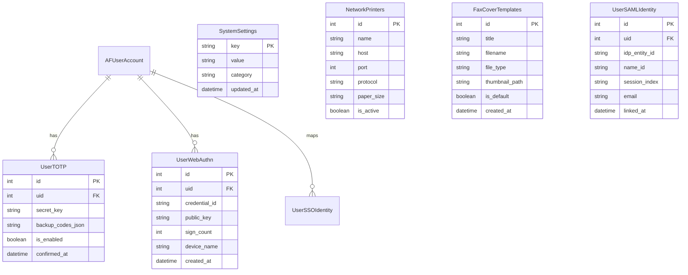
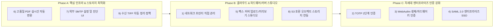

# NamiFAX 신규 엔터프라이즈 기능 구현 계획서
## (Legacy AvantFAX 비교 분석 및 신규 기능 아키텍처 설계)

---

## 1. 개요 및 배경

NamiFAX는 오픈소스 팩스 솔루션인 AvantFAX(PHP 5 + MySQL + HylaFAX)를 모던 Python/Pyramid 스택으로 100% 무회귀 이식한 시스템입니다.
현재 코어 시스템, 24개 다국어 지원, E2E Golden Master(68개 시나리오) 검증이 완료된 상태이며, 현대적인 기업 환경의 보안, 스토리지 효율성, 클라우드 연동 및 사용자 편의성을 강화하기 위해 **9대 핵심 엔터프라이즈 기능**의 도입을 추진합니다.

본 문서는 사용자가 요청한 9가지 기능에 대해 **[1] 레거시 시스템(AvantFAX)의 기존 동작 방식 및 한계**를 전수 대조하고, **[2] NamiFAX 환경에서 구축할 신규 아키텍처 및 구현 로드맵**을 정의합니다.

---

## 2. 레거시(AvantFAX) vs 신규(NamiFAX) 9대 기능 비교 매트릭스

| 번호 | 요구 기능 | 레거시(AvantFAX) 지원 현황 | NamiFAX 신규 구현 방향 & 차별점 | 구현 복잡도 |
| :---: | :--- | :--- | :--- | :---: |
| **1** | **네트워크 프린터 추가** | **제한적 지원 (간접 연동)** • 웹 UI에서 IP/포트 설정 불가 • 호스트 OS의 CUPS 큐 이름 문자열만 입력 (`lpr -P <name>`) | **완전 지원 (직접 연동)** • IPP, LPD, RAW 9100 소켓 직접 지원 • 웹 UI에서 프린터 IP/Port/프로토콜 등록 및 테스트 인쇄 | 중간 |
| **2** | **TOTP 로그인** | **미지원 (전무)** • 단순 DB 해시 비밀번호 인증만 제공 | **완전 지원 (RFC 6238)** • Authenticator 앱 연동 (QR 코드 발급) • 일회용 복구 백업 코드(Emergency Codes) 제공 | 중간 |
| **3** | **WebAuthn 로그인** | **미지원 (전무)** • 구형 브라우저 세션 쿠키 방식 | **완전 지원 (FIDO2 / Passkeys)** • Touch ID, Face ID, Windows Hello, YubiKey 지원 • 패스워드리스 로그인 및 2차 인증 수단 연동 | 보통~높음 |
| **4** | **SSO 로그인** | **미지원 (전무)** • Apache `REMOTE_USER` 환경변수 연동 수준만 존재 | **완전 지원 (SAML 2.0 Enterprise SP)** • Entra ID(Azure AD), Okta, Keycloak, ADFS 등 SAML 2.0 IdP 연동 • SP 메타데이터 XML 제공, ACS 엔드포인트 및 JIT 계정 프로비저닝 | 중간 |
| **5** | **팩스 커버 업로드/탐색/관리** | **제한적 지원 (메타데이터만 관리)** • 웹에서 파일 업로드/탐색 불가 • 서버 디렉터리에 수동 복사된 `.ps` 파일명만 DB 등록 | **완전 지원 (Cover Studio)** • 웹 브라우저 기반 PS/PDF/HTML 템플릿 드래그앤드롭 업로드 • 썸네일 미리보기, 동적 필드 태그 매핑 및 관리 UI | 중간 |
| **6** | **팩스 수신 시 PDF 자동 변환** | **부분 지원 (시스템 바이너리 의존)** • HylaFAX 내장 `tiff2pdf` 및 `gs` 서브프로세스 호출 • (현재 NamiFAX는 스텁 처리 상태) | **완전 지원 (고품질 변환 파이프라인)** • Pillow / PyMuPDF 기반 무손실 멀티페이지 PDF 변환 엔진 • `faxrcvd` 수신 즉시 비동기 썸네일/PDF 자동 생성 파이프라인 실체화 | 보통 |
| **7** | **외부 이메일 서버 설정** | **미지원 (설정 파일 하드코딩)** • `config.php` 내 상수로 직접 기입 • 관리자 웹 설정 UI 및 연결 테스트 기능 부재 | **완전 지원 (Admin SMTP Gateway)** • 관리자 콘솔 내 SMTP 호스트, 포트, TLS/SSL, 인증정보 설정 • 실시간 "연결 및 테스트 메일 발송" 진단 도구 제공 | 낮음~중간 |
| **8** | **오브젝트 스토리지 연동 (AWS S3 & GCP GCS)** | **미지원 (전무)** • 로컬 파일시스템 디렉터리(`/var/spool/hylafax/archive/`) 고정 | **완전 지원 (멀티 클라우드 오브젝트 스토리지)** • AWS S3, Google Cloud Storage(GCS), MinIO, SeaweedFS, Cloudflare R2 등 • 수신/발신 팩스 즉시/백그라운드 원격 업로드 및 스트리밍 다운로드 | 중간~높음 |
| **9** | **스토리지 수명주기 & 로컬/원격 자동 삭제** | **제한적 지원 (단순 전체 삭제)** • `avantfaxcron.php -d`로 팩스 전체(DB+파일) 일괄 삭제만 가능 • PDF 변환 후 TIFF 선별 정리 및 원격(S3/GCS) 객체 라이프사이클 관리 전무 | **완전 지원 (통합 Storage Lifecycle Engine)** • "PDF 변환 및 S3/GCS 업로드 완료 후 원본 TIFF 자동 삭제" 정책 • 보존 주기 만료 시 로컬 파일 및 원격 S3/GCS 객체 자동 삭제(DeleteObject) 연동 | 보통 |

---

## 3. 기능별 상세 분석 및 신규 아키텍처 설계

### 3.1 네트워크 프린터 연동 및 가상 프린터 에뮬레이션 (Network Printer & Print-to-Fax)
- **레거시 한계**:
  - 레거시 AvantFAX의 `DIDRouting`, `BarcodeRouting`, `FaxModem`, `Fax2Email` 테이블에는 모두 `printer` 컬럼이 존재했으나, 이는 단순 문자열로 서버의 CUPS 큐 이름(`-P printer_name`)을 넘기는 방식이었습니다.
  - 관리자가 시스템 콘솔에서 CUPS 드라이버를 직접 수동 설치하지 않으면 작동하지 않았으며, PC에서 '인쇄'하여 팩스를 발송하는 기능은 전무했습니다.
- **신규 아키텍처 (양방향 네트워크 프린팅 지원)**:
  1. **아웃바운드 인쇄 (수신 팩스 ➔ 실물 프린터 자동 출력)**:
     - **프로토콜 지원**: RAW 9100 (HP JetDirect), LPR/LPD (RFC 1179), IPP/IPPS (Internet Printing Protocol).
     - **프린터 관리 서비스 (`NetworkPrinterService`)**: 관리자 콘솔(`Admin > Hardware & Lines > Network Printers`)에서 프린터 IP, 포트, 프로토콜, 용지 규격 등록 및 "Test Print" 진단 제공. DID/모뎀/바코드별 수신 즉시 실물 프린터 소켓으로 TIFF/PDF 직접 자동 출력.
  2. **인바운드 인쇄 (클라이언트 PC 인쇄 ➔ NamiFAX 가상 프린터 수신 ➔ 팩스 자동 발송)**:
     - **NamiFAX 가상 프린터 데몬 (Virtual Print Server)**: NamiFAX 서버 자체에 포트 9100(RAW) 및 포트 631(IPP) 리스너를 내장하여 사내망에서 일반 네트워크 프린터로 가장.
     - **클라이언트 무설치 전송**: Windows/Mac/Linux 사용자나 ERP 시스템이 드라이버 추가 없이 표준 PostScript 프린터로 NamiFAX에 출력 가능.
     - **문서 내 태그 인식 (Text Tagging)**: 수신된 인쇄 데이터에서 `[[FAX: 02-123-4567]]` 정규식을 파싱하여 해당 번호로 자동 즉시 발송하고, 태그 텍스트는 최종 팩스에서 마스킹 제거.
     - **웹 드래프트 폴백**: 태그가 없는 문서는 웹 "임시보관함(Drafts)"으로 자동 저장하여 사용자가 웹에서 수신처를 지정하여 발송할 수 있도록 안내.

---

### 3.2 TOTP 2단계 인증 (RFC 6238 Two-Factor Authentication)
- **레거시 한계**:
  - 오직 사용자명/비밀번호 단일 요소 인증만 지원. 무차별 대입 공격 및 계정 탈취에 취약.
- **신규 아키텍처**:
  - **표준 라이브러리**: `pyotp` (Python 기반 RFC 6238 TOTP 구현) + `qrcode` (SVG/PNG QR 생성).
  - **사용자 활성화 플로우 (`/settings/security`)**:
    1. 사용자가 2FA 활성화 클릭 -> 시크릿 키(Secret Key) 생성 및 QR 코드 표시.
    2. Google Authenticator / Microsoft Authenticator 등으로 스캔 후 6자리 코드 검증.
    3. 8개의 1회용 백업 복구 코드(Emergency Recovery Codes, bcrypt 해시 저장) 발급.
  - **로그인 인터셉터 플로우 (`/login`)**:
    1. 1차 ID/PW 검증 통과 -> 세션에 `2fa_pending_uid` 설정 (접근 권한 제한).
    2. 2차 `/login/totp` 챌린지 화면으로 리다이렉트 -> 6자리 TOTP 입력 후 완전 로그인 세션 발급.

---

### 3.3 WebAuthn 로그인 (FIDO2 / Passkeys)
- **레거시 한계**:
  - 전혀 지원하지 않음.
- **신규 아키텍처**:
  - **표준 라이브러리**: `webauthn` (Python WebAuthn 2.x 라이브러리).
  - **클라이언트 브라우저**: WebAuthn API (`navigator.credentials.create()`, `navigator.credentials.get()`).
  - **기능 명세**:
    - **디바이스 등록**: 사용자가 `/settings/security`에서 보안 키(YubiKey, Touch ID 등)를 등록. 서버는 공개키 및 Credential ID를 `UserWebAuthnCredentials` 테이블에 보관.
    - **패스워드리스 로그인**: 로그인 화면에 "Passkey로 로그인" 버튼 제공. 사용자 입력 없이 지문/Face ID/보안키 인증으로 원클릭 로그인.
    - **2차 인증(2FA)으로 활용**: TOTP 대신 WebAuthn 키 터치를 2차 인증 수단으로 지원.

---

### 3.4 SSO 엔터프라이즈 통합 로그인 (SAML 2.0 Service Provider)
- **레거시 한계**:
  - 구형 Apache 웹서버의 HTTP Basic Auth 헤더(`$_SERVER['REMOTE_USER']`)에만 의존하였으며, 엔터프라이즈 표준 SAML 2.0 연동이 전무.
- **신규 아키텍처**:
  - **표준 프로토콜**: SAML 2.0 (Security Assertion Markup Language 2.0) Service Provider (SP).
  - **호환 Identity Provider (IdP)**: Microsoft Entra ID (Azure AD), Okta, Keycloak, ADFS, PingIdentity, Google Workspace 등 모든 SAML 2.0 규격 지원.
  - **표준 라이브러리**: `python3-saml` (OneLogin 공인 고신뢰성 SAML2 엔진) 또는 경량 `pysaml2`.
  - **핵심 엔드포인트 명세**:
    1. `GET /auth/saml/metadata`: NamiFAX SP 엔티티 ID, ACS URL, X.509 인증서가 포함된 SAML 메타데이터 XML 제공 (IdP 등록용).
    2. `GET /auth/saml/login`: IdP SingleSignOnService URL로 SAML AuthnRequest 생성 및 HTTP-Redirect 전송.
    3. `POST /auth/saml/acs`: IdP로부터 SAML Response(Assertion) 수신, XML 전자서명 검증, NameID 및 속성(Email, DisplayName, Role) 추출.
    4. `GET/POST /auth/saml/sls`: Single Logout Service (단일 로그아웃) 지원.
  - **관리자 설정 UI (`Admin > System & Security > SAML 2.0 SSO`)**:
    - IdP Metadata XML 파일 업로드 또는 메타데이터 URL 자동 페치.
    - IdP Entity ID, SSO Service URL, X.509 공개 인증서 수동 입력 및 테스트.
    - JIT (Just-In-Time) 사용자 자동 프로비저닝 옵션 (최초 로그인 시 NamiFAX 계정 자동 생성 및 기본 역할 부여).
    - 로그인 화면에 "SAML 2.0 SSO 로그인" 버튼 활성화/비활성화 토글.

---

### 3.5 팩스 커버 템플릿 업로드/탐색/관리 (Fax Cover Template Studio)
- **레거시 한계**:
  - 레거시 관리자 화면(`admin/conf_covers_edit.php`)은 파일 업로드 기능이 없었으며, 관리자가 서버 CLI로 직접 파일을 옮겨 넣은 뒤 파일명만 수동 기입해야 했습니다.
- **신규 아키텍처**:
  - **템플릿 형식 다양화**: 기존 PostScript(`.ps`) 외에도 모던 HTML/CSS 템플릿(`.html.jinja2`) 및 PDF 템플릿(`.pdf`) 지원.
  - **관리자 전용 커버 스튜디오 (`/admin/covers`)**:
    - 드래그 앤 드롭 파일 업로드 (`/admin/covers/upload`).
    - 업로드된 파일의 썸네일 미리보기(SVG/PNG) 실시간 생성 및 표시.
    - 동적 치환 변수 가이드 제공: `{{ to_person }}`, `{{ to_company }}`, `{{ regarding }}`, `{{ pages }}`, `{{ comments }}` 등.
    - 템플릿 다운로드, 이름 변경, 활성화/비활성화, 삭제 기능.

---

### 3.6 팩스 수신 시 고품질 PDF 실시간 자동 변환 (Inbound TIFF->PDF Engine)
- **레거시 한계 및 현재 상태**:
  - 레거시는 OS에 설치된 `tiff2pdf` 및 `gs`를 쉘 실행하여 변환했으나, 현재 포팅된 NamiFAX 코드에는 가상 헤더만 쓰는 목업 함수로 남아있습니다.
- **신규 아키텍처**:
  - **하이브리드 변환 엔진 (`TiffToPdfConverter`)**:
    1. **우선 순위 1**: LibTIFF 시스템 네이티브 `tiff2pdf` 바이너리 연동 (초고속, 무손실 압축).
    2. **우선 순위 2 (내장 폴백)**: Python `Pillow` (PIL) + `pypdf` / `reportlab` 순수 파이썬 변환 (외부 의존성 부재 시에도 100% 무중단 변환 보장).
  - **자동 파이프라인 (`faxrcvd.py`)**:
    - TIFF 수신 완료 즉시 -> `fax.pdf` 생성 -> 페이지별 `thumb_*.png` 썸네일 래스터화 -> OCR 텍스트 추출(Tesseract) 순차 실행.
    - 변환 실패 시 관리자 알림 및 수신함에 에러 태그 부착.

---

### 3.7 관리자 웹 기반 외부 SMTP 이메일 서버 설정 (External SMTP Gateway)
- **레거시 한계**:
  - 레거시는 웹 UI가 없어 `local_config.php`에 상수를 손으로 코딩해야 했으며, 설정 오류 시 이메일이 유실되었습니다.
- **신규 아키텍처**:
  - **관리자 설정 UI (`Admin > System & Security > SMTP Gateway`)**:
    - 호스트명, 포트(25, 465, 587, 2525), 보안 방식(Plain, STARTTLS, SSL/TLS).
    - SMTP 인증(ID / Password), 기본 발신자 이메일 주소 및 표시 이름.
    - 시스템 기본 HTML/Text 이메일 서명 설정.
  - **자가 진단 기능 ("Test Connection & Send Test Email")**:
    - 관리자가 수신 이메일을 입력하고 테스트 버튼 클릭 시, 실시간 SMTP 핸드셰이크 진단 및 결과(성공/실패 상세 로그) 모달 표시.
  - **동적 적용**:
    - 설정 저장 시 DB의 `SystemSettings` 테이블에 기록되며, 서비스 재시작 없이 `MailerService`가 즉시 새 설정을 반영.

---

### 3.8 멀티 클라우드 오브젝트 스토리지 연동 (AWS S3 & Google Cloud Storage)
- **레거시 한계**:
  - 클라우드 스토리지 개념 부재. 온프레미스 단일 서버 디스크에만 보관되어 디스크 용량 고갈 및 이중화 백업에 한계.
- **신규 아키텍처**:
  - **추상화된 스토리지 인터페이스 (`StorageProvider`)**:
    - `upload_file(local_path, remote_key)`
    - `download_file(remote_key, local_path)`
    - `delete_file(remote_key)`
    - `generate_presigned_url(remote_key, expires_in)`
  - **지원 스토리지 프로바이더**:
    1. **AWS S3 & S3 호환 스토리지**: AWS S3, MinIO, SeaweedFS, Garage, Cloudflare R2, Ceph RADOS (`boto3` 기반).
    2. **Google Cloud Storage (GCS)**:
       - **GCS 상호 운용성(HMAC) 방식**: GCS의 S3 호환 XML 엔드포인트(`https://storage.googleapis.com`)에 HMAC Access/Secret Key로 접속하여 일관된 Boto3 클라이언트로 고속 통신.
       - **GCP 서비스 계정 키 방식**: 서비스 계정 JSON 키 업로드를 통한 네이티브 인증 지원.
  - **관리자 설정 UI (`Admin > Storage & Retention > Cloud Storage`)**:
    - 스토리지 유형 선택: `Local Only`, `AWS S3 / S3-Compatible`, `Google Cloud Storage (GCS)`
    - 설정 입력 필드:
      - S3 모드: Endpoint URL, Region, Bucket Name, Access Key, Secret Key, Prefix
      - GCS 모드: Project ID, Bucket Name, HMAC Key (또는 Service Account JSON 파일 업로드), Prefix
    - "Test Connection" 진단 버튼 (버킷 존재 확인 및 읽기/쓰기/삭제 권한 실시간 진단).
  - **동기화 및 뷰어 전략**:
    - **업로드 파이프라인**: 팩스 수신(`faxrcvd`) 및 발신(`notify`) 완료 시 로컬 저장과 동시에 백그라운드 워커로 S3/GCS에 `fax.tif`, `fax.pdf`, `thumb.png` 자동 업로드.
    - **스마트 다운로드**: 로컬 디스크에 파일이 삭제된 경우 S3/GCS로부터 스트리밍 프록시하거나 1회용 Presigned Download URL을 생성하여 웹 뷰어 서빙.

---

### 3.9 통합 스토리지 라이프사이클 및 로컬/원격 객체 자동 삭제 (Storage Lifecycle & Remote Purge)
- **레거시 한계**:
  - 레거시 크론(`avantfaxcron.php`)은 팩스 전체(DB 레코드 + PDF + TIFF)를 통째로 지우는 기능만 제공하여, 원본 TIFF만 선택적으로 삭제하거나 클라우드(S3/GCS)에 보관된 파일까지 수명주기를 제어하는 기능이 전무했습니다.
- **신규 아키텍처**:
  - **로컬 디스크 최적화 (TIFF 선별 삭제)**:
    - 팩스 원본 멀티페이지 TIFF는 PDF 대비 용량이 크며, 일반적인 뷰어 및 다운로드는 PDF로 충분함.
    - 관리자 정책에 따라 PDF 변환 및 S3/GCS 업로드가 확인된 원본 TIFF를 즉시 또는 N일(예: 7일/30일) 후 로컬에서 선별 삭제하여 디스크 고갈 방지.
  - **원격 클라우드(S3/GCS) 수명주기 연동 정책**:
    1. **하이브리드 보존 모드 (`REMOTE_KEEP_FOREVER`)**:
       - 로컬 디스크는 N일 후 파일(TIFF 또는 전체)을 삭제하여 서버 용량을 확보하되, 원격 S3/GCS에는 영구 보존(장기 법적 보존/감사 대응).
    2. **원격 동기화 삭제 모드 (`REMOTE_SYNC_LIFECYCLE`)**:
       - 관리자가 웹 UI에서 팩스를 영구 삭제하거나 아카이브 보존 기한(예: 3년/5년)이 만료되었을 때, 로컬 DB/파일 삭제와 동시에 **원격 S3/GCS의 `DeleteObject` API를 호출하여 클라우드 상의 객체까지 영구 폐기**.
    3. **선별적 원격 TIFF 삭제 (`REMOTE_PURGE_TIFF_ONLY`)**:
       - 원격 버킷에서도 보존 기간이 지난 대용량 원본 TIFF만 골라 삭제하고 경량 PDF만 남겨 클라우드 스토리지 비용 절감.
  - **자동 백그라운드 실행**:
    - NamiFAX 내장 APScheduler를 통해 매일 자정에 `run_storage_lifecycle_job` 태스크가 실행되어, 정책에 정의된 로컬 파일 및 원격 S3/GCS 객체 삭제 파이프라인을 일괄 처리.

---

## 4. 데이터베이스 스키마 확장 계획

기존 테이블과의 100% 호환성을 유지하면서, 신규 기능을 수용하기 위한 모델 확장안입니다.

---

## 5. 단계별 구현 로드맵 및 마일스톤

기능의 의존 관계와 난이도를 고려하여 3단계 마일스톤으로 점진적 구현을 제안합니다.

### Milestone Phase A: 핵심 인프라 & 스토리지 안정화 (단기)
1. **팩스 수신 시 PDF 자동 변환 엔진 실체화**: LibTIFF + Pillow 이중화 파이프라인 완성.
2. **관리자 웹 기반 외부 SMTP 서버 설정**: UI 구현 및 실시간 메일 진단 도구 탑재.
3. **수신 TIFF 자동 정리 정책**: APScheduler 연동 및 PDF/S3 변환 완료 후 디스크 회수 로직.

### Milestone Phase B: 클라우드 스토리지 & 하드웨어 확장 (중기)
1. **네트워크 프린터 추가 및 인쇄 엔진**: RAW 9100 / IPP / LPD 소켓 직접 제어 UI.
2. **팩스 커버 업로드 및 썸네일 관리 스튜디오**: 파일 업로드, 렌더링 미리보기, 변수 태깅.
3. **S3 Compatible Object Storage 연동**: MinIO / AWS S3 동기화 및 Presigned URL 뷰어.

### Milestone Phase C: 차세대 보안 인증 체계 구축 (장기)
1. **TOTP 2FA**: QR 코드 발급, 6자리 챌린지 검증, 비상 복구 코드.
2. **WebAuthn Passkeys**: Touch ID / YubiKey 등록 및 패스워드리스 인증.
3. **엔터프라이즈 SSO**: Microsoft Entra ID / Okta / Keycloak / ADFS 등 SAML 2.0 IdP 프로바이더 연동.

---

## 6. 무회귀 검증 및 호환성 원칙

1. **골든 마스터 불변성 보장**:
   - 신규 기능 추가 후에도 기존 68개 Web E2E Golden Master 시나리오 및 291개 pytest 테스트가 100% PASS를 유지해야 합니다.
2. **기본 동작 하위 호환성 (Zero Disruption)**:
   - 신규 기능(S3, TOTP, 네트워크 프린터, TIFF 삭제)은 초기 설정 시 '비활성화' 또는 '기본 모드'로 시작하여, 기존 온프레미스 로컬 환경 운영에 어떠한 사이드 이펙트도 유발하지 않도록 설계합니다.
3. **모듈식 독립성**:
   - 각 기능은 `services/` 하위의 독립 서비스 객체로 캡슐화하여, 특정 기능(예: S3 라이브러리 부재)의 장애가 팩스 송수신 코어 파이프라인에 영향을 주지 않는 Fail-Safe 구조를 확립합니다.
