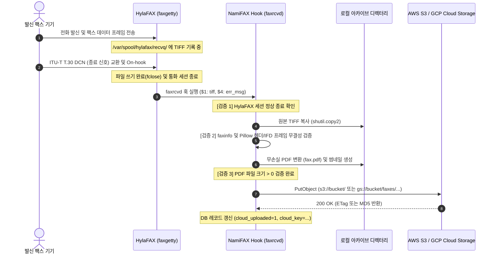

# HylaFAX & AvantFAX (NamiFAX) 연동 아키텍처 및 스토리지 관리 명세서

---

## 1. 개요 (Overview)

본 문서는 리눅스 기반 C/C++ 팩스 통신 데몬인 **HylaFAX**와 웹 기반 팩스 관리 시스템인 **AvantFAX (현 NamiFAX)** 간의 상호작용 아키텍처, 수신 스풀 디렉터리 경로 변경 방법, 레거시 Cron 기반 유지보수/청소 메커니즘, 그리고 단일/다중 페이지 팩스 수신 시의 실제 파일 저장 구조를 상세히 기술합니다.

---

## 2. 전체 연동 아키텍처 (Full Integration Architecture)

HylaFAX와 AvantFAX는 단일 프로세스가 아니며, **CLI 바이너리 호출**, **이벤트 기반 쉘 콜백(Hook)**, **공유 스풀 파일시스템 접근**, **TCP 소켓 프로토콜**의 4가지 채널을 통해 유기적으로 결합되어 동작합니다.

```
 +-----------------------------------------------------------------------------------+
 |                             NamiFAX / AvantFAX                                    |
 |                                                                                   |
 |  [ 웹 인터페이스 (Pyramid) ]          [ 자동화 / CLI 훅 (namifax CLI) ]           |
 |   - 수신함/발송/주소록 관리             - faxrcvd (수신 팩스 처리)                 |
 |   - 모뎀 상태 모니터링                 - notify  (발송 결과 처리)                 |
 |   - 시스템 관리/권한 통제              - dynconf (발신번호 필터/블랙리스트)       |
 +------------+-----------------------------------+----------------------------------+
              |                                   ^
    (1) 발송 및 상태 조회               (2) 이벤트 콜백 훅
     CLI / FIFO / 포트 4559              수신완료 / 발송완료 시 자동 실행
              v                                   |
 +------------+-----------------------------------+----------------------------------+
 |                                HylaFAX 서버                                       |
 |                                                                                   |
 |  [ hfaxd 데몬 ]                     [ faxq 큐 스케줄러 ]   [ faxgetty 모뎀 제어 ] |
 |   - 팩스 프로토콜 (포트 4559)          - 송신 대기열 관리    - 전화선 수발신 제어  |
 +-----------------------------------+-----------------------------------------------+
                                     |
                       (3) 스풀 파일시스템 공유
                        /var/spool/hylafax/{recvq, sendq, doneq, docq}
                                     |
                                     v
                       +-----------------------------+
                       |    하드웨어 팩스 모뎀 /     |
                       |    VoIP T.38 (전화 회선)    |
                       +-----------------------------+
```

### 2.1 팩스 발송 파이프라인 (Outbound: Web → HylaFAX)
1. 사용자가 웹 UI에서 팩스 번호와 문서를 입력하고 발송을 요청합니다.
2. 백엔드 시스템은 업로드된 문서(PDF, PS, DOC 등)를 HylaFAX 호환 PostScript/TIFF 포맷으로 변환합니다.
3. HylaFAX의 표준 CLI 도구인 `sendfax`를 서브프로세스로 호출하여 작업을 스풀 큐에 등록합니다:
   ```bash
   sendfax -n -d "02-123-4567" -i "Job Description" -r "Acme Corp" /path/to/document.ps
   ```
4. HylaFAX 스케줄러 데몬(`faxq`)이 `/var/spool/hylafax/sendq/` 디렉터리에 Q-file을 생성하고, 사용 가능한 모뎀을 할당하여 실제 전화망으로 다이얼링을 수행합니다.

### 2.2 팩스 수신 파이프라인 (Inbound: HylaFAX → AvantFAX 훅)
1. 외부에서 전화벨이 울리면 모뎀 감시 데몬(`faxgetty`)이 전화를 받아 팩스 신호를 복조하고 데이터를 수신합니다.
2. 수신이 완료되면 전체 세션 데이터를 단일 TIFF 파일로 `/var/spool/hylafax/recvq/fax00000001.tif`에 저장합니다.
3. `faxgetty`는 수신 즉시 사전 정의된 훅 스크립트(`/var/spool/hylafax/bin/faxrcvd`)를 실행합니다:
   ```bash
   faxrcvd "recvq/fax00000001.tif" "ttyS0" "00000001" "" "<CIDNumber>" "<CIDName>" "<DIDNum>"
   ```
4. AvantFAX/NamiFAX의 `faxrcvd` 훅이 구동되어 다음과 같은 일괄 처리를 수행합니다:
   - 원본 TIFF 무손실 PDF 변환 (`fax.pdf`) 및 페이지별 웹 프리뷰 이미지(`previewN.png`) 생성
   - 발신자 번호(CID) 및 DID 착신 번호를 주소록(`AddressBook`) 및 DID 규칙(`DIDRoute`)과 매핑
   - 영구 아카이브 디렉터리로 파일 이동 및 DB(`FaxArchive`)에 `inbox = 1`로 등록
   - 담당자 이메일 발송(PDF 첨부) 및 네트워크 프린터 자동 인쇄 수행

### 2.3 발송 결과 알림 파이프라인 (`notify` 훅)
1. HylaFAX가 송신 큐의 작업 처리를 완료(성공 또는 통화중/응답없음 실패)하면 `/var/spool/hylafax/bin/notify` 훅을 호출합니다:
   ```bash
   notify "sendq/q12" "done" "0:45"
   ```
2. AvantFAX(`namifax notify`)가 실행되어 작업 상태를 파싱하고, DB 내 송신 기록을 업데이트하며 발송자에게 전송 결과 통지 메일을 발송합니다.

### 2.4 동적 수신 거부 및 라우팅 (`dynconf` 훅)
1. 전화벨이 울리는 순간 HylaFAX가 발신자 번호(CID)를 감지하고 `/var/spool/hylafax/etc/dynconf`를 호출합니다.
2. AvantFAX의 차단 목록 DB(`DynConf`)를 조회하여 블랙리스트 등록 번호인 경우 `RejectCall: true`를 반환하여 모뎀이 즉시 통화를 끊도록 지시합니다.

### 2.5 실시간 모뎀 상태 모니터링 (`faxstat` & TCP 4559)
1. 웹 상단 툴바 및 대시보드에 모뎀 회선의 실시간 상태(IDLE, SENDING, RECEIVING)를 표시하기 위해 AvantFAX는 `faxstat -s -d` 출력을 파싱하거나, HylaFAX 클라이언트 프로토콜 데몬(`hfaxd`, TCP 4559 포트) 소켓과 통신합니다.

---

## 3. 수신 스풀 경로(`/var/spool/hylafax/recvq`) 및 스토리지 변경 방법

### 3.1 HylaFAX 스풀 레벨에서의 경로 변경
HylaFAX는 C++ 컴파일 시 지정된 스풀 루트(`/var/spool/hylafax`)와 하위 디렉터리(`recvq`)를 표준으로 사용합니다. 데몬 내부 설정으로 서브디렉터리 명칭을 변경하는 것은 권장되지 않으며, **운영체제 레벨의 마운트 또는 심볼릭 링크**를 통해 물리적 스토리지를 변경합니다:

* **방법 1: 심볼릭 링크 (Symbolic Link)**
  ```bash
  service hylafax stop
  mv /var/spool/hylafax/recvq /data/storage/fax_recvq
  ln -s /data/storage/fax_recvq /var/spool/hylafax/recvq
  chown -R uucp:uucp /data/storage/fax_recvq
  service hylafax start
  ```
* **방법 2: 바인드 마운트 (Bind Mount - 가장 안정적)**
  `/etc/fstab`에 대용량 NVMe/SAN/NFS 마운트 포인트를 바인드 마운트:
  ```text
  /data/storage/fax_recvq   /var/spool/hylafax/recvq   none   bind   0 0
  ```

### 3.2 AvantFAX / NamiFAX 아카이브 레벨 (최종 보관 경로)
`/var/spool/hylafax/recvq`는 HylaFAX가 통신 중 임시로 사용하는 **버퍼 디렉터리**에 불과합니다.
수신이 완료되면 AvantFAX의 `faxrcvd` 훅이 파일을 읽어 **AvantFAX 영구 아카이브 디렉터리로 복사/이동**시킵니다.
따라서 사용자가 보관하고 검색하는 실제 팩스 파일의 경로는 AvantFAX 설정에서 100% 자유롭게 지정할 수 있습니다:
* **AvantFAX 레거시 설정 (`local_config.php`)**:
  ```php
  $ARCHIVE = "/data/nas_faxes"; // 원하는 임의 경로 지정
  ```
* **NamiFAX 모던 설정 (환경 변수 또는 `production.ini`)**:
  ```ini
  [app:main]
  namifax.archive_dir = /data/nas_faxes
  ```

---

## 4. 레거시 Cron 기반 파일 청소 및 수명주기 메커니즘

레거시 환경에서 팩스가 누적되면 디스크 용량이 고갈되므로, 관리자는 crontab에 정기 청소 스케줄을 필수로 등록하여 운영했습니다.

### 4.1 `avantfaxcron.php` 스크립트 규격
AvantFAX는 공식적으로 `/etc/cron.d/avantfax` 또는 root crontab에 다음 스케줄을 등록하도록 요구합니다:

```bash
# 매일 자정에 실행 (임시파일 2일, 수신함 이동 30일, 아카이브 영구삭제 90일)
0 0 * * * /usr/bin/php /var/www/avantfax/includes/avantfaxcron.php -t 2 -i 30 -d 90
```

| 옵션 | 명칭 | 동작 방식 및 대상 |
| :---: | :--- | :--- |
| **`-t <days>`** | 임시 파일 정리 | `/tmp` 또는 AvantFAX 임시 디렉터리 내 N일이 지난 잔여 변환 파일 완전 삭제 |
| **`-i <days>`** | 수신함 보관 정리 (`prune_inbox`) | 수신함(Inbox)에 방치된 지 N일이 지난 팩스의 DB 상태를 `inbox = 0` (아카이브 보관함)으로 자동 전환 |
| **`-d <days>`** | 아카이브 영구 삭제 (`prune_archive`) | 보관일이 N일을 초과한 오래된 팩스를 **데이터베이스 레코드와 디스크 파일(TIFF, PDF, PNG 이미지)까지 전수 물리 삭제** |

### 4.2 HylaFAX 자체 수명주기 데몬 (`faxqclean`)
HylaFAX 자체도 `/usr/sbin/faxqclean` cron 작업을 통해 `/var/spool/hylafax/recvq` 및 `doneq`에 남겨진 오래된 임시 원본 파일들을 30일 단위로 자동 삭제합니다.

---

## 5. 팩스 1통(단일/수십 페이지) 수신 시 실제 파일 저장 구조

### 5.1 HylaFAX 수신 단계: 단일 멀티페이지 TIFF
팩스 통신 프로토콜(ITU-T T.30 / G3 / G4 압축) 특성상, 1통의 통화 세션으로 전달된 팩스는 페이지 수가 1페이지든 100페이지든 **단 1개의 멀티페이지 TIFF (Multi-page TIFF) 파일**로 `recvq`에 생성됩니다.
* 파일 경로: `/var/spool/hylafax/recvq/fax000000042.tif`
* 내부 구조: 단일 TIFF 파일 헤더 내에 복수의 IFD(Image File Directory) 프레임이 순차적으로 연결되어 저장됩니다.

### 5.2 AvantFAX / NamiFAX 아카이브 단계 (`faxrcvd`)
수신이 완료되면 `faxrcvd`가 해당 팩스 1통만을 위한 **날짜/발신자/HylaFAX_ID 전용 디렉터리**를 생성하고 문서를 분할 및 보관합니다:
* 아카이브 경로 구조: `faxes/YYYY/MM/DD/<발신번호>/<FaxID>/`
  - 예시: `faxes/2026/09/30/021234567/42/`

해당 디렉터리 내부에는 다음과 같은 파일들이 생성됩니다:

| 생성 파일명 | 파일 포맷 | 수량 | 역할 및 설명 |
| :--- | :--- | :---: | :--- |
| **`fax.tif`** | Multi-page TIFF | 1개 | 수신된 원본 전체 페이지를 그대로 보존한 무손실 원본 파일 |
| **`fax.pdf`** | Multi-page PDF | 1개 | 사용자가 웹에서 다운로드하거나 이메일로 전달받는 전체 통합 PDF 문서 |
| **`thumb.png`** | Single PNG | 1개 | 웹 수신함 목록 테이블에서 보여주기 위한 1페이지 대표 축소 썸네일 (160x220) |
| **`preview0.png`**<br>**`preview1.png`**<br>...<br>**`preview(N-1).png`** | Single PNG | **N개** | 웹 브라우저 팩스 뷰어(`viewfax`)에서 페이지 넘김 및 캔버스 렌더링을 위해 **전체 페이지 수(N)만큼 낱장으로 쪼개어 생성한 고해상도 PNG 이미지** |

### 5.3 페이지 수에 따른 파일 생성 수량 비교 매트릭스

| 수신 팩스 분량 | 생성되는 파일 구성 | 총 저장 파일 개수 |
| :---: | :--- | :---: |
| **1페이지 팩스 1통** | `fax.tif`(1), `fax.pdf`(1), `thumb.png`(1), `preview0.png`(1) | **총 4개 파일** |
| **5페이지 팩스 1통** | `fax.tif`(1), `fax.pdf`(1), `thumb.png`(1), `preview0.png` ~ `preview4.png`(5) | **총 8개 파일** |
| **30페이지 팩스 1통** | `fax.tif`(1), `fax.pdf`(1), `thumb.png`(1), `preview0.png` ~ `preview29.png`(30) | **총 33개 파일** |
| **100페이지 팩스 1통** | `fax.tif`(1), `fax.pdf`(1), `thumb.png`(1), `preview0.png` ~ `preview99.png`(100) | **총 103개 파일** |

---

## 6. 스토리지 부하 및 NamiFAX 신규 엔터프라이즈 기능 연계

### 6.1 레거시 구조의 문제점 및 I/O 병목
* **디렉터리 파일 폭증(Inode 고갈)**: 하루 수백 통의 팩스가 수신되는 기업 환경에서는 페이지별 `previewN.png` 파일로 인해 디스크 아이노드(Inode)와 메타데이터 검색 속도가 급격히 저하됩니다.
* **중복 스토리지 점유**: 원본 `fax.tif`, 변환본 `fax.pdf`, 각 페이지별 `previewN.png`가 모두 로컬 디스크에 중복 보관되어 스토리지 용량 소모가 3배 이상 증가합니다.

### 6.2 NamiFAX 신규 엔터프라이즈 로드맵과의 연계
이러한 레거시의 구조적 한계를 극복하기 위해, NamiFAX 신규 개발 로드맵 중 다음 기능들이 설계되었습니다:
1. **S3 호환 오브젝트 스토리지 연동 (기능 #8)**:
   - 로컬 디스크 공간을 비우고, PDF 및 원본 파일을 AWS S3, MinIO, Ceph 등으로 자동 오프로드/아카이빙.
2. **스토리지 수명주기 관리 및 TIFF 자동 정리 (기능 #9)**:
   - PDF 생성 및 S3 업로드가 완료된 후 디스크 내 고용량 `fax.tif` 및 구형 `previewN.png` 파일을 자동으로 선별 삭제하여 로컬 디스크 사용량을 최대 80% 이상 절감.

---

## 7. Cron에서 APScheduler 전환 및 관리자 웹 UI 아키텍처

레거시 AvantFAX의 OS crontab 종속성과 관리 투명성 부재 문제를 해결하기 위해, NamiFAX는 내장 **APScheduler**(`src/namifax/services/scheduler.py`) 기반의 스토리지 수명주기 엔진과 관리자 웹 콘솔을 제공합니다.

### 7.1 레거시 Cron vs NamiFAX APScheduler 비교

| 비교 항목 | 레거시 AvantFAX (`avantfaxcron.php`) | NamiFAX APScheduler 기반 신규 아키텍처 |
| :--- | :--- | :--- |
| **실행 주체** | OS crontab 데몬 (`/etc/cron.d/avantfax`) | NamiFAX 웹 내부 인프로세스 또는 독립 서비스 데몬 |
| **설정 방식** | 서버 쉘 접속 후 crontab 파일 수동 편집 | 관리자 웹 콘솔 (`Admin > Maintenance`) UI 설정 |
| **설정 항목** | 정적 CLI 인자 (`-t`, `-i`, `-d`) 고정 | 보존 일수, 실행 시각, TIFF 정리 여부 동적 설정 |
| **모니터링** | 파일 시스템 로그 확인 외 UI 모니터링 불가 | 최종 실행 시각, 성공 여부, 정리된 파일 수/용량 실시간 대시보드 |
| **수동 실행** | 터미널 명령어 직접 실행 | 관리자 콘솔 내 `[Run Clean Now]` 버튼 즉시 트리거 |

### 7.2 관리자 웹 UI 명세 (`Admin > Storage Lifecycle & Scheduled Tasks`)
* **위치**: `/admin/maintenance` 또는 `/admin/lifecycle`
* **주요 설정 필드**:
  1. **임시 파일 보존 기간 (`tmp_retention_days`)**: 변환 임시 파일 정리 기준일 (기본: 2일)
  2. **수신함 팩스 보존 기간 (`inbox_retention_days`)**: 수신함에 머문 팩스를 아카이브로 자동 전환할 기준일 (기본: 30일)
  3. **아카이브 팩스 보존 기간 (`archive_retention_days`)**: 아카이브 보관 팩스를 영구 삭제할 기준일 (기본: 90일 / 비활성화 옵션)
  4. **로컬 원본 TIFF 파일 정리 정책 (`tiff_lifecycle_policy`)**:
     - `KEEP_ALL`: 원본 TIFF 영구 보존
     - `PRUNE_AFTER_PDF`: PDF 변환 성공 즉시 로컬 TIFF 삭제 (디스크 용량 절감 극대화)
     - `PRUNE_AFTER_DAYS`: 지정 일수(예: 7일/30일) 경과 후 로컬 TIFF만 선별 삭제
  5. **원격 클라우드(S3/GCS) 객체 동기화 및 수명주기 정책 (`remote_lifecycle_policy`)**:
     - `REMOTE_KEEP_FOREVER`: 로컬은 삭제하더라도 S3/GCS 원격 객체는 영구 보존 (하이브리드 백업)
     - `REMOTE_SYNC_LIFECYCLE`: 보존 기간 만료 또는 관리자 영구 삭제 시 **원격 S3/GCS 버킷의 해당 파일(TIFF, PDF)까지 `DeleteObject` 동기화 삭제**
     - `REMOTE_PURGE_TIFF_ONLY`: 원격 버킷에서도 보존 기간이 지난 대용량 원본 TIFF만 골라 삭제하고 PDF만 영구 보존
  6. **자동 스케줄 설정**: 매일 특정 시각(예: 03:00) 또는 사용자 정의 Cron 표현식
* **작업 이력 및 진단 패널**:
  - 최근 작업 실행 시각 (Last Run Time)
  - 실행 상태 (SUCCESS, FAILED, RUNNING)
  - 정리 결과 (삭제된 임시 파일 수, 아카이빙된 팩스 수, 삭제된 팩스 수, 삭제된 원격 S3/GCS 객체 수, 회수된 디스크 용량 MB)
  - `[Run Clean Now]` 즉시 실행 버튼 (로컬 및 원격 클라우드 동시 수명주기 정리 트리거)

---

## 8. HylaFAX 훅(Hook) 구현 상세 규격

HylaFAX는 C++ 통신 데몬(`faxgetty`, `faxq`)이 이벤트 발생 시 사전에 정의된 실행 파일을 커널의 `execve` 시스템 콜로 직접 호출합니다.

### 8.1 훅 파일명 및 경로의 가변성 (Configurability)

HylaFAX의 훅 파일명과 경로는 고정되어 있지 않으며, HylaFAX 설정 파일(`/var/spool/hylafax/etc/config` 또는 모뎀별 `/var/spool/hylafax/etc/config.<devID>`)에서 지시자(Directives)를 통해 임의의 파일명과 경로로 자유롭게 변경할 수 있습니다:

| 설정 지시자 (Directive) | 기본 파일 경로 | 이벤트 트리거 시점 | NamiFAX 대응 서브커맨드 |
| :--- | :--- | :--- | :--- |
| **`FaxRcvdCmd`** | `bin/faxrcvd` | 팩스 수신 세션 완료 및 On-hook 직후 | `namifax faxrcvd "$@"` |
| **`NotifyCmd`** | `bin/notify` | 팩스 송신 성공 / 실패 / 재시도 완료 시 | `namifax notify "$@"` |
| **`DynamicConfig`** | `bin/dynconf` (또는 `etc/dynconf`) | 전화 수신 벨 울림 시 발신번호(CallID) 필터링 | `namifax dynconf "$@"` |

* **설정 예시 (`/var/spool/hylafax/etc/config`)**:
  ```text
  # 기본 bin/faxrcvd 대신 커스텀 실행 경로 지정 가능
  FaxRcvdCmd:         bin/namifax_rcvd
  NotifyCmd:          bin/namifax_notify
  DynamicConfig:      bin/namifax_dynconf
  ```

---

### 8.2 훅 실행 파일의 기술적 포맷 (Executable Types)

HylaFAX는 쉘을 거쳐 실행하는 것이 아니라 C++ 데몬 내부에서 직접 `execve()` 시스템 콜을 호출하므로, **반드시 Bash 쉘 스크립트일 필요가 없습니다.** 리눅스 커널이 실행 가능한 모든 형태의 파일(실행 권한 `chmod +x` 필수)을 직접 등록할 수 있습니다:

1. **Python 스크립트 직접 실행**:
   상단에 셔뱅(`#!/usr/bin/env python3`)을 선언하고 실행 권한을 부여하면 파이썬 파일 자체를 훅으로 등록하여 즉시 실행 가능합니다.
2. **단독 컴파일 바이너리 (Go, Rust, C/C++)**:
   외부 런타임 의존성 없는 단일 바이너리를 빌드하여 등록할 수 있습니다.
3. **NamiFAX CLI 직접 심볼릭 링크**:
   `/var/spool/hylafax/bin/faxrcvd` 자체를 `/usr/local/bin/namifax-faxrcvd`로 심볼릭 링크(`ln -s`)하여 중간 스크립트 없이 직접 호출할 수 있습니다.
4. **POSIX Bash / Sh 래퍼 스크립트**:
   환경변수 제어 및 로깅을 위한 얇은 래퍼(Thin Wrapper) 방식입니다.

#### Bash 래퍼 스크립트를 여전히 권장하는 실무적 이유
Python 바이너리를 직접 호출할 수 있음에도 불구하고, 엔터프라이즈 운영 환경에서 Bash 래퍼 스크립트를 중간에 두는 주된 이유는 다음과 같습니다:
* **HylaFAX Chroot Jail 격리 대응**: HylaFAX가 보안상 `/var/spool/hylafax`를 chroot 환경으로 격리할 경우, chroot 내부에는 파이썬 가상환경(`.venv`)이나 시스템 공유 라이브러리가 존재하지 않습니다. 따라서 쉘 래퍼를 통해 chroot 밖의 호스트 환경변수(`PATH`, `VIRTUAL_ENV`, `LD_LIBRARY_PATH`)를 주입하고 실행해야 합니다.
* **프로세스 충돌 시 로깅 및 디버깅**: 파이썬 인터프리터 예외나 크래시 발생 시 표준 에러(`2>&1`)를 안전하게 파일(`/var/log/namifax/hook.log`)로 리다이렉트하여 선로 장애인지 애플리케이션 버그인지 즉각 진단할 수 있습니다.

---

### 8.3 배포 환경별 훅 구현 패턴

#### 패턴 A: 동일 서버 / 공유 볼륨 환경 (CLI 래퍼 스크립트)
HylaFAX와 NamiFAX가 동일 서버에 설치되어 로컬 파일시스템과 CLI에 직접 접근할 수 있는 표준 구성입니다.

* **수신 훅 스크립트 (`/var/spool/hylafax/bin/faxrcvd`)**:
  ```bash
  #!/bin/bash
  # HylaFAX 전달 인수:
  # $1: 수신 파일 상대경로 (recvq/fax000000042.tif)
  # $2: 수신 모뎀 디바이스명 (ttyS0)
  # $3: 통신 세션 ID (commID)
  # $4: 통신 에러 메시지 (정상 수신 시 빈 문자열 "")
  # $5: 발신자 번호 (CIDNumber)
  # $6: 발신자 이름 (CIDName)
  # $7: 착신 DID 번호 (DIDNum)

  # HylaFAX 기본 환경변수 보존 및 NamiFAX CLI 호출
  export NAMIFAX_CONF="/etc/namifax/namifax.ini"
  exec /usr/local/bin/namifax faxrcvd "$@"
  ```

* **발송 결과 훅 스크립트 (`/var/spool/hylafax/bin/notify`)**:
  ```bash
  #!/bin/bash
  # $1: 큐 파일 상대경로 (sendq/q12)
  # $2: 발송 상태 (done, failed, rejected 등)
  # $3: 통화 소요 시간 (0:45)
  # $4: 에러 상세 메시지

  exec /usr/local/bin/namifax notify "$@"
  ```

* **동적 수신거부 훅 스크립트 (`/var/spool/hylafax/etc/dynconf`)**:
  ```bash
  #!/bin/bash
  # 발신번호 기반 Call Screening
  exec /usr/local/bin/namifax dynconf "$@"
  ```

#### 패턴 B: 컨테이너 분리 / 원격 마이크로서비스 환경 (HTTP Webhook 래퍼)
HylaFAX와 NamiFAX 웹 서비스가 각각 독립된 Docker 컨테이너 또는 별도 VM으로 분리된 클라우드 네이티브 환경입니다.

* **수신 웹훅 래퍼 (`/var/spool/hylafax/bin/faxrcvd`)**:
  ```bash
  #!/bin/bash
  SPOOL_DIR="/var/spool/hylafax"
  TIFF_PATH="${SPOOL_DIR}/$1"

  # NamiFAX 내부 API로 멀티파트 파일 및 메타데이터 전송
  curl -s -X POST http://namifax-app:8000/api/hooks/faxrcvd \
       -F "file=@${TIFF_PATH}" \
       -F "device=$2" \
       -F "comm_id=$3" \
       -F "error=$4" \
       -F "cid_number=$5" \
       -F "cid_name=$6" \
       -F "did_num=$7" \
       --retry 3 \
       --connect-timeout 5
  ```

---

## 9. 멀티 클라우드(AWS S3 & GCP GCS) 연동, 3단계 무결성 보장 및 원격 수명주기 동기화

팩스가 전화선으로 전송 중인 불완전한 상태에서 원격 오브젝트 스토리지에 업로드되는 것을 원천 차단하기 위해, 시스템은 **이벤트 완료 보장 → 포맷 무결성 검증 → 로컬 트랜잭션 완료**의 3단계 파이프라인을 엄격히 적용합니다.



### 9.1 1단계: HylaFAX 통신 라이프사이클에 의한 수신 완료 보장
* **메커니즘**: HylaFAX의 `faxgetty` 프로세스는 데이터 패킷을 수신 중일 때는 절대로 `faxrcvd` 훅을 실행하지 않습니다.
* **보장 기준**: 상대방 모뎀과 프로토콜 핸드셰이크(DCN)를 마치고, 모뎀이 전화선을 완전히 끊었으며(On-hook), HylaFAX가 디스크 상의 TIFF 파일에 버퍼를 비우고 파일 디스크립터를 닫은(`fclose`) **직후에만 훅이 트리거**됩니다. 따라서 훅이 실행되었다는 사건 자체가 1차 완료 보증입니다.

### 9.2 2단계: TIFF 포맷 헤더 및 에러 파라미터 무결성 검증
통신 도중 선로 잡음이나 강제 단선으로 인해 불완전하게 수신된 파일을 필터링합니다:
* **HylaFAX 에러 인수 검사**: `$4`(error-msg)가 빈 문자열인지 확인합니다. 통신 오류가 발생한 경우 에러 메시지가 기록되어 즉시 에러 큐로 분기합니다.
* **TIFF 구조 무결성 검사**: Python `Pillow` 및 LibTIFF 라이브러리로 원본 TIFF를 열어, 파일 헤더의 유효성, IFD(Image File Directory) 엔드 태그 정상 종료 여부, 페이지 수(Pages) 메타데이터를 정밀 파싱합니다. 손상된 파일은 클라우드 전송을 중단하고 관리자 감사 로그에 기록합니다.

### 9.3 3단계: 로컬 무손실 PDF 변환 트랜잭션 후 클라우드 업로드
* **로컬 가공 선행**: 수신된 TIFF로부터 `fax.pdf`와 `previewN.png`를 로컬 디렉터리에서 완전히 생성합니다.
* **업로드 트리거 조건**:
  - `os.path.exists(pdffile)` 및 `os.path.getsize(pdffile) > 0` 검증 통과
  - `os.path.exists(faxfile)` 및 `os.path.getsize(faxfile) > 0` 검증 통과
* **트랜잭션 확정**:
  - 상기 조건을 만족할 때 비로소 스토리지 클라이언트(AWS S3 Boto3 또는 GCP Cloud Storage)를 호출하여 버킷에 업로드합니다.
  - 클라우드 엔드포인트로부터 정상 `200 OK` 및 식별자(ETag)를 수신하면 데이터베이스 `FaxArchive` 레코드에 `cloud_uploaded = 1`, `cloud_key = '...'`를 기록합니다.
* **장애 복구 보장**: 만약 클라우드 엔드포인트 네트워크 장애 등으로 업로드가 실패하더라도, 파일은 로컬 아카이브 디렉터리에 온전히 남아있으므로 내장 APScheduler의 백그라운드 재시도 큐(Retry Worker)를 통해 유실 없이 안전하게 재업로드됩니다.

---

### 9.4 스토리지 수명주기 청소 스크립트와 클라우드(S3/GCS) 원격 객체 삭제 연동

NamiFAX의 청소 스크립트(APScheduler 기반 수명주기 엔진)는 로컬 디스크뿐만 아니라 **원격 S3 및 GCP Cloud Storage 버킷에 직접 접근하여 보존 기간이 만료된 객체를 삭제하는 권한과 제어 로직을 내장**합니다:

1. **원격 객체 삭제 메커니즘**:
   - 스케줄러가 매일 자정에 실행될 때, `archive_retention_days`(예: 3년)가 경과한 팩스 목록을 DB에서 조회합니다.
   - 관리자가 `REMOTE_SYNC_LIFECYCLE` 정책을 설정한 경우, 스토리지 어댑터의 `delete_file(remote_key)`를 호출하여 원격 버킷의 `fax.pdf`, `fax.tif`, `thumb.png`를 `DeleteObject` API로 안전하게 삭제합니다.
   - 단건 수동 삭제 시에도, 관리자가 웹 UI에서 "팩스 영구 삭제"를 클릭하면 로컬 파일/DB 레코드 제거와 동시에 원격 S3/GCS 객체도 함께 폐기됩니다.
2. **선별적 원격 TIFF 삭제를 통한 클라우드 비용 절감 (`REMOTE_PURGE_TIFF_ONLY`)**:
   - 수신 30일이 지난 아카이브 팩스의 경우, 사용 빈도가 낮고 용량이 큰 원본 멀티페이지 TIFF(`fax.tif`)만 원격 버킷에서 `DeleteObject`로 제거하고, 경량 PDF(`fax.pdf`)만 클라우드에 영구 보존하여 스토리지 청구 비용을 70~80% 이상 절감합니다.
3. **삭제 실패 안전장치 (Fail-Safe)**:
   - 원격 객체 삭제 중 네트워크 장애나 API Rate Limit이 발생할 경우, DB의 `cloud_delete_pending = 1` 플래그로 마킹하고 다음 스케줄러 루프에서 멱등성(Idempotency)을 유지하며 재시도합니다.

---

## 10. 팩스 발송 시 첨부파일 지원 포맷 및 변환 규격

NamiFAX 웹 발송 화면(`/sendfax`)에서 사용자가 첨부할 수 있는 문서 형식, 백엔드 변환 파이프라인, 그리고 팩스 품질 최적화 권장 사양입니다.

### 10.1 기본 지원 포맷 매트릭스 (Directly Supported Formats)

HylaFAX `sendfax` 스풀러 및 NamiFAX 파이프라인이 기본적으로 수용하고 팩스 신호로 변환할 수 있는 파일 포맷입니다:

| 파일 포맷 | 확장자 | MIME 타입 | 내부 처리 및 변환 방식 | 권장 수준 |
| :--- | :---: | :--- | :--- | :---: |
| **PDF 문서** | `.pdf` | `application/pdf` | **업계 표준 포맷.** 텍스트와 벡터 그래픽을 보존하며 Ghostscript 엔진을 통해 팩스 해상도(204x98dpi 표준 또는 204x196dpi 고해상도)로 무손실 래스터라이징 | **최고 권장 (Primary)** |
| **PostScript** | `.ps` | `application/postscript` | HylaFAX의 원천 네이티브 인쇄 포맷. 드라이버 오버헤드 없이 가장 빠르고 정확하게 팩스 래스터 데이터로 직접 변환 | 매우 높음 |
| **TIFF 이미지** | `.tif`, `.tiff` | `image/tiff` | ITU-T G3/G4 흑백 압축 규격의 단일 또는 멀티페이지 이미지. 추가 렌더링 없이 즉시 전송 가능 | 높음 |
| **일반 텍스트** | `.txt` | `text/plain` | HylaFAX 내장 텍스트 포맷터(`textfmt`)가 폰트, 여백, 줄바꿈을 적용하여 PostScript로 실시간 변환 후 전송 | 보통 |

### 10.2 이미지 포맷 처리 (`.png`, `.jpg`, `.jpeg`)
* **변환 파이프라인**: 업로드된 이미지는 NamiFAX 미디어 엔진(Python Pillow) 또는 HylaFAX 룰셋(`/var/spool/hylafax/etc/typerules`)을 통해 단일/멀티페이지 PDF 또는 PostScript 문서로 자동 래핑된 후 발송됩니다.
* **디더링 주의점**: 팩스 전화선 통신(T.30 프로토콜)은 본질적으로 **흑백 1비트 모노크롬(Monochrome)** 전송만 지원합니다. 따라서 컬러 사진이나 연한 배경색 그래픽은 흑백 망점화(Dithering) 과정에서 텍스트가 뭉개지거나 배경이 검게 출력될 수 있으므로 고대비 흑백 이미지가 권장됩니다.

### 10.3 오피스 문서 연동 (Word, Excel, PowerPoint, HWP 등)
* **사전 변환 필요성**: 팩스 모뎀은 오피스 문서의 독자 바이너리/XML 구조나 서식을 직접 해석할 수 없습니다. 따라서 반드시 인쇄 가능한 표준 규격(PDF/PostScript)으로 변환되어야 합니다.
* **권장 운영 정책**:
  1. **클라이언트 사전 변환 (가장 권장)**: 사용자 PC에서 문서를 "PDF로 저장"한 후 첨부하면, 폰트 깨짐이나 줄바꿈 어긋남 없이 원본 그대로 발송됩니다.
  2. **서버 자동 변환 엔진 연동**: 서버 호스트에 **LibreOffice Headless** (`libreoffice --headless --convert-to pdf`) 또는 Unoconv를 설치하여, 백엔드에서 `.docx`, `.xlsx`, `.pptx`, `.hwp` 업로드 시 자동으로 PDF로 사전 변환한 뒤 `sendfax`로 전달하도록 파이프라인을 구축할 수 있습니다.

### 10.4 팩스 전송 품질 최적화 권장 사양 (Best Practices)
1. **용지 규격**: **A4 (210 x 297 mm)** 또는 **US Letter (8.5 x 11 in)**
2. **색상 모드**: **흑백(Black & White 1-bit)** 또는 **그레이스케일(Grayscale)** (흰색 배경에 선명한 검은색 텍스트 권장)
3. **입력 해상도**: **200 DPI ~ 300 DPI** (팩스 표준 규격은 가로 204 DPI, 세로 98 DPI(표준) 또는 196 DPI(고해상도)이므로 300 DPI 초과 고해상도는 전송 시간만 증가시킵니다)
4. **파일 크기**: 팩스 1통당 **10 MB 이하** 권장 (아날로그 전화선 전송 속도는 9,600 ~ 14,400 bps에 불과하므로, 지나치게 큰 용량은 모뎀 통화 시간을 수십 분 이상 점유하여 통신 단선 위험을 높입니다)

---

## 11. OS별 Print-to-Fax 아키텍처 및 NamiFAX 가상 네트워크 프린터 에뮬레이션

사용자가 오피스 프로그램(Word, Excel, HWP 등)이나 PDF 뷰어에서 문서를 열어둔 상태로 `Ctrl+P`(또는 `Cmd+P`)를 눌러 NamiFAX를 통해 즉시 팩스를 발송하는 파이프라인 명세입니다.

### 11.1 핵심 과제: 수신 팩스 번호 전달 문제

일반 OS 인쇄 대화상자에는 "수신 팩스 번호"를 입력하는 필드가 존재하지 않습니다. 따라서 이를 해결하기 위해 두 가지 상호 보완적 아키텍처를 제공합니다:
1. **클라이언트 팝업 방식 (Interactive GUI)**: 인쇄 가로채기 후 화면에 번호 입력창 팝업.
2. **가상 네트워크 프린터 에뮬레이션 + 문서 내 태그 인식 방식 (Driverless Text Tagging)**: 클라이언트에 별도 소프트웨어 설치 없이 네트워크 프린터로 출력하고 문서 본문에서 번호를 자동 파싱.

---

### 11.2 OS별 클라이언트 가상 프린터 아키텍처

```
 [ Windows 클라이언트 ]       [ macOS 클라이언트 ]       [ Linux 클라이언트 ]
  - Generic PostScript 드라이버  - CUPS PPD 가상 프린터    - CUPS PPD (fax4CUPS)
  - RedMon 포트 모니터          - AppleScript 번호 다이얼로그 - Zenity / KDialog 팝업
          \                         |                         /
           +------------------------+------------------------+
                                    |
                            (HTTP REST API 전송)
                                    v
                       [ NamiFAX /api/sendfax ]
```

* **Windows**:
  - **구성**: PostScript 프린터 드라이버 + 가상 포트 모니터 (RedMon 또는 WPHFX 포트).
  - **동작**: 인쇄 시 가상 포트가 스풀된 PostScript/PDF 데이터를 가로채고 경량 수신번호 입력 팝업 창을 호출. 번호 확인 즉시 NamiFAX REST API로 업로드.
* **macOS**:
  - **구성**: macOS 유닉스 표준인 CUPS(Common Unix Printing System) 커스텀 백엔드(`/usr/libexec/cups/backend/namifax`).
  - **동작**: `Cmd+P` 인쇄 시 CUPS 백엔드가 macOS 네이티브 AppleScript 다이얼로그(`osascript -e 'display dialog ...'`)를 화면에 띄워 팩스 번호 및 주소록을 입력받은 후 `curl`로 NamiFAX에 POST 전송. (별도 무거운 상주 프로그램 불필요)
* **Linux**:
  - **구성**: CUPS 백엔드(`fax4CUPS`) + 데스크톱 GUI 팝업(`zenity` 또는 `kdialog`).
  - **동작**: 인쇄 스풀을 감지하여 팝업으로 번호를 입력받고 `namifax sendfax` CLI 호출.

---

### 11.3 호스트 OS CUPS 네트워크 프린터 공유 및 NamiFAX 인쇄 수신 연동

NamiFAX 내부에 저수준 소켓 리스너(RAW 9100, IPP 631)를 바닥부터 직접 개발하는 오버엔지니어링을 지양하고, **리눅스 호스트 OS의 표준 인쇄 데몬인 CUPS(Common Unix Printing System)의 네트워크 공유 큐**를 활용합니다.

```
 [ Windows / Mac / Linux / ERP ] (클라이언트 무설치)
         |
         | 표준 네트워크 인쇄 (Generic PostScript 드라이버 사용)
         | ipp://서버IP:631/printers/namifax (CUPS 표준 공유)
         v
 +-------------------------------------------------------------------------------+
 |                       호스트 OS 표준 CUPS 데몬                                 |
 |                                                                               |
 |   - 네트워크 프린터 큐 공유 및 인쇄 스풀 관리                                 |
 |   - NamiFAX CUPS 백엔드 필터 (/usr/lib/cups/backend/namifax) 호출             |
 +---------------------------------------+---------------------------------------+
                                         |
                            표준 입력 / 파일 경로 전달
                                         v
 +-------------------------------------------------------------------------------+
 |                        NamiFAX Text Tagging CLI 파이프라인                    |
 |                       (namifax print-in /path/to/spool.pdf)                   |
 |                                                                               |
 |  1. 텍스트 레이어 파싱 (PyMuPDF / pdfplumber) 및 첫 페이지 고속 OCR           |
 |  2. 정규식 매칭: [[FAX: 02-123-4567]] 또는 <<FAX: 010-1234-5678>>          |
 |                                                                               |
 |      [ 태그 발견 시 ]                         [ 태그 미발견 시 ]              |
 |       - 해당 번호로 자동 즉시 발송               - 웹 "임시보관함(Drafts)"으로 저장 |
 |       - 원본에서 태그 텍스트 마스킹             - 해당 사용자 웹 화면에 알림 배너  |
 |       - HylaFAX sendfax 큐 등록                - 웹에서 수신처 선택 후 발송      |
 +-------------------------------------------------------------------------------+
```

#### 연동 및 배포 구성:
1. **호스트 CUPS 설정**:
   - CUPS에 `namifax` 가상 프린터 큐를 등록하고 `Share printers connected to this system` 옵션을 활성화합니다.
   - CUPS 백엔드로 등록된 스크립트가 인쇄 작업을 수신하여 `namifax print-in "$1" "$2" ...` CLI로 인쇄 파일을 즉시 넘겨줍니다.
2. **클라이언트 설정 (전 OS 공통 무설치)**:
   - 클라이언트 PC(Windows, macOS, Linux)에서는 드라이버 설치 없이 "네트워크 프린터 추가"에서 NamiFAX 서버의 CUPS 공유 주소(`ipp://namifax-server:631/printers/namifax`)를 지정하고 제조사를 `Generic / PostScript`로 선택하면 즉시 인쇄 준비가 완료됩니다.

---

### 11.4 문서 내 팩스 번호 태그 자동 인식 (Text Tagging Pipeline)

가상 네트워크 프린터로 출력 시 팝업 창 없이 본문 텍스트만으로 완전 자동 팩스 발송을 수행하는 규칙입니다:

1. **태그 문법**:
   - `[[FAX: 02-123-4567]]`
   - `[[FAX: 010-9876-5432, TO: 홍길동 귀하, COVER: standard]]`
   - 대소문자 무관 및 공백 허용 정규식: `\[\[FAX:\s*([0-9\-\+\s]+)(?:,\s*TO:\s*([^,\]]+))?(?:,\s*COVER:\s*([^\]]+))?\]\]`
2. **개인정보 보호 및 태그 마스킹 (Tag Concealment)**:
   - 전송되는 최종 팩스 이미지에서 `[[FAX: ...]]` 태그 텍스트가 상대방에게 그대로 노출되지 않도록, 해당 영역을 흰색 사각형으로 오버레이 마스킹하거나 커버페이지로 대체하여 깔끔하게 발송합니다.
3. **태그 부재 시 안전 처리 ("Print-to-Web Draft")**:
   - 태그가 적혀있지 않은 문서가 인쇄된 경우 오류로 폐기하지 않고, 인쇄자 IP/계정 기반으로 NamiFAX 웹 수신함의 **"임시 보관함(Outbox Drafts)"**에 자동 등록합니다.
   - 사용자가 웹 브라우저를 열면 *"방금 인쇄된 문서 1건이 대기 중입니다. 수신처를 지정해 주세요"* 팝업이 노출되어 안전하게 발송을 완료할 수 있습니다.


